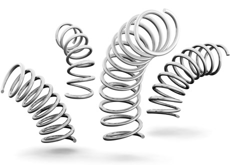
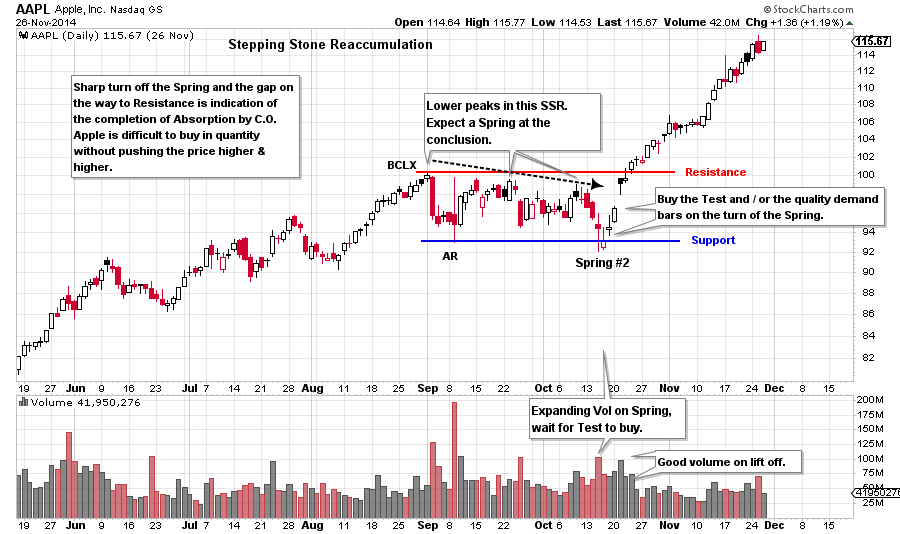
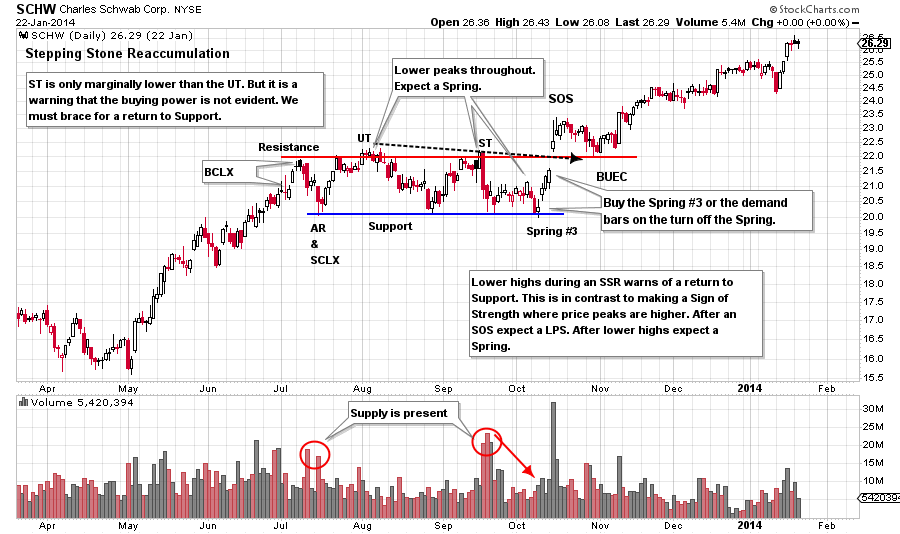

# Springing into Action

URL: https://articles.stockcharts.com/article/articles-wyckoff-2016-05-springing-into-action/
Date: May 06, 2016 at 03:49 PM
Author: Bruce Fraser

Stepping Stone Reaccumulation (SSR) formations are significant yet common. An SSR is a pause where the stock rests before resuming the uptrend. SSR formations often have a signature of making the lowest low early in the pause (in the first third to half of the total time spent in the SSR). We have recently explored some examples of this phenomena and how best to trade it (click here). Once the low is in place, the tendency is for the price to then scale upward with a series of higher lows until reaching the resistance area. Once above resistance, the trend tends to resume at a steady and robust pace. There is another type of SSR that we should be prepared to trade.

As is the case with all SSR formations, once the Buying Climax has been set, the Automatic Reaction will follow and these two points set the Resistance and Support of the emerging trading range. In this alternative type of SSR, we see a pattern of rallies off of Support being stopped at ever lower peaks. The appearance is of a series of declining highs which suggests that sellers are becoming more aggressive in their shedding shares at ever lower prices. This looks like Distribution, but it is not.

---

The final act of this deteriorating picture is typically a Spring. A break of the Support line and the prior lows shatters the confidence of the remaining holders and in many cases they are compelled to sell. It is difficult to hold on to stock that continually diminishes in value as the trading range grinds onward, only to be confronted with a wholesale breakdown of the SSR.

The breakdown in the late stages of the SSR is a Spring. The Spring is a terminal act that concludes the listless sideways price action and it is followed by a robust rally to the Resistance area and a resumption of the uptrend.

(click on chart for active version)

Apple abruptly concludes an advance with a reversal and we label a BCLX and AR to set the Resistance and Support. Each peak thereafter is lower than the prior. An important rule of thumb for this type of SSR is that lower peaks are followed by a Spring. That is the case here. Note the big surge of volume on the break of Support. This is a Spring #2 which must be tested and it is the next day. High volume indicates a supply of stock becoming available below the Support zone. The Composite Operator is buying this stock but they are uncertain how much supply is actually present at this level. The next day on the Test, the price remains above the low and the volume is less than on the Spring day. The selling appears to be exhausted. Quality demand bars emerge the next two days on high volume as Apple works up to the Resistance line and into a new uptrend. Note the gap on the way up. We conclude from the gap that much of the supply has been absorbed and price will now move easily upward. Volume diminishes as price climbs above the Resistance area. It is taking very little Effort (volume) to move prices up (the Law of Effort and Result). Stock supply is scarce. Buy Apple on the Test of the Spring #2 and place the stop under the lowest price. Also stock can be bought on the demand bars that follow the turn off the Spring. Stops would be set in the same location.

(click on chart for active version)

Charles Schwab has an Upthrust as it tests the BCLX and then returns to Support. The next peak is marginally lower than the UT and then abruptly falls back to Support. Note in both of these examples that the stock wants to return to Support. In previous SSR studies, the stock tended to make higher lows and stay near the Resistance area. For SCHW the tendency is for the price to camp in the lower half of the trading range. The price hovering near the low of the trading range is very discouraging to stock holders. The final act is a Spring #3 which goes below the low of the AR and the Support. The volume is low, not rising above the recent low levels. When the price Springs on low volume the stock can be bought right away. Don’t expect a Test of a #3 Spring and in the case of SCHW there is no Test. The price pivots off the low and begins marching upward. Buy the Spring or any of the demand bars that follow. Place stops under the low of the Spring day. Just like with AAPL, there is a gap up and out of the Resistance. Stock has been absorbed and is scarce. The gap proves that institutions are finding it difficult to buy the stock in quantity. After a SOS there is a Back Up to the Edge of the Creek (BUEC) which returns to Resistance (old Resistance becomes new Support). The BUEC is a classic place to add to the position. Move up stops on the entire position to under the BUEC and the Resistance line. After the BUEC, a big demand bar launches SCHW into the next phase of the uptrend.

There are no absolutes in the price action of stocks and markets. We study and discuss tendencies. Tendencies are the product of human behavior in action, and the sum total of all of the participants and their methods and influence. All reflected on the tape. We study these tendencies and we prepare for any and all eventualities as best we can. As Wyckoffians we learn to love the uncertainty and the opportunity to learn something from every situation. This attitude puts us on the mastery path. We walk it with humility and gratitude.

All the Best,

Bruce

Professor Roman Bogomazov and I will discuss the Wyckoff Method in a three part webinar series (6 hours in total) on May 9th, 16th and 23rd. Roman teaches the Wyckoff Method (online course) at Golden Gate University. We will use the “Wyckoff Power Charting” blogs as the framework for our discussions with additional material added. Each session will be recorded and will include ample time for attendees to ask questions. The recordings will be available for your review or if you are unable to attend the live sessions. The fee for this series is only $49. Click here to sign up now.
