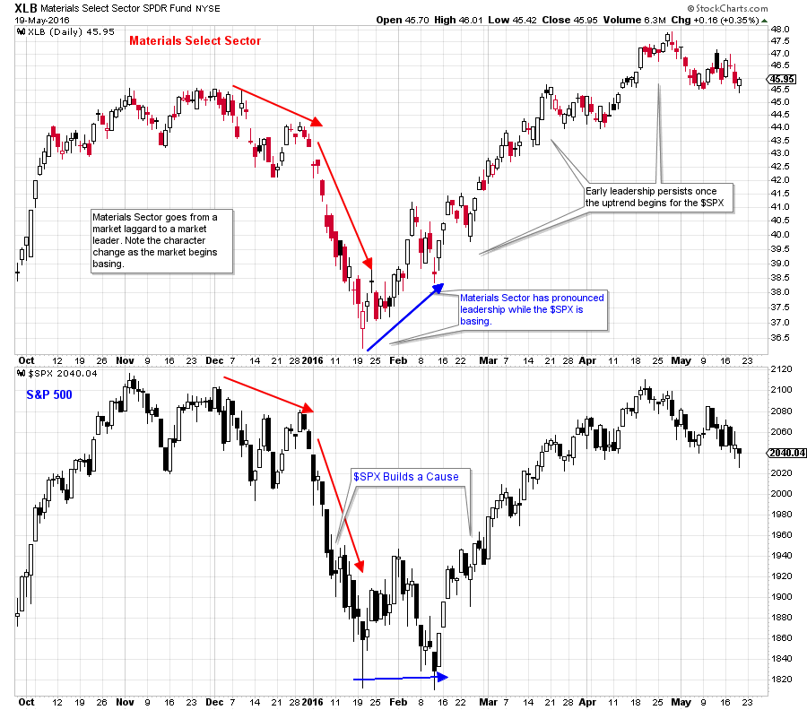
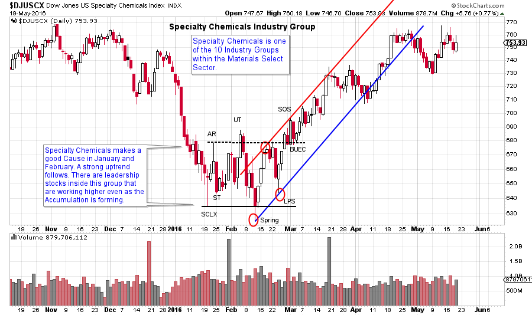
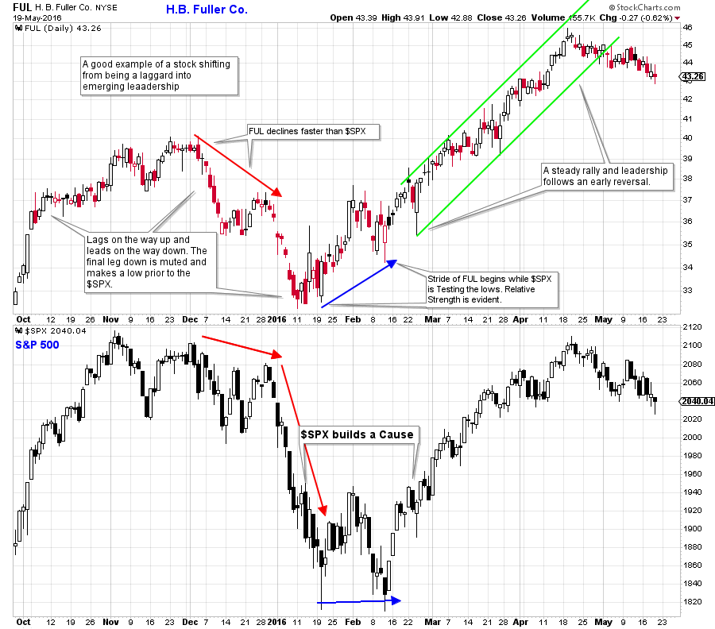

# Wyckoff Group Think

URL: https://articles.stockcharts.com/article/articles-wyckoff-2016-05-wyckoff-group-think/
Date: May 19, 2016 at 07:22 PM
Author: Bruce Fraser

Finding the best emerging stock ideas can seem like finding a needle in a haystack. The goal is to organize your market analysis in such a way that you can drill down into the market structure and find leadership quickly and efficiently. There are many good ways to survey the market. As a Wyckoffian, I think a powerful technique is to scan the market manually. This approach will give you a feel for the market that is unique and intimate. While this may seem like a daunting task, a thoughtful system reduces the burden.

My preference is to scan the overall market, then the Sectors, then the Industry Groups. Choose the most promising Industry Groups and then drill into them to find the strongest, leading stocks. Doing this work each week on some part of the market will give you a good feel for the state of the entire stock market. Soon you will have a strong sense of the leadership and the laggards and eventually a feel for the emerging rotation of Industries into favor and out of favor.

---

Organizing your analysis by market, then Sector, then Industry Group will make this exercise manageable in the time you have available. Stockcharts.com makes it efficient to drill in and go from Sector to Industry Group to stock analysis.

(click here for active version)

Leadership change among the Sectors often occurs somewhat suddenly (over a few weeks). The Materials Sector is weak and has a decline that is in-gear with the $SPX into the January low. Then an abrupt shift occurs where XLB is noticeably stronger than the $SPX while the broad market is basing.

(click here for active version)

When we drill into the Materials Sector list there are ten Industry Groups. The Specialty Chemical Group illustrates how well Wyckoff Analysis works. In late 2015 this group was a laggard performer. At the beginning of 2016 this all changed as the Specialty Chemicals began building a Cause and performing in lockstep with the $SPX. IF the Specialty Chemicals are demonstrating improved performance there must be stocks in this Industry Group that are outperforming. The Wyckoffian mission is to find the stocks imbedded in the Industry Group that are pulling the entire Group and Sector upward.

(click here for active version)

H.B. Fuller (FUL) is in the Specialty Chemical Group. First note that FUL makes a final low one week before the $SPX makes a Climax low. Thereafter it shows pronounced leadership. By the final February test in the $SPX, the higher low in FUL is dramatically higher. This is one of the stocks that is leading the Specialty Chemical Group. As Wyckoffians we are interested in campaigning the leading stocks. FUL is clearly a leading stock in an emerging Industry Group leader ($DJUSCX) and Sector leader (XLB). The dynamic performance of FUL, once the entire market enters an uptrend, proves that this stock wants to persist as a leader.

There are other considerations as you search through the individual stocks in an emerging Industry Group. Start by looking at the largest capitalization names first. Institutions will tend to buy the large and liquid stocks first. They will generally avoid the small capitalization stocks. Always buy the leaders and avoid the laggards. Early leadership tends to persist as long term leadership.

Try drilling into the Materials Sector and the Underlying Industry Groups to see if you can identify other emerging leadership stocks during the January and February timeframe. With practice you will become very efficient at finding the best leadership in the market.

All the Best,

Bruce

Skill Drill: Visually scan the Sectors to identify leaders and laggards. (click here for a list of Sectors).

Choose a leading Sector and evaluate the underlying Industry Groups by clicking on the Sector name (click here for an example).

Evaluate the stocks in an Industry Group (click on the name for the list of stocks in that group) and see if you can find the leading stocks (click here for an example).
