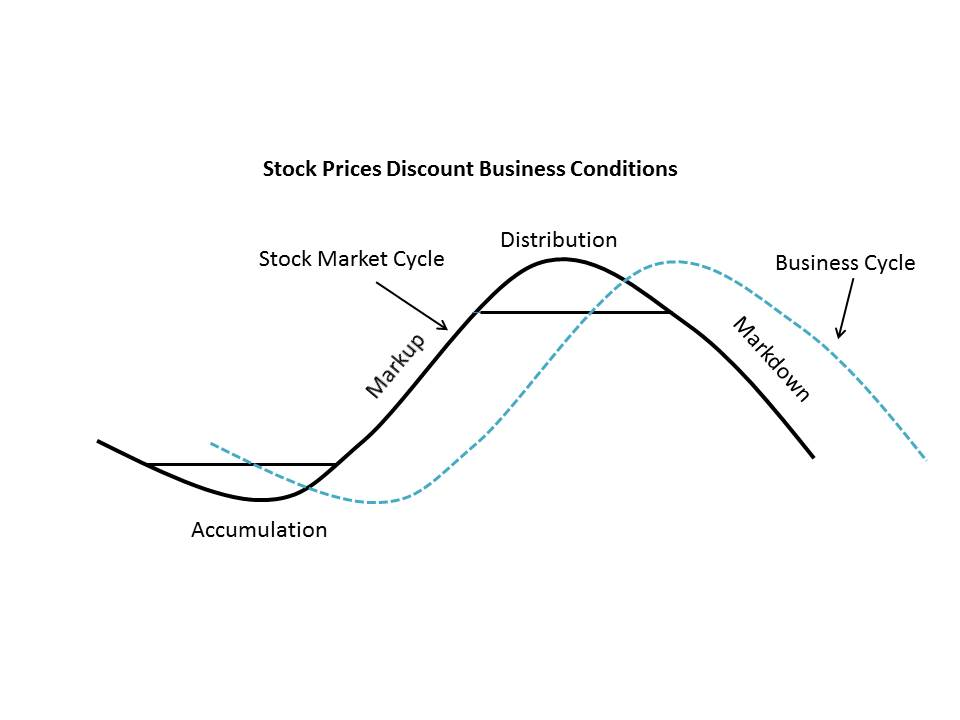
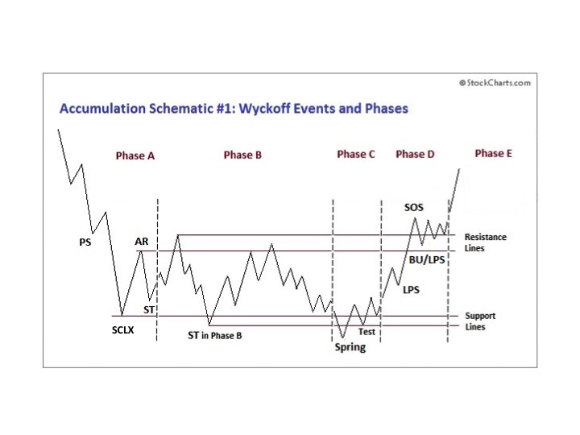
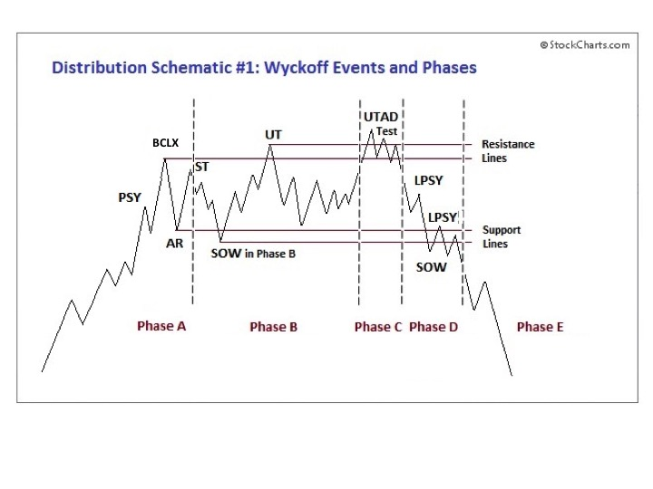

# Wyckoff Power Charting. Happy Birthday!

URL: https://articles.stockcharts.com/article/articles-wyckoff-2016-05-wyckoff-power-charting-happy-birthday/
Date: May 12, 2016 at 06:33 PM
Author: Bruce Fraser

We have reached the one year anniversary of the Wyckoff Power Charting blog. Many thanks for being enthusiastic and supportive readers. Let’s pause and look back at what we did in the first year.

Richard D. Wyckoff’s emphasis was, first and foremost, to educate investors about the ‘Real Rules of the Game’ of Wall Street. The public must understand that investing is a competition where they are trading against the sharpest minds and the best systems imaginable. The absolute finest of this professional class of investors are the ‘Super Traders’ whom we call the Composite Operator (C.O.). The C.O. is the very, very best on Wall Street and they manage inordinately large portfolios. When the C.O. finds a stock they plan on owning and campaigning, they build a huge position in it. This takes knowledge, time and skill. The C.O. class of investor also must compete with other large C.O. types to lock up the float of the available shares.

---

In the blog post ‘Getting Some Basic Terminology Under our Belts’ (click here for a link) we explore the investment cycle. The investment cycle is classically composed of Accumulation, Markup, Distribution and Markdown. This cycle repeats endlessly on Wall Street. Mr. Wyckoff wanted us to understand that the fate of a stock is the result of who owns it. Who has absorbed and controls the floating supply of shares available? The law of Supply and Demand is the dynamic at work here. If the Supply of shares is in the strongest hands (the C.O.) then the float is locked up. The Composite Operator, through their campaigns, have limited the shares available for others to buy. A slight increase in Demand for the shares, combined with scarcity of shares obtainable, will send the stock price rocketing upward.

The process of Absorbing shares of a stock is called Accumulation. After a markdown, the C.O. determines the price where value exists and Supply is present (the area of the Selling Climax, SCLX) and initiates the Accumulation process. This is the start of the absorption of the floating shares. Early blogs were devoted to the study of Accumulation, beginning with the stopping of a downtrend (SCLX). Then the C.O. carefully absorbs shares without unintentionally driving the stock upward until a full position is Accumulated. Mr. Wyckoff made the case that we could detect the footprints of the C.O. on the tape (in the vertical bar chart) as they stealthily did their work. Through the analysis of the Phases of Accumulation (click here for a link), Wyckoffians learn how to see the nuanced changes in the stock price action that tells of the completion of Accumulation.

Completing Accumulation (absorption) tips the Supply and Demand balance toward scarcity of shares and this puts the stock into a robust uptrend. The Wyckoff method has a unique and ‘all its’ own’ quality to trend analysis. Trend channels in the form of Demand Lines and Overbought Lines show the ‘Stride’ of the advance and provide junctures for the purchase of shares during the Markup. Trend analysis is unique in the ability to identify trend exhaustion which either leads to the Stepping Stone Reaccumulation or the Distribution Phase.

A Wyckoffian’s objective is to detect the stock that is under Accumulation and then to time purchases to coincide with the stock Jumping into an uptrend. The mission here is not to compete with the Composite Operator, but rather, to trade in concert with their campaigns.

Exhaustion of the uptrend arrives with a series of Climactic price spikes. Either a Stepping Stone Reaccumulation or a Distribution formation follows Climactic stopping action. A Stepping Stone Reaccumulation is a period of time in a trading range where stock is Reaccumulated for another leg up of the bull run.

Distribution arrives after many months to years of rising prices. The C.O. is very, very carefully selling their large holding of stock with the objective of not inducing weakness while they sell and prematurely putting the stock in a downtrend. A stock requires the active support of the C.O. to remain in a bullish uptrend. The removal of that campaign of support will stall the stock and produce a sideways market. The act of selling will eventually produce a bear market. The best markets to sell into are frothy with bullish news on the market and on the individual stock’s sunny prospects. This glow of good news has the effect of keeping institutions and individual investors in the stock and buying more. The paradox of good news at the top is one that Wyckoffians must guard against. Good news during Distribution and bad news during Accumulation is a signature of all market cycles. Selling in concert with the C.O. is the objective of Wyckoff Analysis.

The Markdown is the inevitable result of the C.O. finally selling all of their stock during Distribution. Typically the downtrend begins with a bang as prices tumble violently. Downtrend channels are very helpful tools for evaluating and trading bear markets.

In Wyckoff Analysis the compliment to the vertical bar chart is the point and figure chart. The horizontal counting method provides the Wyckoff trader the ability to estimate price objectives. By counting across the horizontal area of the Accumulation range or the Stepping Stone Reaccumulation the potential ‘reward’ or extent of the move can be calculated. Counting the Area of the Distribution and Stepping Stone Redistribution accomplishes the same objective for declining markets.

First Year Highlights for your Review (click on the title for a link):

'Wyckoff Walk Around the Clock' For a review of the investment cycle of Accumulation, Markup, Distribution, Markdown.

'Wyckoff Power Charting. Let's Review' A discussion of the Phases of Accumulation with Schematics.

'Context is King' A discussion of the Phases of Distribution.

‘The Laws of Wyckoff’ and ‘The Illustrated Wyckoff’ A discussion of the three laws of the Wyckoff Method.

'Intro to Point and Figure Construction' This is the first of seven posts devoted to horizontal point and figure construction and counting.

We have done much work in building the Wyckoff foundation during the first year. As year two begins, we will focus more attention on skill building and mastery development. There is also more to reveal about the method and its hidden secrets. Again, thank you for your readership.

Also, I would like to express my gratitude to Chip Anderson and the staff at stockcharts.com for their ongoing support of Wyckoff Power Charting.

All the Best,

Bruce

Professor Roman Bogomazov and I discuss the Wyckoff Method in a three part webinar series (6 hours in total) on May 9th, 16th and 23rd. Roman teaches the Wyckoff Method (online course) at Golden Gate University. It is not too late to sign up for this lively discussion of the Wyckoff Method. All sessions are recorded and available to each attendee. Join us for two more sessions of live discussions and review all of the recordings at your convenience. We will use the “Wyckoff Power Charting” blogs as the framework with additional material added. The fee for this series is only $49. Click here to sign up now.
