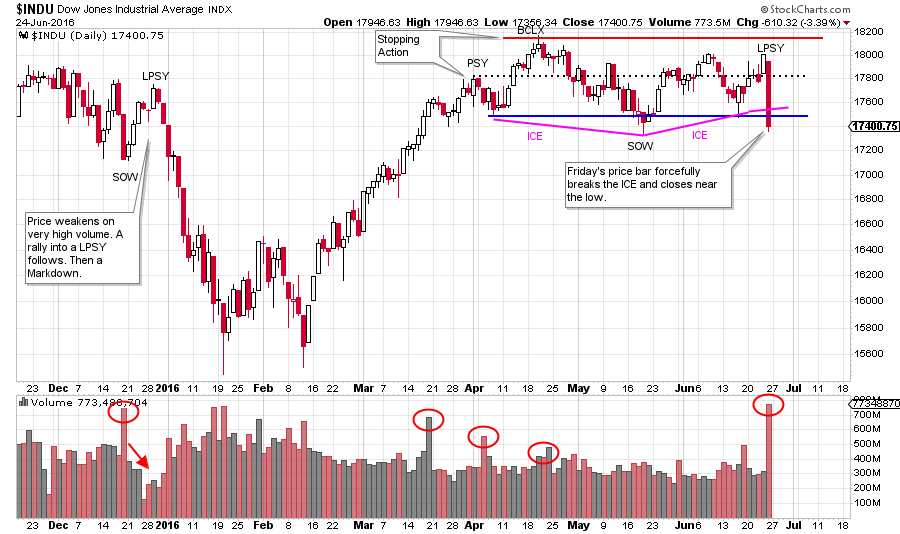
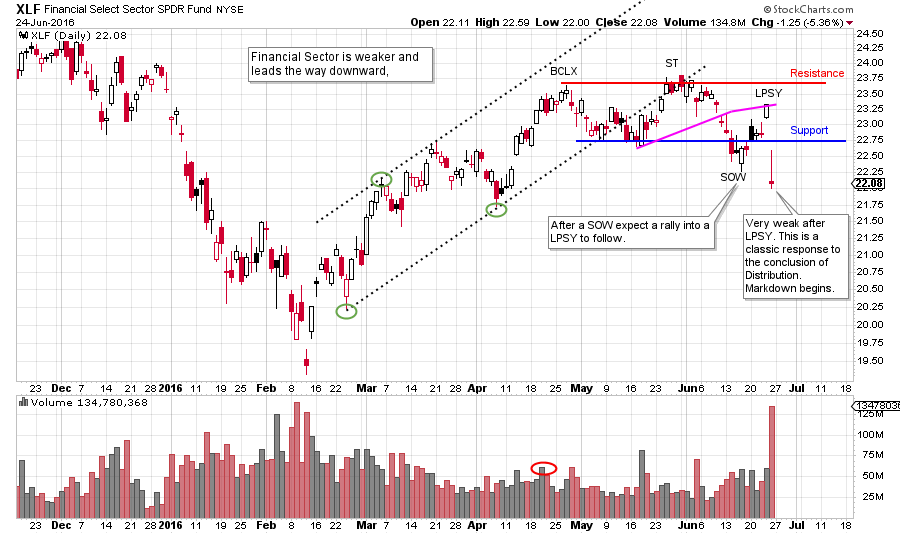
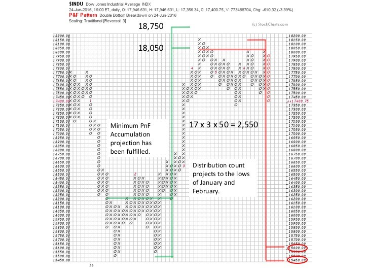

# breXit and O's

URL: https://articles.stockcharts.com/article/articles-wyckoff-2016-06-brexit-and-os/
Date: June 26, 2016 at 11:08 PM
Author: Bruce Fraser

Using the Dow Jones Industrials ($INDU) as a proxy for the U.S. stock market, let’s look at the market’s response to the Brexit vote. Is there a Wyckoffian theme unfolding that possibly provides some early advice on how to proceed from here?

Wyckoffians think in terms of scenarios. Now that price has returned to Support, we consider a bearish and a bullish response to the Brexit event.

---

In April a big bulge of volume accompanies Preliminary Supply (PSY) and a Buying Climax (BCLX). This supply checks the advance and indicates the C.O. is Distributing in this price zone. Thereafter, a long grinding decline takes $INDU back to the area of Support and slightly through it for a Sign of Weakness (SOW). ICE is an estimation of where Demand and Support reside. The index needs to hold above the ICE and rally away from it. When a market or stock is Distributing, there comes a moment when ICE is suddenly and forcefully broken. This appears to have taken place on the sharp Brexit decline. Volume was huge. We ask ourselves what typically happens after a breaking of the ICE?

Bull Case: Support is still in-play at this price level. A Spring of the SOW low and then a reversal up produces a rally back to the Resistance and potentially into a new uptrend. The Brexit decline is the conclusion of the Reaccumulation and the new uptrend begins.

Bear Case: The very big bearish Brexit bar off the Last Point of Supply (LPSY) is evidence of Distribution being nearly complete. LPSY (there can be more than one LPSY) is the last act of the Distribution phase. A period of Markdown follows the completion of Distribution. There are three classic responses $INDU could make at this level. First, the index rallies to about the mid-point of the Distribution range. The rally is of low quality and low volume. Such a rally would be labeled as another LPSY. This could take a few weeks. Second, the price does not lift and trades sideways under the ICE for a week or two and then resumes the decline down and away from the distribution area. Third, price weakness continues within a few days and the markdown is underway.

(click on chart for active version)

The volume indicates there was an abundance of supply on Brexit day. Markdowns often start in such a manner. The bull case would need $INDU to begin retracing the Brexit decline very soon with a robust jump back into the Resistance area and to the top of the trading range.

(click on chart for active version)

The Financial Select Sector SPDR ETF (XLF) has recently been weaker than the $INDU and the $SPX. This sector tends to be leadership (bullish and bearish). Since the beginning of 2016 the XLF has been a laggard. In May and June, XLF is weaker and is breaking into a Markdown after a SOW and LPSY.

Counting the trading range from March to the present as Distribution, there is 2,550 $INDU points generated so far. There could be more. This projects a price objective back to the range of the lows set in January and February. There is a case to be made for another LPSY forming, and this would make the count larger. Also note that the minimum bullish count generated early in the year has been met. The domestic stock market has been in a huge trading range since 2014. The Distribution count illustrated above returns the market back to the bottom of this large multi-year trading range.

Conclusion: the Brexit decline has taken the $INDU to the Support area. Price should attempt to hold in the area of Support. The quality of the rally (or the lack of) that follows will tell much about what comes next. For additional recent market studies click here and here.

All the Best,

Bruce

June Webinar Special: ‘Practices for Successful Trading: Establishing Routines and Effective Mental Habits’

Roman Bogomazov and I have created a new two part webinar series to help traders and investors adopt or refine the habits – psychological and analytical – needed to acquire mastery of the Wyckoff Method of trading. Join us for part two on Monday, June 27th and review both recordings at your convenience. (click here to learn more)
