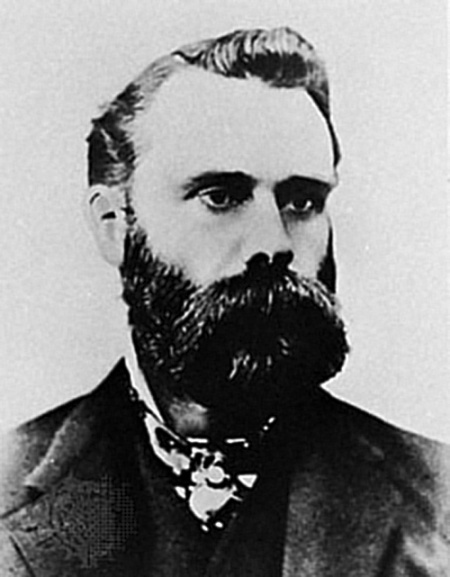
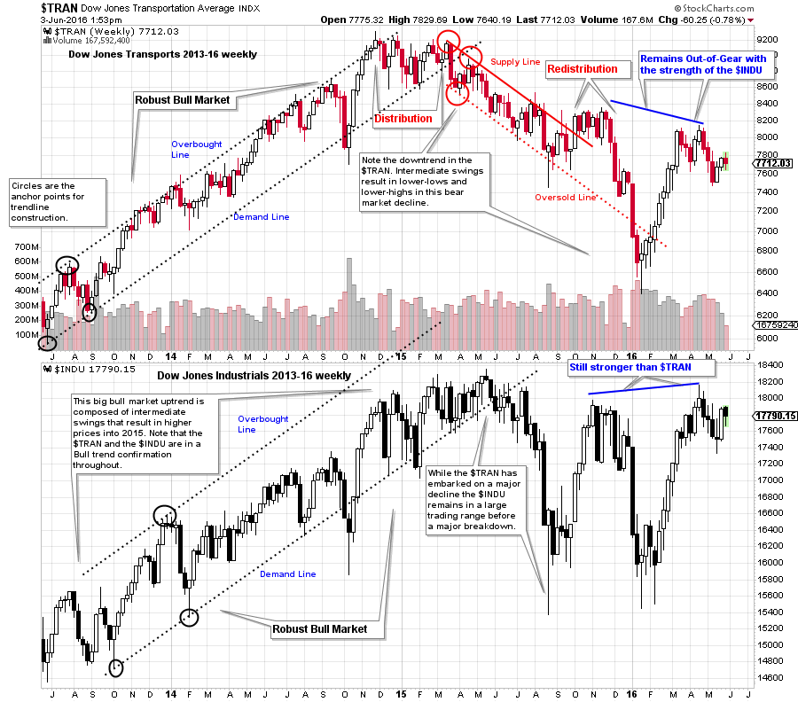
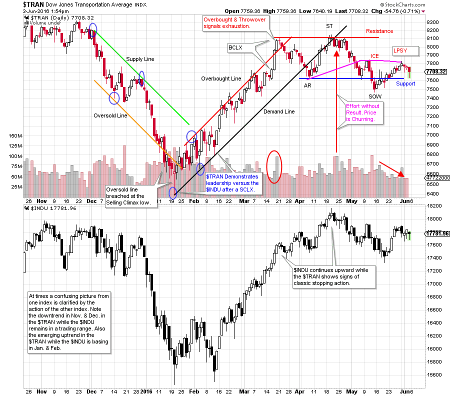
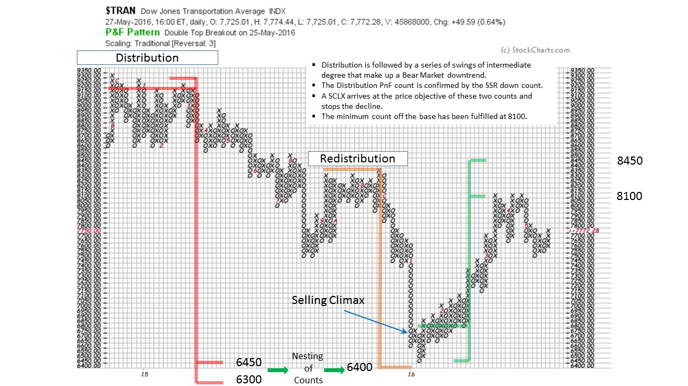

# How Now Charles Dow?

URL: https://articles.stockcharts.com/article/articles-wyckoff-2016-06-how-now-charles-dow/
Date: June 03, 2016 at 02:52 PM
Author: Bruce Fraser

My first teaching assignment at Golden Gate University was the survey course, FI352 ‘Technical Analysis of Securities’. This course is devoted to the study of the major technical analysis methods. It is a wonderful course for becoming familiar with the vast body of knowledge that is technical analysis. When I began teaching FI352 it was the only graduate course available on the subject at an accredited university. Today, in addition to FI352, there is an entire graduate degree program in technical analysis offered at GGU, and it remains the only program of its kind anywhere.

I would always open the FI352 semester with a lecture on Charles H. Dow and ‘Dow’s Theory’. His theory, in many regards, is the birth of modern day technical analysis. Chart analysis was in use before his arrival on Wall Street. But it was his innovations, in my opinion, that revolutionized the study of markets and influenced so many of the tools we use today and the common understanding we have about how markets work.

---

In the early 1880’s, Mr. Dow and Edward Jones began publishing an afternoon two-page summary of the day’s financial news. Included was an 11 stock index mostly composed of Rail stocks. This publication was delivered throughout New York City and became indispensable to those working in finance at the time. At the end of the decade this publication became the ‘Wall Street Journal’. A few years later Mr. Dow created the Dow Jones Industrial stock index which was composed of 12 industrial stocks. About a year later he added a Dow Jones Transportation stock index. These two indexes became very popular and were watched very closely.

Mr. Dow was of the strong belief that stocks tended to move upward and downward together. Like a flock of birds, most stocks moved in lockstep with the overall direction of the market indexes he published. He observed three degrees of movement in the markets; a major move lasting years, an intermediate move lasting months, and minor swings lasting weeks. Mr. Dow noted that the major trend of stock prices tracked the ebb and flow of business conditions and broad economic activity. His industrial and transportation stock indexes were very useful in indicating the health and direction of the economy.

Another very important observation was that stocks tended to ‘discount’ future economic activity. As we have discussed in earlier blogs, stocks (and therefore the stock indexes) tend to change their trends months prior to the turn in broad economic activity (click here for a link to an earlier blog on this subject). The stock market is a very reliable leading indicator of changes in economic activity.

These theories were published by Mr. Dow on the editorial page over a period of years. The collection of these editorials became known as ‘Dow’s Theory’ or ‘The Dow Theory’.

Central to the Theory was the definition of a trend. A Bull Market uptrend was composed of a series of higher high prices and higher low prices in the Dow Jones Indexes. Intermediate swings of weeks to months in duration would trace out these trends to ever higher prices that make up a big Bull Market. Bear Markets were a series of lower high index prices followed by lower low prices. The broad conclusion to be made was that business conditions would follow the lead of these big upward and downward stock index trends.

After Mr. Dow’s death, numerous outstanding market analysts carried the baton of The Dow Theory and added their own ideas to it. As Wyckoffians we acknowledge this robust theory for all it has done for the development of the study of markets. The Dow Theory advanced the concepts of indexes, industry groups, chart analysis, and on and on.

From the study of index charts and stock charts Mr. Wyckoff developed his own methodology. He was familiar with the theory and paid close attention to the published indexes.

As a ‘Tip of the Hat’ to Mr. Dow, we will compare the Dow Jones Industrial Average and the Dow Jones Transportation Average and add in some Wyckoff Analysis. The analysis and comparison of the Industrial Average and the Transportation Average can be as useful today as it was a century ago.

(click on chart for active version)

A key tenet of the Dow Theory is that when both the Transportation and Industrial Averages trend together, a bull or bear market is confirmed. From 2013-15 we see robust uptrends in both averages and this would be considered a bull market. In 2015 the Transportation Average enters a downtrend while we might describe the Industrial Average to be in a giant trading range. The theory states that the Industrials reflect the health of manufacturing and the Transports indicate that the goods manufactured are (or are not) being shipped to market. If these two gauges fall out of synch with each other then the economy is not humming along. There is stress developing for the broad business environment. A decline in both averages portends a slow down or recession in business conditions.

On the weekly charts above, we can see a Selling Climax in January of 2016 in the Transportation Average and this was followed by a robust rally. But the rally, so far, has been to a lower high. It appears that the Transports are still lagging the Industrials but the Selling Climax is suggesting the downtrend may be over.

(click on chart for active version)

Zooming in to the daily chart the $TRAN culminates the downtrend with a SCLX (mid-January) and then acts distinctly stronger than the $INDU by beginning an uptrend early. The robust uptrend ends with a BCLX and a throwover of the Overbought line. Support and Resistance lines can be drawn after the Automatic Reaction (AR). Classic signs of Distribution are emerging. We note the decline into a Sign of Weakness (SOW) on expanding volume. The rally that follows is of poor quality as the volume diminishes on the rise from 7500 to 7800. After a SOW we look for a Last Point of Supply (LPSY). Weakness typically follows an LPSY. One potential scenario is that $TRAN declines, but stays above the February low. This could indicate a bigger base being formed (with a larger PnF count) for a more sustainable bull run later on.

If the current trading range in the $TRAN is a Stepping Stone Reaccumulation, we would want to see the volume become dull and quiet on the pullbacks while expanding on the rallies. The evidence does not yet suggest this scenario.

The minimum objective of the Distribution count is an exact hit. Also this is confirmed by a Stepping Stone Redistribution count to the same target. Note that a large SCLX develops right into these downside price objectives which helps to confirm that the PnF price targets are working. In 2015 there appears to have been a bear market in the Dow Jones Transports while the Dow Jones Industrials muddled along in a large trading range. Fulfilling the PnF downside projections combined with a ‘Change of Character’ in the Transports is an encouraging sign for the bulls. While the $INDU is near all-time high prices, the $TRAN is not. Both indexes, in gear together and in strong uptrends would be a good sign for the stock market and broad business conditions.

Mr. Wyckoff was influenced by the development of the Dow Jones Indexes and Charles Dow’s Theory. He added to this body of technical analysis knowledge by developing his own buying and selling tests that built on these principles as well as other valuable indicators. In future posts we will explore these contributions by Mr. Wyckoff.

All the Best,

Bruce

(Although not in use today, the phrase "how now" is a greeting, short for "how say you now", and can be found in archaic literature, such as the plays of William Shakespeare. -Wikipedia)
