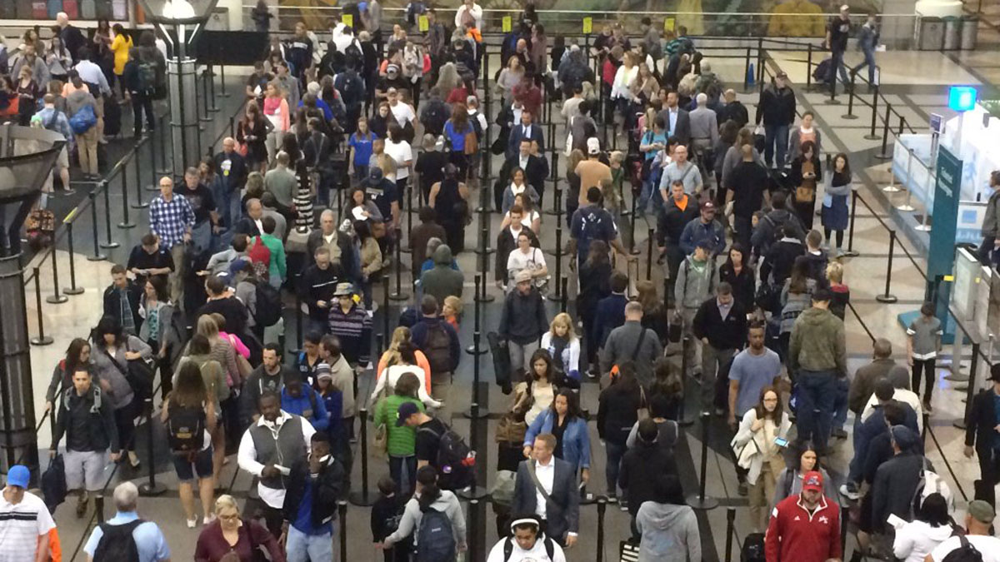
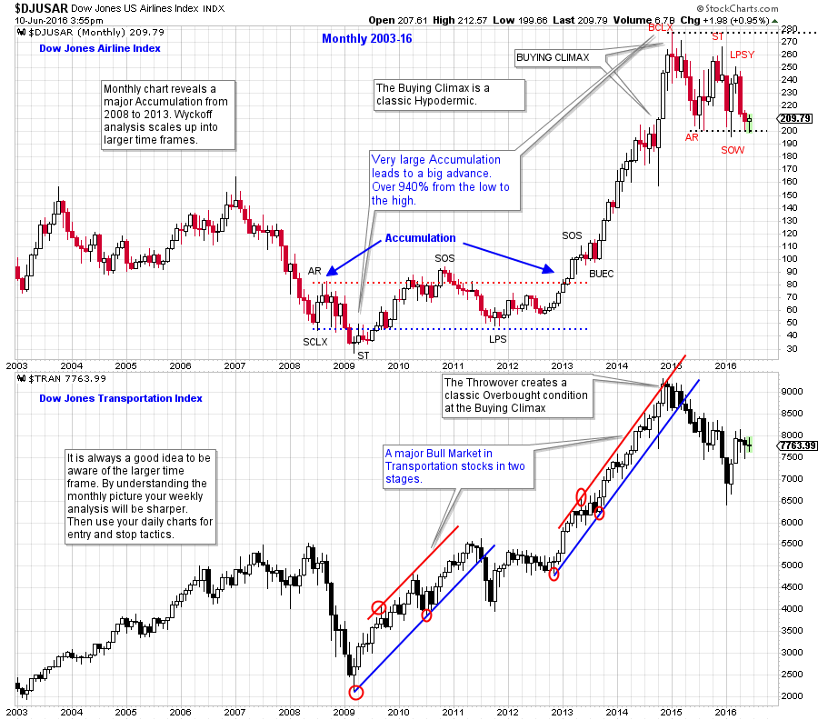
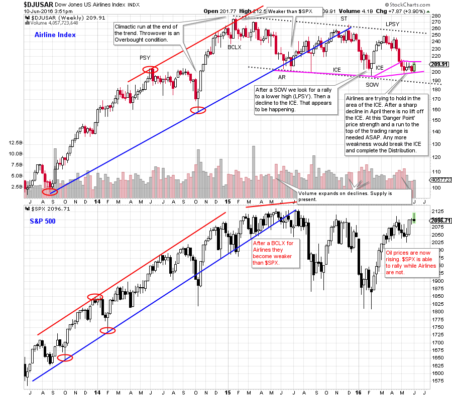

# The Unfriendly Skies

URL: https://articles.stockcharts.com/article/articles-wyckoff-2016-06-the-unfriendly-skies/
Date: June 10, 2016 at 04:03 PM
Author: Bruce Fraser

Mr. Wyckoff’s counsel was to learn how to read the tape and then to determine buying and selling decisions by the price action. For Mr. Wyckoff ‘reading the tape’ was best done by plotting the price onto a chart and then interpreting the chart. Our mission in ‘Wyckoff Power Charting’ is to elevate our tape reading skills through the endless practice of chart analysis.

In our last post we compared the Dow Jones Transportation Average to the Dow Jones Industrial Average. The Dow Theory was founded on this type of analysis. Let’s drill down into the Transportation Average and study one of the key industry groups; Airlines.

---

(click on chart for active version)

Monthly charts can be illuminating. A nearly five year long Accumulation forms after the bear market of 2007-09. The structure of classic Accumulation can be observed and labeled on this monthly vertical chart. A big Cause leads to a big Effect. From the low to the high this six year advance in the Airlines industry group leads to over a 940% advance. At the conclusion of the bull run a dramatic Buying Climax forms. After the climax, the price structure has the characteristics of Distribution. We will zoom into a weekly view for more detail.

(click on chart for active version)

After the rush into the Buying Climax, classic Distribution forms for the Airlines. The rally from the Automatic Reaction (AR) to the Secondary Test (ST) is of poor quality and the result is a decline into a Sign of Weakness (SOW). After the SOW for both the $SPX and the Airlines industry group, the two indexes diverge from each other. The S&P 500 remains strong and matches the prior high, while the Airlines make a lower peak. This is labeled a Last Point of Supply (LPSY) because of the prior SOW. Recall that when a lower low forms (SOW), Wyckoffians are on the alert for a LPSY which is a lower peak. An LPSY typically results in a bear market downtrend. Note how the Airlines have become weak after the LPSY and are now hovering just above the prior (February 2016) low. This is where ICE forms. Now at the bottom of this trading range, Support needs to hold and a rally begin. Falling through the ICE can result in a breakdown and the resumption of the downtrend.

All the Best,

Bruce

June Webinar Special: ‘Practices for Successful Trading: Establishing Routines and Effective Mental Habits’

Roman Bogomazov and I have created a new webinar series to help traders and investors adopt or refine the habits – psychological and analytical – needed to acquire mastery of the Wyckoff Method of trading. (click here to learn more)
