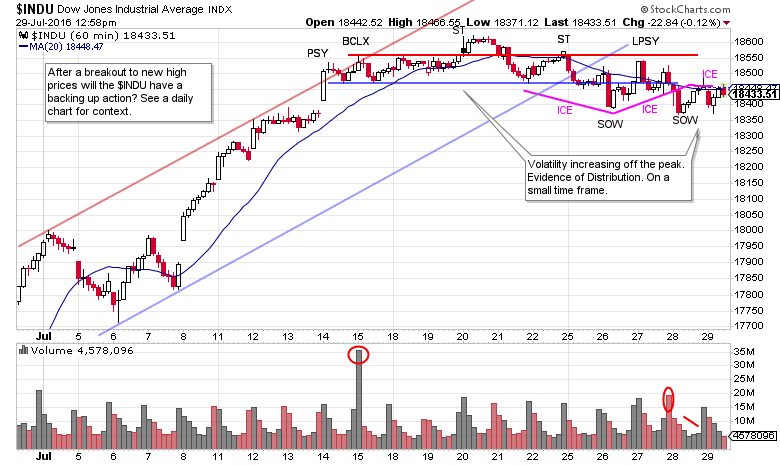
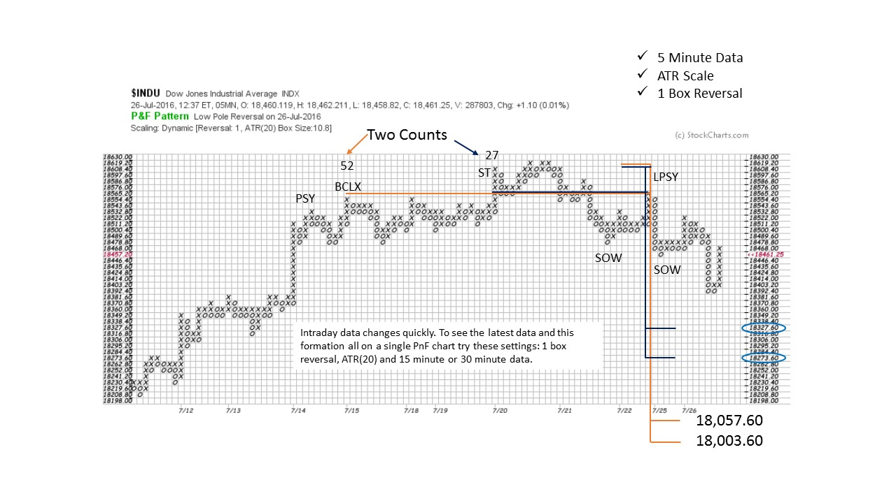
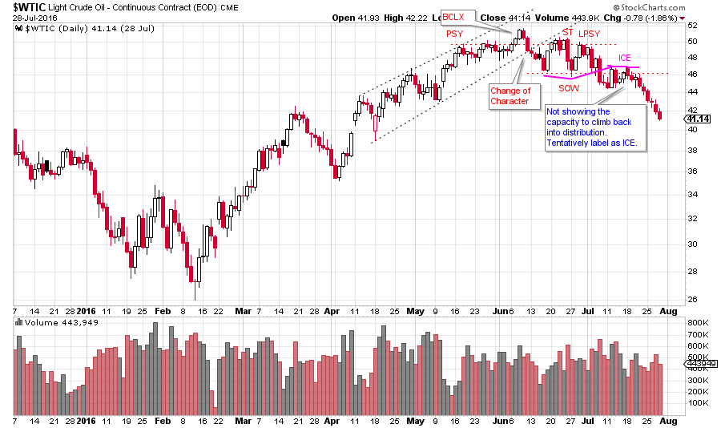
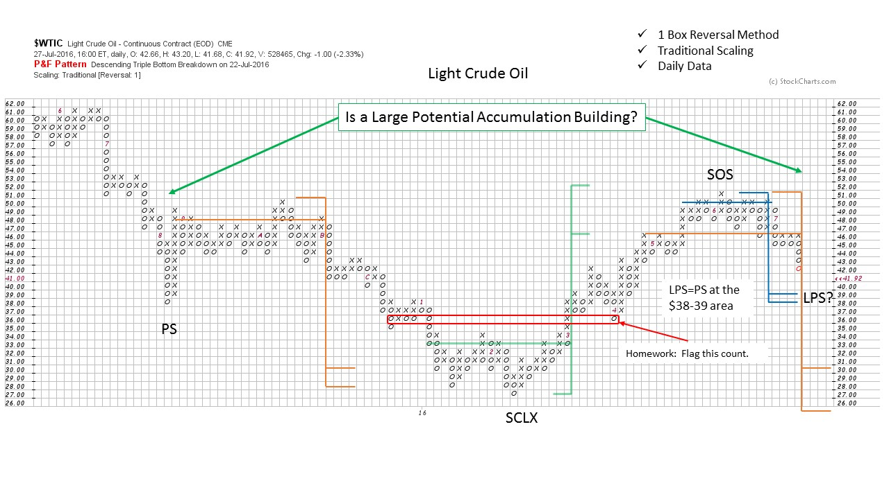
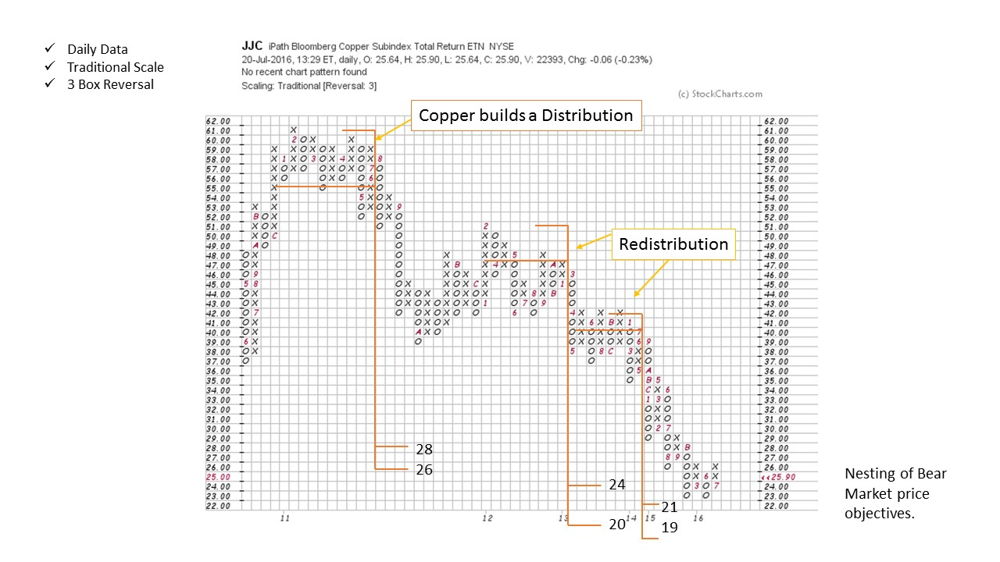
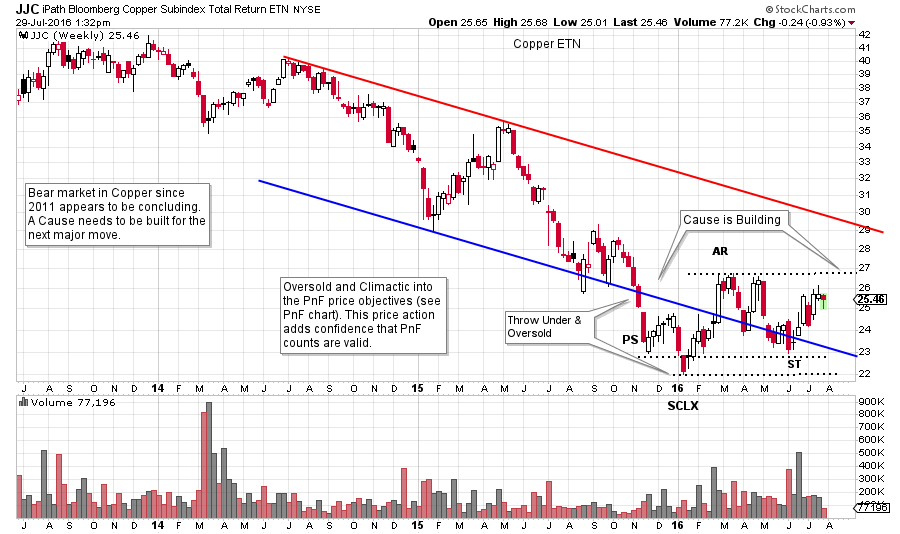

# Beach Reads

URL: https://articles.stockcharts.com/article/articles-wyckoff-2016-07-beach-reads/
Date: July 29, 2016 at 03:02 PM
Author: Bruce Fraser

During the long hot summer, it is a wise idea for Wyckoffians to go to the beach (or the pool) and relax, recharge, and do some light reading. My favorite summer reads are…. Charts!! What could possibly be more relaxing and enjoyable. So get your tablet (or laptop), find a beach towel and start reading.

I am off to the beach to take some of my own medicine. So here are some charts that I am going to be looking at while having fun in the sun. May these charts get your rest and relaxation off to a good start.

---

(click on chart for active version)

Here is a 60 minute chart of the Dow Jones Industrials. Note the stopping action at the Preliminary Supply (PSY) followed by a Buying Climax (BCLX). Thereafter the $INDU has become range bound and increasingly volatile and Distributional in nature. After the peak at the Secondary Test (ST), volatility emerges and this is a sign of large interests selling stock. Smaller timeframes like this 60 minute chart will still have Wyckoff attributes, and events will unfold more quickly. After a robust breakout (see a daily or weekly $INDU chart) to all-time new high prices, a backing up action would be expected that returns the index back toward, or slightly in to, the breakout area. The Distribution on the 60 minute chart could be an indication that such a backing up action is at hand. We will turn to a Point and Figure chart to estimate the potential that has been generated in this Distribution.

This PnF chart is constructed with 5 minute data. Note that it encompasses the timeframe of the 60 minute vertical chart. When constructing PnF charts, different time intervals can be used when comparing the vertical chart to the PnF chart. The key is that each price point evaluated on the vertical can be identified on the PnF for counting purposes.

ATR scaling and the 1 box reversal method yields a substantial short term price objective. Two counts are generated, a conservative count and a more aggressive one. The smaller count returns the $INDU to the top of the breakout area and does not settle back into the prior high prices. While the larger count dips back into the area of the old high prices. Using stockcharts.com make a daily and a weekly vertical bar chart to visualize how this retracement could occur.

(click on chart for active version)

Light Crude Oil ($WTIC) has a family resemblance to the $INDU above. The Distributional qualities outlined for the $INDU are at work here. $WTIC is a daily chart, therefore the scale of the Distribution is more extensive than the $INDU. After the peak price at the BCLX, there is a change of character where $WTIC then becomes volatile. This classic Distributional price action results in a breaking of the ICE and then a steady markdown.

Ponder this chart while you are getting sand between your toes. The earlier counts worked out well. Two current Distribution counts are shown. If the smaller count is accurate then a nice symmetry is formed from the LPS to the PS, and a mega PnF Accumulation count objective could be in the works. The larger Distribution count returns the $WTIC back to the low of the trading range.

Copper has been in a bear trend since 2011. Here is a 3 box reversal PnF chart of the copper ETN (JJC) that has a Distribution count and two Redistribution counts on the way down. Note how they are nesting into a price range and establishing ‘confirming counts’. Copper has met these objectives and appears to be attempting to stop the decline. If this is the area of the low, we would expect to see a Cause built in copper for a new bull market. Make a one box reversal PnF chart and try to determine if copper is in the early stages of Accumulation. Also have a look at the daily vertical bar chart.

Here is a weekly chart of copper for your review. Note that a Cause appears to be building. There is more Accumulation work to be done. Also, note the price throwing under the Oversold line and forming a PS and SCLX into the area where the JJC PnF chart had price objectives.

Fellow Wyckoffians notice how rested, relaxed and recharged you are beginning to feel. Now see what other amazing charts you can find.

All the Best,

Bruce
