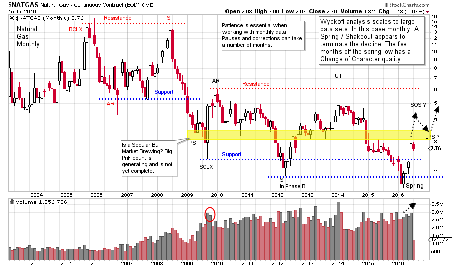
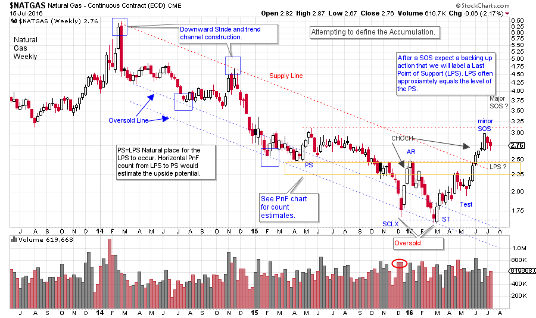
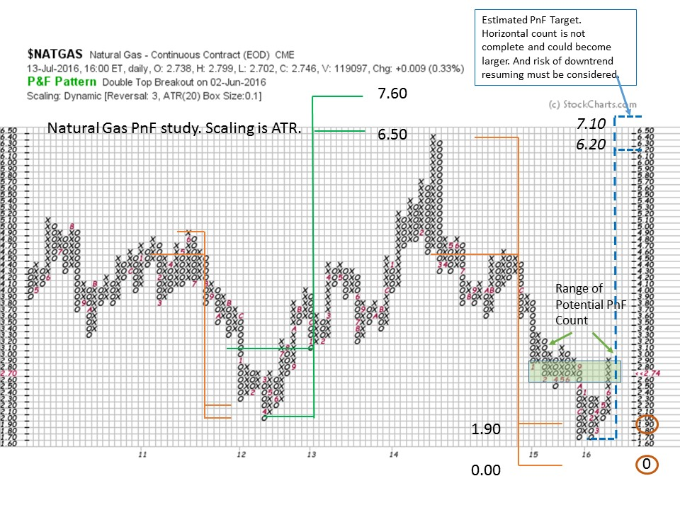

# Getting on the Gas

URL: https://articles.stockcharts.com/article/articles-wyckoff-2016-07-getting-on-the-gas/
Date: July 16, 2016 at 04:06 PM
Author: Bruce Fraser

Since 2008 natural gas has been in a downtrend and has generally under-performed crude oil, common stocks and other commodities. Recent price strength for natural gas could be indicating change is in the air. Is this a sign of better days ahead or just a tease before prices sag and lag again? Let us review this market with a Wyckoffian eye and attempt to divine whether there is potential to profit from an emerging new bull market.

Wyckoff analysis scales well into various time frames. In prior posts we have explored intra-day to weekly to monthly time frames. We will begin by evaluating the continuous futures contract of monthly natural gas prices ($NATGAS) to assess the prior bear trend and get a big picture grasp on current price activity.

---

(click on chart for active version)

It is so important to go up one or two time frames above where you are trading. If trading intraday, study the daily and the weekly time frames. Often the biggest and best moves are easier to see in the next larger time period. Also, big negative surprises are often identified and avoided by being in tune with the bigger picture. The monthly chart of $NATGAS is telling a Wyckoffian tale. The bear market began with a 2005 Buying Climax and a 2008 Secondary Test, and has made lower lows in ‘09, ‘12, ‘15 and ‘16. A Selling Climax (SCLX) and Automatic Rally (AR) set up the outer boundaries of a potential Accumulation in 2009. Note how well this has contained the trading in $NATGAS since. The potential Accumulation is nearly seven years in duration. Such a long period of underperformance and lower prices creates apathy among investors and traders that is difficult to reverse.

A Spring in the first quarter of 2016 has resulted in a notable rally that has snapped prices back into the Accumulation area quickly. We will call this a Change of Character (CHOCH) and watch if and how $NATGAS works back toward the Resistance area of the Accumulation around the $6 level.

$NATGAS remains very near the bottom of the trading range and still has a high risk of turning down and making new lows. A series of bullish Wyckoff type events are needed from here to confirm that a new bull trend is possible. The promise of the monthly chart is a Cause that has been forming for nearly seven years while $NATGAS was all but forgotten. A Spring has just been made and $NATGAS is jumping back into the Accumulation. The rally, post Spring, should be dynamic with good jumps and modest backups as price marks up toward Resistance. A decline into a Last Point of Support should retrace no more than one half of the gain made off the low. Less is better. Let’s turn to the weekly chart to refine our analysis.

(click on chart for active version)

Zooming into the weekly timeframe provides another perspective. At the beginning of 2014 $NATGAS Upthrusts the Resistance area (see monthly chart) and climaxes. The two year downtrend results in an Oversold condition and the Spring that we identified on the prior chart. Note the quality of the rallies after the SCLX and the Secondary Test (ST). These rallies have an ease of movement that is much better than any prior rally in the downtrend. This is a notable Change of Character (CHOCH). Also, observe the ease with which the price went from an oversold condition (at the bottom of the trend channel) to jumping out of the top of the channel during this recent rally. Wyckoffians will look to a CHOCH as a clue to important changes in the trend of prices. The Oversold condition is the Spring on the monthly chart and illustrates why being aware of the larger timeframe is critical. Recall that after a SOS we expect a backing up action that results in a Last Point of Support (LPS). Price drifting down into a LPS will provide a couple of benefits. First, an LPS is a classic zone for entering a trade and secondly, the PnF horizontal count is taken from the LPS to the SCLX and the Preliminary Support (PS). There can be more than one LPS during the price rally up and out of the Accumulation area. $NATGAS will not be out of the Accumulation area and into an uptrend until it gets and stays above the $6 area. This is a long way away. In the monthly time frame a reaction from the SOS to the conclusion of a LPS could take six months or more. Rallies can go on for many months also. We must be psychologically in synch with the time frames being studied and traded.

Prior PnF counts of $NATGAS have been useful, as we can see on this three box reversal PnF chart. We have elected Dynamic ATR for calculating the scale. The current count is not yet complete as it needs a LPS. The green shaded box is a guess about the potential horizontal size. Currently 14 columns are counted. At 15 columns there is enough fuel to get to $6.20 which is the area of Resistance on the monthly chart. It could take more time and numerous additional columns to complete the PnF horizontal count. We must let the tape tell us when and if the Accumulation is complete and an uptrend is brewing.

$NATGAS is showing us an Accumulation structure on the Monthly and the weekly charts. If $NATGAS can get to the top of the monthly Accumulation, PnF counts could be generated that portend an advance of major bullish potential.

All the Best,

Bruce
