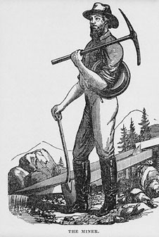
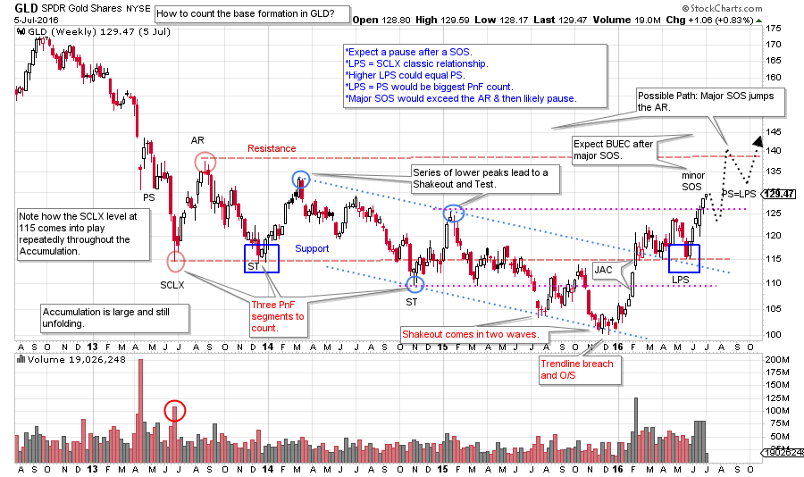
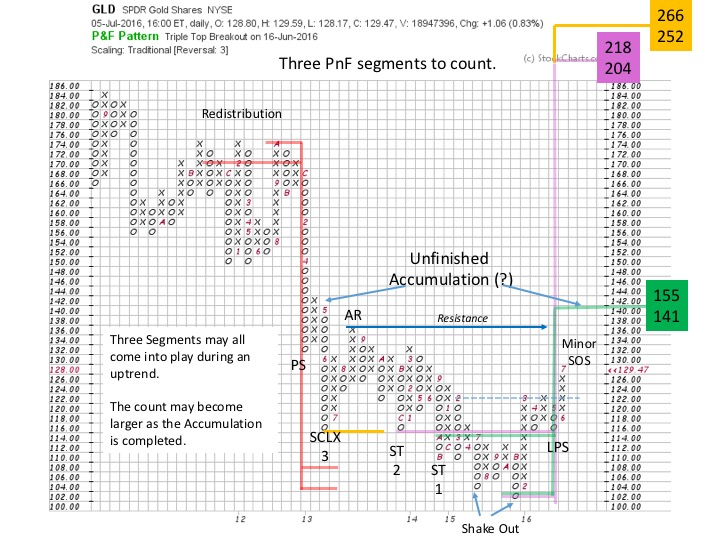
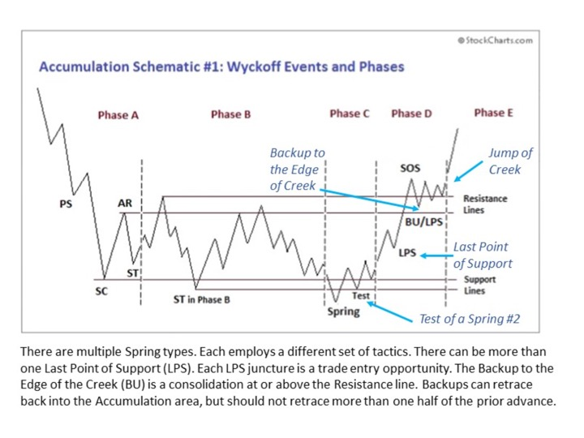

# Gold Fever

URL: https://articles.stockcharts.com/article/articles-wyckoff-2016-07-gold-fever/
Date: July 08, 2016 at 12:40 PM
Author: Bruce Fraser

My grandfather and great grandfather were gold miners. They took their ‘grubstake’ to Alaska and the mountains of California. After many adventures they succeeded with a small working gold mine in Northern California. You should know this when reading this post as, by heredity; I may have a touch of ‘Gold Fever’.

To tamp down my perma-enthusiasm for gold I am first and foremost a Wyckoffian. Let us do the Wyckoff Drill on the SPDR Gold Shares (GLD). GLD is designed to track the price of the cash gold market. A share of GLD is valued at about one tenth the price of an ounce of gold. It has been a reliable proxy for the price of gold and it is traded by many gold enthusiasts. There are other gold tracking instruments that differ in composition and thus may be more suitable for your objectives.

---

After a long and grinding bear market for gold, a powerful turn upward in January and February has persisted through mid-year 2016. Is this the start of a new gold bull market? Does it have the potential to keep rising? How far can GLD go and how long can it go?

(click on chart for active version)

Notice the largest bulge of volume at the Preliminary Support (PS) which often happens. The Selling Climax follows, also on very high volume. The Automatic Rally (AR) and the SCLX set the trading range of the Accumulation, which has been three years in the making. Lower peaks (circled in blue) keep the meme of a downtrend in force and mask the Accumulation at work under the surface. A classic trend channel is drawn and highlights an oversold condition in July ’15 and November ’15. We are calling this a Shakeout as it deeply penetrates the SCLX level and remains below for an extended period. The $100 level holds by 23 cents, a key round number and important support.

The rally that starts at the beginning of 2016 is a ‘Change of Character’. Springs and Shakeouts often reverse in such a dramatic fashion. Is the rally nearly over or is there more fuel in the tank? First note that Gold is still within the Accumulation structure. The peak of the Automatic Rally (AR) is Resistance and defines the upper border of Accumulation. Gold has not yet rallied to Resistance. A Sign of Strength (SOS) is a rally that has the power to push higher than a prior important peak. A Minor Sign of Strength has just occurred with a move above $125 (prior important peak). Often a SOS indicates resistance is forming and price needs a rest. There are three key peaks in the Accumulation that are magnets for a SOS followed by a Backing Up action (more on this later).

Labeled on the PnF chart are the essential points from the vertical chart. We always take our horizontal PnF counts from the analysis of the vertical chart. Is there enough fuel in the tank (pent up Accumulation) to make a campaign in GLD worthwhile? We always count from right to left and the LPS will be our anchor on the right side to begin counting. Three segments are counted, two Secondary Tests (ST) and the SCLX. Each of these counts is flagged on the PnF chart. The count could become bigger if GLD rises to the Resistance area and forms additional LPS and Backup levels as these can and would be counted.

The first segment (smallest count) takes GLD to the Resistance area at 141 / 155 which would produce a Major Sign of Strength and complete the Accumulation. The next segment counts to an exact double of the 102 low. There is substantial fuel in the tank to propel GLD higher. The segment from the LPS to the SCLX targets a price of 252 / 266.

Horizontal PnF counting is a powerful tool as it offers a method for estimating the extent of a price movement. But it cannot reveal the time it will, take or the path. The ‘Art of the Campaign’ is a major subject for future consideration. Here is an article co-authored by Dr. Pruden, Prof. Bogomazov and your blogger on another campaign that could illuminate how to proceed with GLD (click here for a link).

Take a moment to study and compare the above schematic to our GLD chart. Typically markets do not move in a straight line. At times markets are in hurry, and then they languish. Wyckoffians learn to let the markets lead the way. This schematic provides a potential roadmap for how prices emerge from Accumulation. It could help us to understand how GLD will stair step its way into an uptrend. There is Resistance at the upper bounds of the Accumulation that must be worked through. This will create pauses and opportunities to climb on board GLD. There is something here for investors and for traders. Investors will look to the dull periods when prices sag to build a position for a long term campaign while the trader will be poised for when dull and quiet prices morph into jumping action and the emergence of a new uptrend.

All the Best,

Bruce

Seminar Announcement: "The Art of Stock Campaigning Using the Wyckoff Method", Roman Bogomazov, Hank Pruden and I will be conducting a day long seminar in San Francisco on August 19, 2016. For additional informationclick here.
