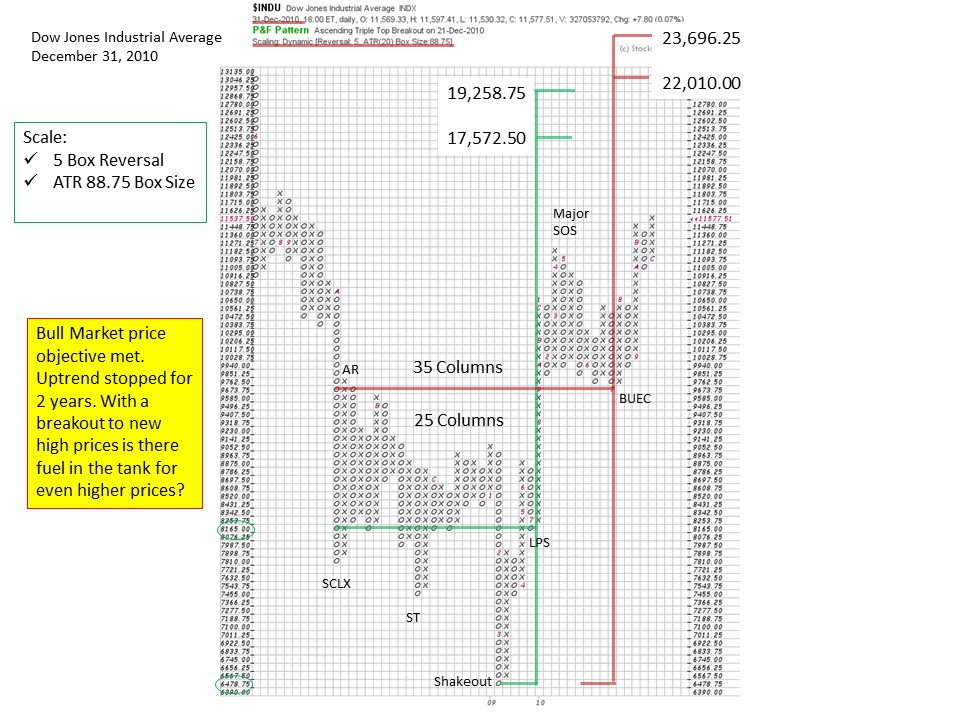
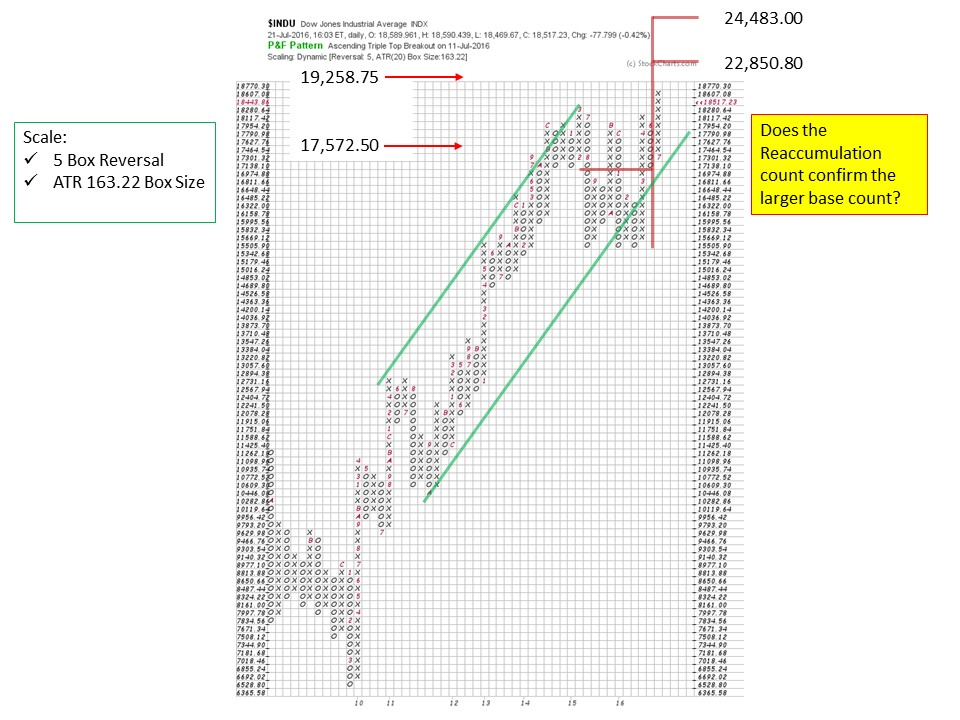
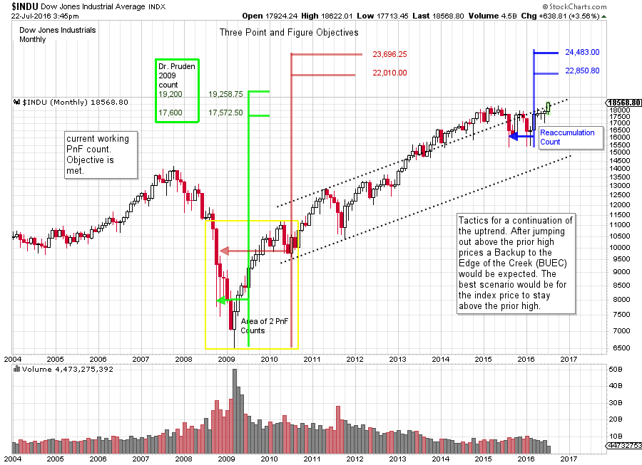

# Point and Figure Pie in the Sky?

URL: https://articles.stockcharts.com/article/articles-wyckoff-2016-07-point-and-figure-pie-in-the-sky/
Date: July 22, 2016 at 04:12 PM
Author: Bruce Fraser

During the bear market that ended in 2009, the broad market indexes traced out a large base. Using the horizontal Point and Figure counting methodology, a Wyckoffian could generate a very large price objective. The countline was at the 8,100 level on the Dow Jones Industrial Average, with a low of 6,500. Once the Accumulation zone was completed the price projection was a range of 17,600 to 19,200. At the time the wheels appeared to be coming off all of the financial markets. While the gloom was thick, the Composite Operator was absorbing shares of stock with the expectation of higher prices, much higher prices. In December of 2014 the $INDU peaked at 17,991.19 fulfilling the lower 17,600 projection. During the following 18 months the $INDU index has been unable to rally to, or above, the 19,200 zone. The recent run to a new high has taken the $INDU to 18,622, still nearly 600 points below the 19,200 upper target.

Looking back at the projection generated from the base horizontal PnF count we must conclude that it was a remarkable projection. Dr. Hank Pruden published this count in the International Federation of Technical Analysts Journal in 2011 (click here for a link to this excellent article, pages 29 to 34). Now that the Dow Jones Industrials is 3% from the upper count, Wyckoffians should consider possibilities and tactics.

---

The post Brexit new high in the $INDU and the $SPX has generated much excitement. While Wyckoffians are intently focused on 19,200 as a potential stopping level, many are asking if this market has the capacity to begin a new uptrend. Mr. Wyckoff would counsel that reaching a PnF objective is not, in itself, a reason to close out a position, or change long term strategy. Rather it is a signal to ‘Stop, Look and Listen’ to the market for other evidence that reinforces or refutes the PnF count objective just attained.

The Case for Distribution. An Upthrust After Distribution (UTAD) is like a Spring at the completion of Accumulation. A UTAD is the last gasp push to new high prices. This is an attempt by the C.O. types to trap the breakout buyers with a convincing drive to new highs after an area of Distribution. This brings in new money to buy stock with the expectation of a fresh new uptrend starting. A UTAD will not linger long at new high prices. After a sharp and final breakout, expect one or two thrusts upward and then a turn downward. Once price falls back into the Distribution area, assume that prices can fall rapidly. The sequence that follows a UTAD would be a Sign of Weakness (SOW) and then a Last Point of Supply (LPSY) followed by a bear market downtrend. The danger of a UTAD is in the name itself. Distribution precedes the Upthrust, which means that C.O. selling is complete and markdown is the next important chart action. The result is that price can markdown at an alarming rate from the UTAD to the bottom of the prior trading range (think January lows) where a SOW is made.

A sound strategy for this scenario is to snug up stops on long stock positions to just below the break out high price in the Indexes. As an example, the $INDU should not return to the Brexit low price and thus would represent a good tactical place for stops. A return of more than one third of the prior trading range would be a warning.

The Case for a New Uptrend. A Backup (BUEC) action will usually follow a good breakout. The shallower the BUEC the better. A return to the breakout level should, at most, minimally dip back into that level. It is even better to stay above the breakout zone.

Is there more fuel in the PnF tank for higher prices? Dr. Pruden presented his bull market PnF count objectives at the annual IFTA conference in October of 2009 as the $INDU was jumping out of the large Accumulation structure. These charts were published later in the IFTA Journal. In 2011 a large BUEC formed as the market indexes settled back to the Accumulation of 2008-09. Typically the BUEC is the most aggressive PnF count. Let us take that count and determine if there could be more fuel for higher prices.

This PnF chart is modified from the original chart from 2009. Here we use a 5 box reversal method and the scaling is ATR 20 (click here for discussion of ATR 20 scaling). Even with these changes our counts should be consistent. In green is the original 2009 count Dr. Pruden made. Our PnF chart (using 5 box reversal and ATR20 settings) projects to 17,572.50 to 19,258.75, very very close to Dr. Pruden’s 17,600 to 19,200 original count. Next we add the newer data generated by the count from the BUEC to the SCLX. 35 columns produce a much larger objective of 22,010.00 to 23,696.25. It is always best to work off the conservative counts before extending to the more aggressive objectives. The lower counts appear to have stalled the averages for 18 months and the upper range of the count has still not been exceeded.

There is another Stepping Stone Reaccumulation count that was just generated in 2016. Does it confirm the bigger Accumulation count? The target of this Reaccumulation is 22,850.80 to 24,483.00 and is very close to the larger Accumulation count. It is a confirming PnF count!!

Legendary technician and investor Marty Zweig famously advised ‘Don’t Fight the Fed’. Typically the final phase of a bull market is buffeted by rising interest rates and a hostile Federal Reserve Bank. Currently the Fed has a zero interest rate policy and no appetite for raising rates anytime soon. With an accommodative Fed and more fuel in the PnF tank it is entirely possible that another leg of the bull market is ahead of us.

(click on chart for active version)

Summary. The 17,600 to 19,200 PnF count objective is the active price projection (click here to see a chart). Wyckoffians are on the alert for a UTAD which would be triggered with a decline back into the prior trading range below 18,350. Bullish action would be to stay above the breakout area while consolidating and then resume the markup. Then, and only then, would Wyckoffians begin to focus on the higher PnF price objectives.

All the Best,

Bruce

Many thanks to my teaching partners Dr. Hank Pruden and Prof. Roman Bogomazov for their contributions to this blog.

New Workshop: “Successful Trend Trading in All Time Frames Using the Wyckoff Method: Identifying and Profiting from Institutional Campaigns.” Roman Bogomazov, Hank Pruden and I will be conducting an in-person, day-long workshop in San Francisco on August 19, 2016. This is a unique opportunity to learn from three Wyckoff experts how to recognize when large institutions are just about to launch or end major market campaigns, and how to profitably time trade entries and exits to take advantage of the subsequent price action. For more information, please click here.
