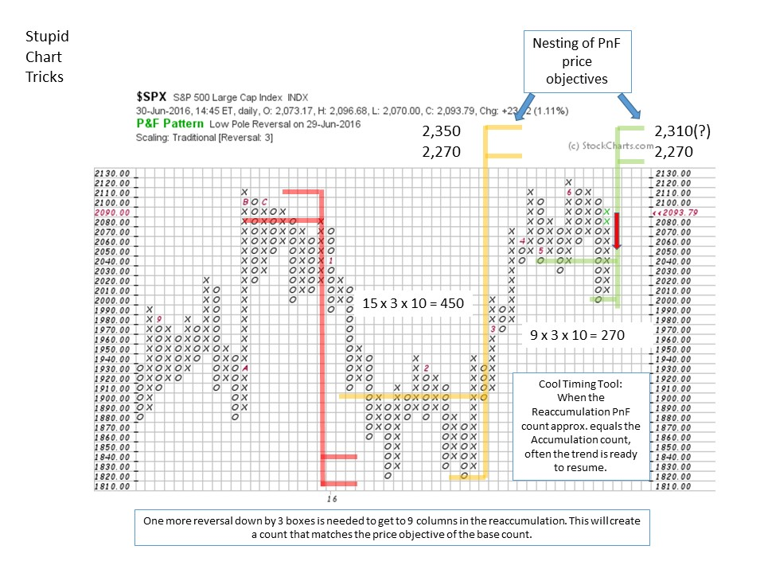

# Stupid Chart Tricks

URL: https://articles.stockcharts.com/article/articles-wyckoff-2016-07-stupid-chart-tricks-/
Date: July 01, 2016 at 03:38 PM
Author: Bruce Fraser

Stupid Chart Tricks are obscure rules of thumb in chart analysis that are helpful in your trading. These tricks are actually not stupid, they are clever and useful and generally unknown. Over the years we pick up these tips and tricks and incorporate them into daily chart analysis. We use them so often that these tricks become second nature and nearly automatic in their application.

From time to time we will showcase some ‘Stupid Chart Tricks’ that could be useful and helpful. In this post we explore one of my favorites that comes from the horizontal Point and Figure counting methodology.

At the completion of an Accumulation, Wyckoffians will make a horizontal count of the area and project a range of price objectives. At some point in the uptrend a Reaccumulation (SSR) trading range may form. There is a technique for determining when the SSR is likely to end and the uptrend resume. This nifty timing tool is our first ‘Stupid Chart Trick’.

---

In our last post (click here for a link) we evaluated potential outcomes from the Brexit vote. A bullish scenario was a springing of the trading range and a rally up to the Resistance area. So far this outcome has merit. Let’s count the Reaccumulation area and see if our chart trick might work.

The Accumulation that formed in the first two months of 2016 provided fuel for a robust uptrend. Since April the S&P 500 ($SPX) has formed a Stepping Stone Reaccumulation. Formidable resistance is in the area of the 2015 high prices where the market has stalled. Overhead supply must be absorbed before the market has the potential to climb to new high prices. Is there a technique for estimating when the Reaccumulation is complete and the $SPX may be ready to jump into a new uptrend?

The $SPX reached 2,110 and then entered a SSR. The Accumulation count is 2,270 to 2,350 so there is more upside potential. There is still more fuel in the tank. As Wyckoffians we ask if it is possible to fulfill this higher count objective generated at the beginning of the year (illustrated in yellow). Since April, a high level consolidation has formed a potential Stepping Stone Reaccumulation (SSR). There is a timing technique we can employ for determining when the SSR could end and the uptrend begin. When the Accumulation PnF count and the Reaccumulation count objectives approximately match, look for the uptrend to resume.

The $SPX is a real-time case study of this timing technique. In the Accumulation 15 columns formed before the liftoff. We would expect the Reaccumulation to have fewer columns before resuming the trend and matching the price objective of the Accumulation count. As the SSR forms, we can estimate the number of columns needed to match the price objectives formed in the Accumulation. In this case 9 columns of count in the SSR will match the 15 columns of count made at the lower price level of the Accumulation. Therefore when the SSR has completed 5-6-7 columns of count we estimate that a total of nine are needed. This is a timing technique. Once we have 9 we start to look for the completion of the SSR on the vertical chart and the resumption of the uptrend. Note the nesting of the count objectives on the PnF chart. After the Brexit Spring, one more reversal downward (by three boxes or more) will complete a total of nine columns of count. When the Accumulation count and the Reaccumulation count approximately equal we will see if our Chart Trick works.

All the Best,

Bruce

For a case study of Redistribution click here. For more on Reaccumulation analysis click here and here and here.

Seminar Announcement: "The Art of Stock Campaigning Using the Wyckoff Method", Roman Bogomazov, Hank Pruden and I will be conducting a day long seminar in San Francisco on August 19, 2016. For additional information click here.
