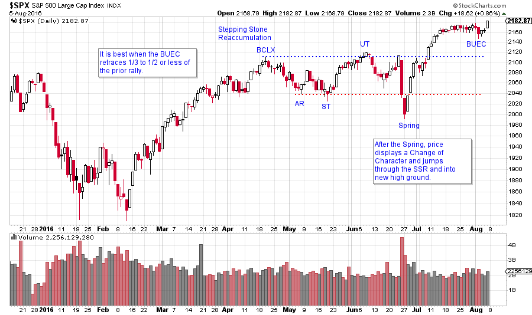
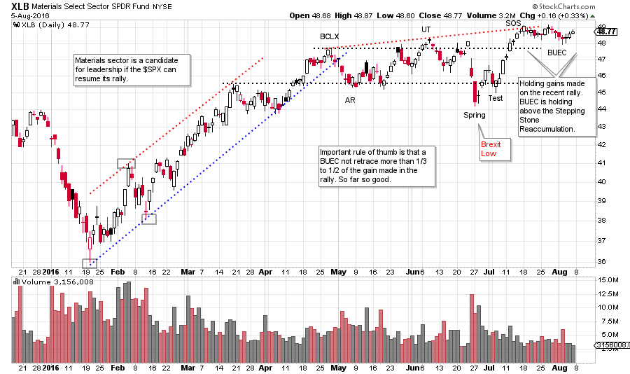
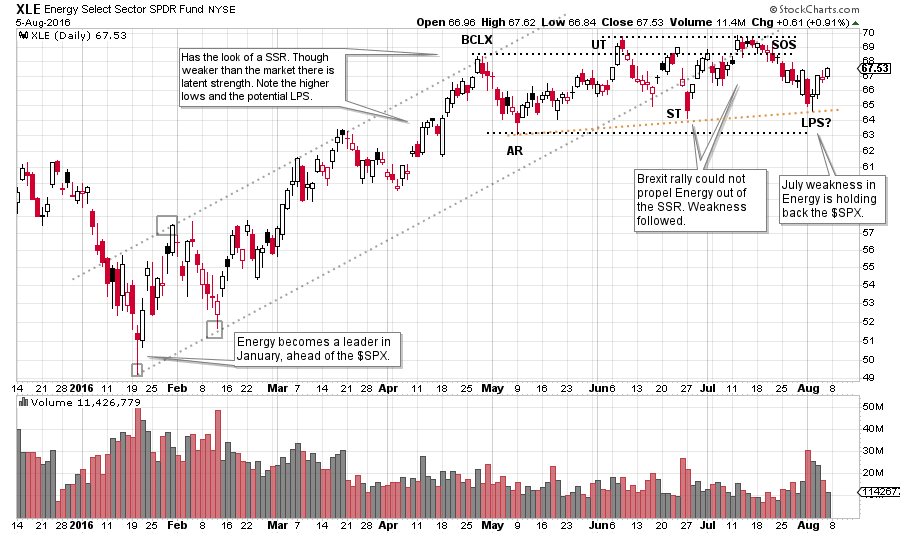
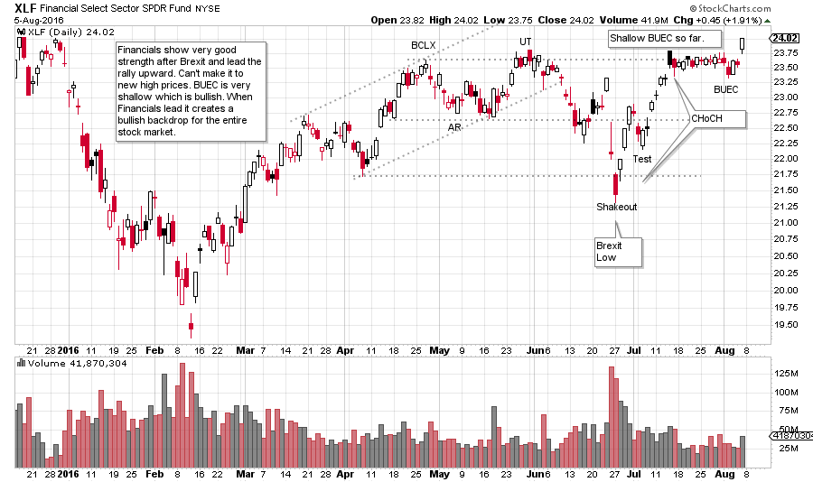
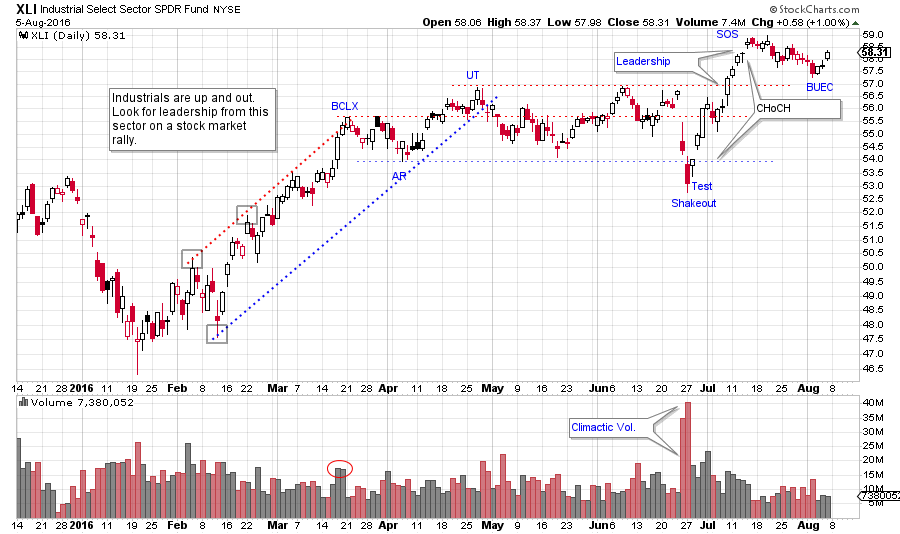
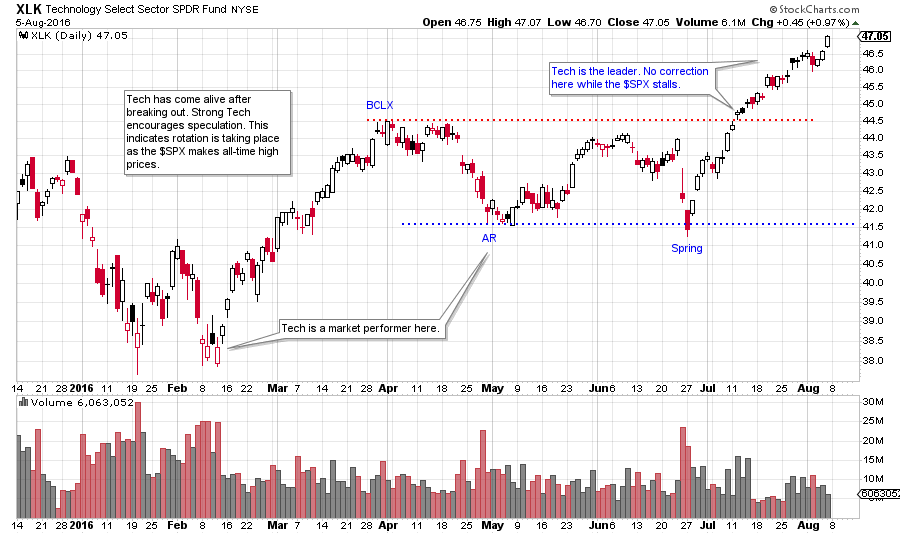
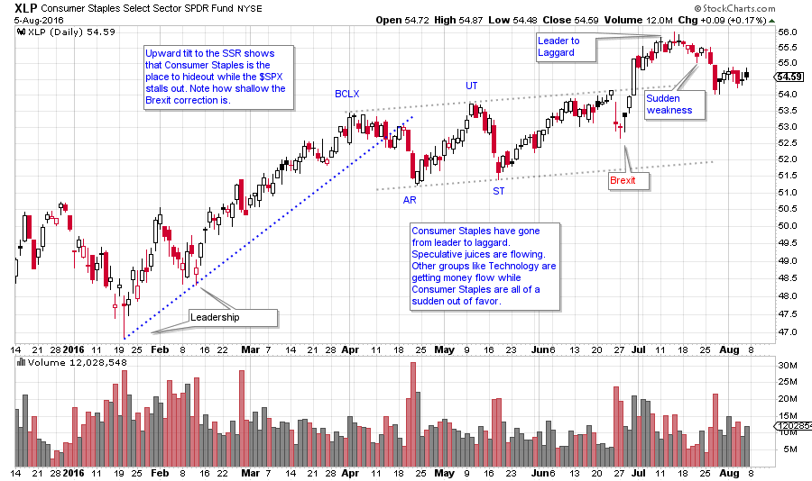
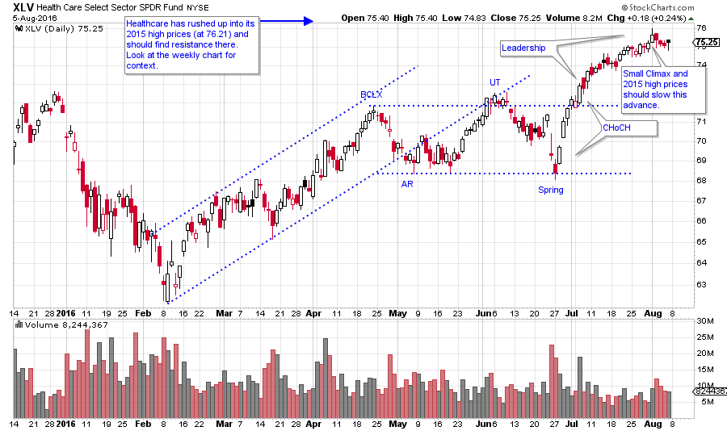

# A Gaggle of Groups

URL: https://articles.stockcharts.com/article/articles-wyckoff-2016-08-a-gaggle-of-groups/
Date: August 06, 2016 at 04:53 PM
Author: Bruce Fraser

So much time is spent on the study of the S&P 500 ($SPX) and other broad market indexes that we forget to have a look at the core themes that make up the performance of the entire market. Let’s take some time to review the underlying sectors to determine the current leadership and emerging trends that might be developing.

Prior to Brexit, the $SPX was forming a Stepping Stone Reaccumulation. A Shakeout of the low of the SSR occurred after the Brexit vote which turned out to be a ‘cathartic event’ that launched the market up and out of the SSR.

---

Now we see about a three week pause and well-deserved rest in the $SPX. In Wyckoff terms we would call this a ‘Backup to the Edge of the Creek’ (BUEC). A backing up action occurs after a jump out of an important consolidation such as an Accumulation or a Stepping Stone Reaccumulation. A BUEC will often return to the breakout area (Creek) before resuming the uptrend.

Industry Sectors and Groups will generally have a family resemblance to the $SPX. While some of these Sectors will be in lockstep with the broad indexes, some will be leading and some will be lagging. As a general rule, the current leaders will keep leading and the current laggards will keep lagging. Let’s have a look at some of the more interesting sectors for a sense of where the action is, and is not.

(click on chart for active version)

A Spring in the $SPX sets up a dramatic rally which takes the index up and out to a new all-time high price level. Keep this chart in the back of your mind while we look at some of the underlying sectors that make up this 500 stock index.

(click on chart for active version)

The Materials Sector is early leadership. The XLB rally begins in January, ahead of most sectors and stocks. After a classic SSR, a Brexit Spring sets up a rally. The BUEC is very shallow, and indicates that XLB may want to keep leading upward.

(click on chart for active version)

The Energy Sector (XLE) made a low in January, ahead of the $SPX, and began an uptrend. At the time it was demonstrating emerging leadership, along with XLB. Note that Energy is making higher lows during the SSR, including the Brexit low. This looks very bullish. But then at the Resistance area sellers of Energy check the advance. Thereafter, XLE drifts back into the SSR and becomes somewhat of a laggard. This is a change of character that could persist and thus Energy could become an underperformer. SSR formations often have a series of higher lows, as is the case with XLE now. If XLE can turn upward off the current levels (or even slightly lower) and jump out of the SSR, leadership could be reestablished. Energy sector capitalization is a very large component of the market. It is difficult for the $SPX to rally without energy participating. Currently energy is not doing its part. This means that other groups and sectors are propelling the Indexes and we want to know which ones.

(click on chart for active version)

Financial stocks (XLF) were a laggard at the beginning of the year. Where Materials and Energy made their lows in January, XLF made lows into February (and was weaker than $SPX). Note how wide and loose the price action was from April onward. The Brexit decline was so deep that we will call it a Shakeout. Note how strong the XLF was on the rally back to the top of the range. This is a classic Change of Character (CHoCH). Although the XLF could not break to a high above the SSR until yesterday, look at the BUEC. It is very narrow and shallow. Sellers cannot push the XLF price back into the SSR which is very constructive. The market generally likes it when the financials lead the way to higher prices.

(click on chart for active version)

The Industrial Sector (XLI) was another leader in January. The post Brexit rally was very strong and XLI jumped to new recovery price highs. Industrials want to lead. The BUEC has more of a downward tilt than $SPX, as would be expected after such a strong rally. As long as XLI stays above the SSR it is poised to resume leadership.

(click on chart for active version)

After the breakout to new highs in the $SPX, most sectors and groups paused to take a rest. Not technology (XLK), which went on a tear. We can see that tech had been tracking with the rest of the market since the January lows with no real indication that it wanted to lead the way. Once out of the SSR it took over and started to grind higher, mostly by itself. Note the contrast between XLE and XLK. Expect tech to lead any move higher by the market.

(click on chart for active version)

Consumer Staples (XLP) has been leading the market higher since January, but something interesting happened after the Brexit rally. Institutions will often favor Consumer stocks during periods of dull, trendless, or uncertain markets. Clearly this has been true recently. After a very shallow Brexit correction, XLP leapt to an all-time high. A sudden bout of weakness followed and now XLP is threatening to fall back into the SSR. Now that the market indexes are making new all-time highs, group and sector rotation is shifting. The old leaders, such as Consumer Staples are giving way to the more economically sensitive themes such as Industrials, Technologies and Materials.

(click on chart for active version)

Health Care (XLV) launched higher off a minor Spring and has just kept going upward. A Climax five days ago indicates that a Backing Up action is directly ahead. XLV has rallied so far out of the SSR that it should prove difficult to return back to it.

New high prices in the $SPX are starting to get Wall Street’s speculative juices flowing. New groups and sectors are emerging and leading while the old favorites are falling away. Take time each week to review all of the Sectors and the leading Industry Groups. Finish this analysis by evaluating Consumer Discretionary (XLY), Utilities (XLU), and Gold Miners (GDX). Then drill down into the Industry Groups that interest you most. Stockcharts.com makes it easy and efficient to get from the Sectors to the Industry Groups to the Stocks that are leading the way.

All the Best,

Bruce

For an index of essential Wyckoff concepts and blogs, and for general review Click Here.
