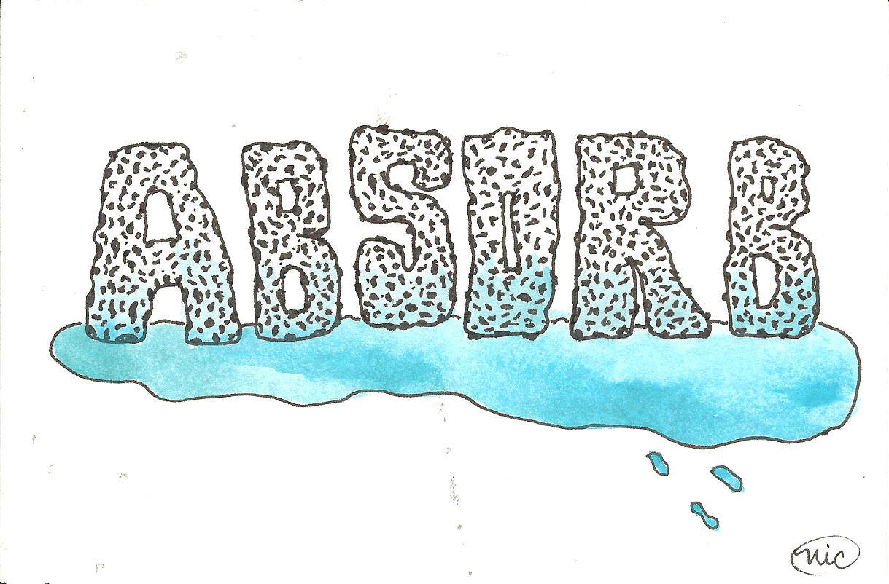
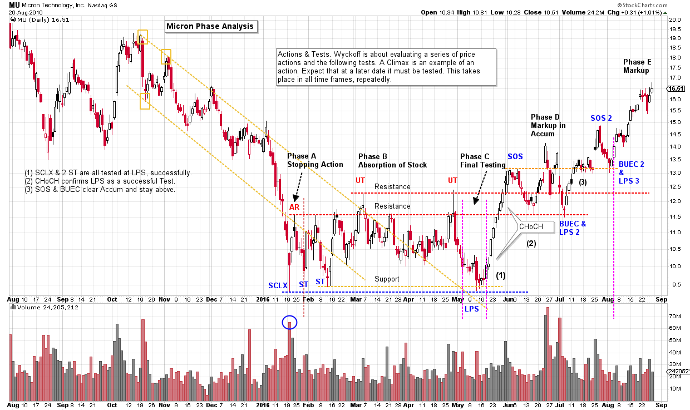
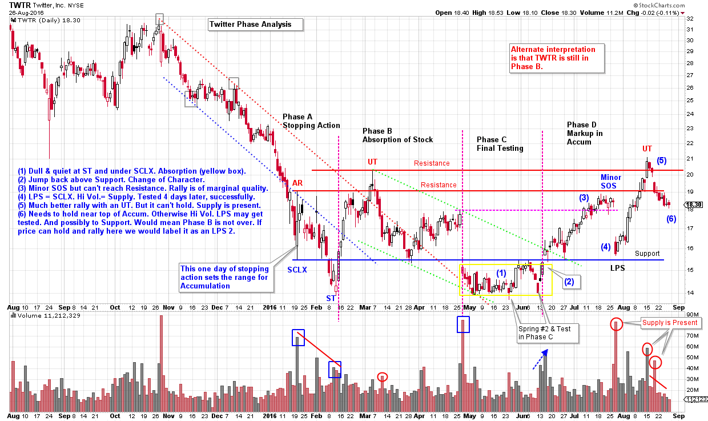

# Phase Analysis. Two Case Studies

URL: https://articles.stockcharts.com/article/articles-wyckoff-2016-08-phase-analysis-two-case-studies/
Date: August 27, 2016 at 03:10 PM
Author: Bruce Fraser

Accumulation is a process, from beginning to end. The purpose of Accumulation is to create an environment where the Composite Operator (C.O.) is able to accumulate large quantities of stock. This is referred to as Absorption. A long and robust stock uptrend follows Accumulation. The Absorption of stock is the systematic removal of stock from the marketplace. The C.O. is purchasing the stock and making it unavailable for purchase by the public or other C.O. types. The goal of the C.O. is to amass these shares of stock in such a way that they do not cause the stock to jump out of the Accumulation area prematurely. The C.O. is very quiet about their activities so as not to attract the unwanted attention of other C.O. types and institutions and thus intensify competition for the Accumulation of available shares.

This process of Accumulation becomes more and more difficult as the Accumulation range reaches a conclusion and the uptrend begins. There are fewer shares being sold by the public and institutions, and there is more smart money competition for these few remaining shares. This is a high skill, large money endeavor.

---

Unlike any other charting methodology, the Wyckoff Method recognizes the evolution of the Accumulation from start to finish. It clarifies the price and volume progression within the Absorption process. Logic tells us that the structure of price and volume will change in ways that the careful observer can identify. These changes signal where the Accumulation is in its march to completion.

Phase analysis in the Wyckoff Method is for tracking the footprints of the Composite Operator in their campaigns. Please refer to prior posts (click here and here and here) for a review of Phase Analysis and then we will do two case studies using current market examples.

(click on chart for active version)

Micron Technology (MU): Look for very large spikes in volume and an acceleration of the stock price in to a low which marks the start of the Accumulation range. This is the Selling Climax (SCLX). After the Automatic Rally and Secondary Test, Phase A is complete. The B Phase is a volatile and aimless trading range which discourages stock holders to the point they give up and sell their shares. Note the two Upthrusts (UT) which appear to breakout of the trading range and then, suddenly, fail back into the range. After the second UT, price slides to the lows where Support is present (classic Phase B action). When the Support area is reached during (the typically long) Phase B, Wyckoffians begin to look for trade entry locations. If a new low is made, expect a Spring. If a new low is not made, a Last Point of Support (LPS) is expected. Testing prior price lows are a major principle in Wyckoff. The LPS is testing the SCLX and the two ST. When a low is made on very high volume, expect a price retest at a later date. That is what is happening at the LPS. An LPS or a Spring are doing the same type of work; which is to test a prior high volume price low. Volume will diminish on the LPS test as compared to the prior low. Supply is being Absorbed.

After the LPS and test, we watch for a rally to the top of the Accumulation area. We are looking for a quality rally that demonstrates a Change of Character. Price spread widens while volume expands and this is evidence of aggressive buying. In addition, the stock price has the power to jump above the prior UT highs and the price holds above the Accumulation area. After the SOS, a Backup to the Edge of the Creek (BUEC) forms. This is a pause that allows more stock to be absorbed around and above the Resistance line. Stock is being bought by the C.O. on a scale up from the lows of the LPS, primarily on the pauses and backups. Because of this Change of Character (CHoCH) this area is labeled Phase D and it is the rally up to, and out of the Accumulation. Phase D concludes after SOS 2 and BUEC 2. Phase E marks the beginning of the uptrend.

(click on chart for active version)

Twitter (TWTR): At the January low the range of Support and Resistance is set, all in one day (Note the SCLX and the AR). We determine this to be the SCLX because of the big volume surge and the ability of price to close off the low and up on the day. Aggressive buying is present on this day. A big bulge of volume on a SCLX will be tested at a later date, which occurs here at the ST. Phase A is complete after the ST. Volatility is the signature of Phase B. After the Up Thrust (UT), price declines easily and rallies are labored. In May and June price camps out (yellow box) at the bottom of the Accumulation below the Support line of the SCLX. During this listless period, a Spring #2 dips below the ST and the price begins to jump the next day. After a Test of the Spring, price jumps the overhead line of Support (blue line). This concludes the final testing of Phase C.

In Phase D we look for price to march up toward the top of the Accumulation zone. The rally in the D Phase cannot get to the AR Resistance line before gapping down on earnings news. We note this rally peak as a Minor Sign of Strength since it could not reach the Resistance line and turned back downward to the LPS. A more dynamic rally would have been preferred. The rally after the LPS and earnings announcement was on better volume and carried above the UT in a near vertical ascent, which was an improvement over the prior rally. Volume spiked on the LPS which demonstrates a supply of stock still being present. As Wyckoffians we expect that price often must retest that high volume level at a later date. Therefore a return to the area currently labeled LPS may be in TWTR’s future. It is possible that a test of the $14 level could be needed.

After a rally to $21 we watch for a SOS that can hold above Resistance. The less price retraces back into the Accumulation the better. But TWTR cannot hold and begins showing signs of weakness and volume expansion immediately. A bullish scenario here would involve the price stabilizing and starting to trade in a small range at the Resistance area. TWTR is a murky picture. Supply is present at the top of the Accumulation and a classic SOS did not form. For these reasons the Wyckoffian must stay vigilant and not assume that any one outcome is likely.

The Spring and the LPS produced classic buy points. Now TWTR must demonstrate that it can resist declining back into the Accumulation, and consolidate near the top of the range. The Backups should have the signature of shrinking volume and spread to prove absorption has taken place. If weakness persists with widening volume and price spread, then we would conclude that more supply is arriving which could drive prices downward. If this second scenario unfolds then we would relabel Phase C and D as a continuation of Phase B, with the final testing still ahead.

The Wyckoff Method is always an unfolding story where unexpected twists and turns are possible. We must continually be ready to update our scenarios and labeling, and thus our tactics.

All the Best,

Bruce

Announcements:

ChartCon 2016 is fast approaching. It will be an information packed two days with legendary technicians presenting their best work. My presentation is titled: Understanding Wyckoff's Approach to Technical Trading. I am working on this presentation now. My mission will be to reveal tools, tips and tricks for making the Wyckoff Method a powerful ally for you. We will explore how to determine the action points, where they are and techniques for identifying them. I hope you can join me during this exciting two day event.

Dr. Hank Pruden will teach FI354, the Wyckoff Method I class, at Golden Gate University in San Francisco, beginning September 3rd. Roman Bogomazov and I will team up with Dr. Pruden with guest lectures during the semester. Dr. Pruden has arranged for individuals interested in this class to attend the first session free of charge. If you live in the San Francisco Bay Area take advantage of this unique opportunity (GGU is one block from the Montgomery St. BART station). As space is strictly limited to the capacity of the classroom, reservations are a must. Please call Dr. Pruden at 415.442.6583 to reserve your space.

Roman Bogomazov will be conducting a complimentary webinar on Monday, August 29th. This is an introduction to his online series: Advanced Wyckoff Trading Course (AWTC) - Wyckoff Market Structure (3:30 – 5:30 p.m. PDT). For more information and the registration link, please click here or if you would like to just register directly, please click here.
