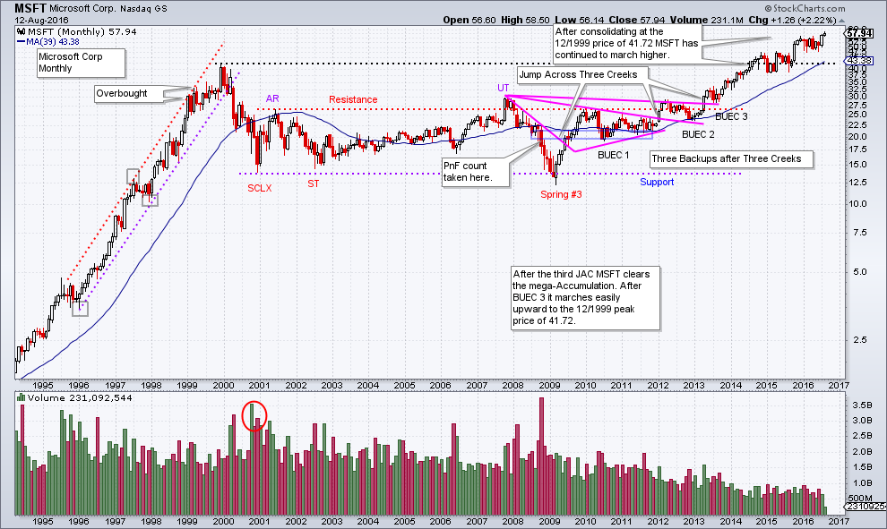
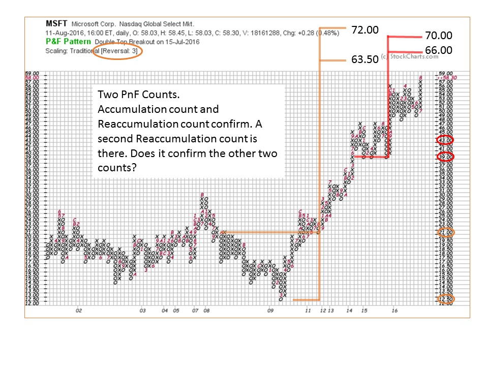
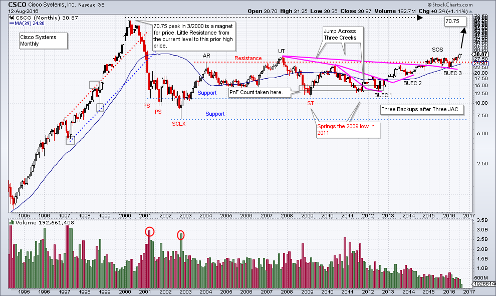
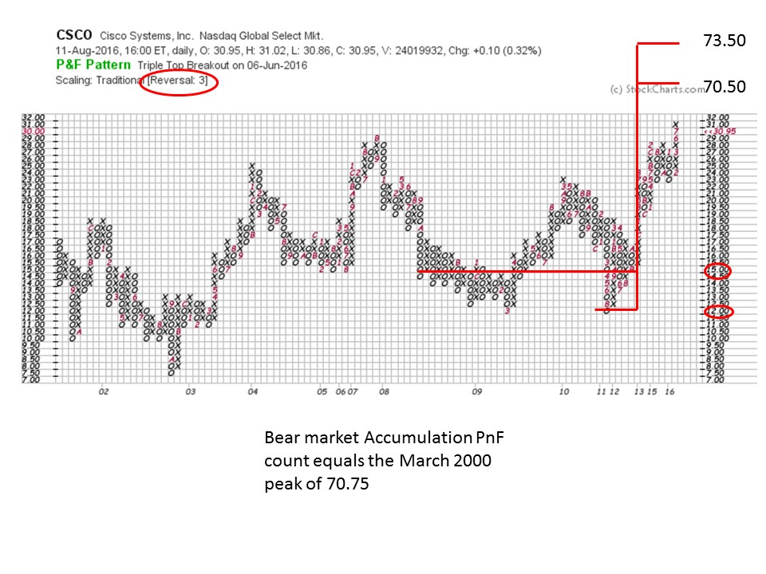
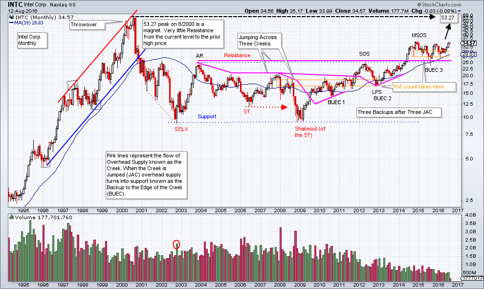
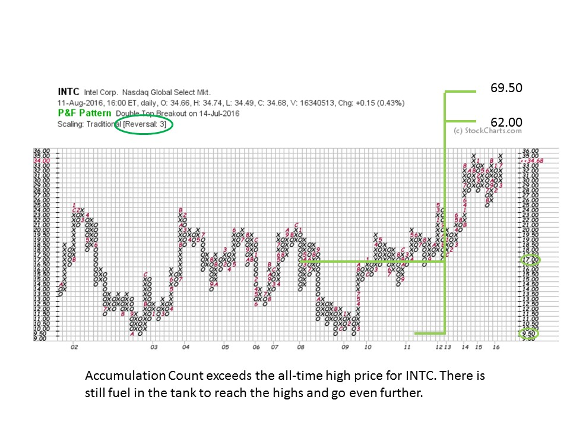
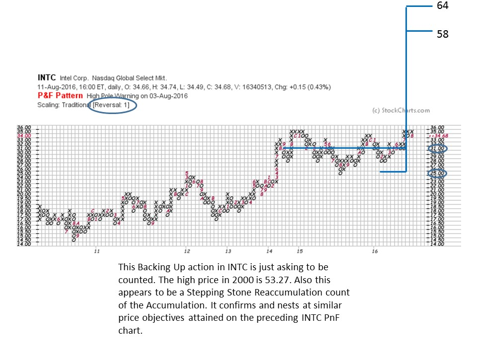

# The Really Big Picture

URL: https://articles.stockcharts.com/article/articles-wyckoff-2016-08-the-really-big-picture/
Date: August 13, 2016 at 04:35 PM
Author: Bruce Fraser

The Wyckoff Method scales down into smaller timeframes. It also is very effective in large timeframes. We have spent much time and attention evaluating daily and weekly charts (and intraday charts). Now we will turn our attention to monthly charts where a decade or more of data can be evaluated. Are these charts useful and practical for making decisions in today’s markets?

At times having the perspective of this larger scale can guide our tactics. Let’s evaluate three important bell-weather stocks to attempt to determine their potential and get clues about how they could influence the larger stock market indexes.

---

Microsoft Corp. (MSFT), Intel Corp. (INTC), and Cisco Systems Inc. (CSCO) are three very large and influential companies. Each is in the Dow Jones Industrial Average, the S&P 500 and the NASDAQ Composite. Their performance can and does impact these important indexes. Evaluating their monthly charts could help to shine a light on the potential of these indexes to perform in the months and year ahead.

(click on chart for active version)

After a dramatic bull run into 1999, MSFT stumbles badly. This decline was the start of a 15 year trading range. Using Wyckoff analysis we can see that even on a monthly scale chart, the attributes of Accumulation are present. Notice after the third Jump Across the Creek (JAC) and Backup to the Edge of that Creek (BUEC 3) the price finally moves above the Accumulation area. This cleared the way for three years, and counting, of an uptrend. Once the resistance line of the 12 year Accumulation is overcome, very little overhead supply exists to impede the progress of prices up to the all-time high price at 41.72. The 1999 high did pause the uptrend for nearly a year, but the trend has since continued.

How much of the Accumulation range is counted on a PnF chart? We always want to make counts that are practical and useful for tactical purposes. Here we count the bear market base from 2011 to 2008 and generate a count of 63.50 to 72. There is also a Stepping Stone Reaccumulation count at the congestion area at the return to the all-time high. This counts to a range of 66 to 70. Therefore this is a confirming count and adds to our confidence about the validity of the two counts. So there is still the potential of higher prices from here for MSFT. Once these counts are fulfilled we will then go back and determine if there are larger PnF counts to evaluate.

(click on chart for active version)

Cisco Systems has a family resemblance to MSFT. It concluded a big bull run in early 2000 and then submerged into a big multi-year decline. A very large 15 year Accumulation range has formed. It appears that after a Sign of Strength, a shallow and long (one year) Backup to the Edge of the Creek (BUEC 3) has formed. Now CSCO is above the SOS high price. As with MSFT, there is minimal resistance for CSCO from the current price to the all-time high at 70.75. Possibly CSCO can act similarly to MSFT as it clears the Accumulation, and a robust uptrend could be ahead.

As we did with MSFT let’s count the Accumulation area of the prior bear market. In this case from 2012 to 2008 (marked on the vertical chart). This generates a PnF count of 70.50 to 73.50 which targets the 2000 high price of 70.75. The PnF price objective targeting the prior all-time high price for CSCO is compelling. We would expect it to take multiple years for such a price target to be reached.

(click on chart for active version)

Intel peaked out in early 2000 and a nasty decline followed. Even on such a large time horizon the attributes of Wyckoff Accumulation are present. INTC has a similar appearance to our prior two examples, but there are differences. Note that a JAC out of the Accumulation area in mid-2014 resulted in a nearly two year Stepping Stone Reaccumulation (SSR) and a Backup to the Edge of the Creek (BUEC 3). What is important is the ability of INTC to Jump out and stay out of the prior Accumulation. This is bullish action. The 2000 high price is 53.27 and that becomes a magnet for an emerging uptrend. Currently INTC is poised at the top of this SSR area and any further price strength puts it into a new stage of Markup.

We have two PnF charts to study. We will count the 2012 to 2008 base. An objective of 62 to 69.50 targets an area above the 2000 price high of 53.27. This PnF count suggests that much fuel remains in the tank and there is potential for new all-time high prices for INTC.

Using a 1 box PnF chart we count the SSR that developed after Jumping out of the Accumulation area. This PnF chart generates a 58 to 64 count to confirm the prior base count. We now have two counts for INTC that nest in the same price zone. If and when these price levels are reached we will revisit the PnF chart to determine if larger counts are available.

Monthly charts can be so revealing. It is always worthwhile zooming out to this mega-timeframe to see if there is a Wyckoff story in the chart. Wyckoff analysis on monthly charts can reveal when major uptrends and downtrend are beginning. Here are three companies that are very influential in all the major stock indexes and will have an impact if they start to run toward their all-time high price points.

All the Best,

Bruce

Please join Roman Bogomazov and me for a free online webinar and interactive discussion on August 24th, 2016, at 3:00 p.m. (PDT). We will review the current market and several leading stocks from a Wyckoff Method perspective. (click here to register)

The Technical Securities Analysts Association of San Francisco (TSAASF) is having their annual conference on August 20th. This one day conference has an all-star cast of speakers. "The Titans of Technical Analysis" is this years theme. It will be held at Golden Gate University, includes lunch and is a great value. For more information click here.

Wyckoff Power Charting will take next week off. Have a great week.
