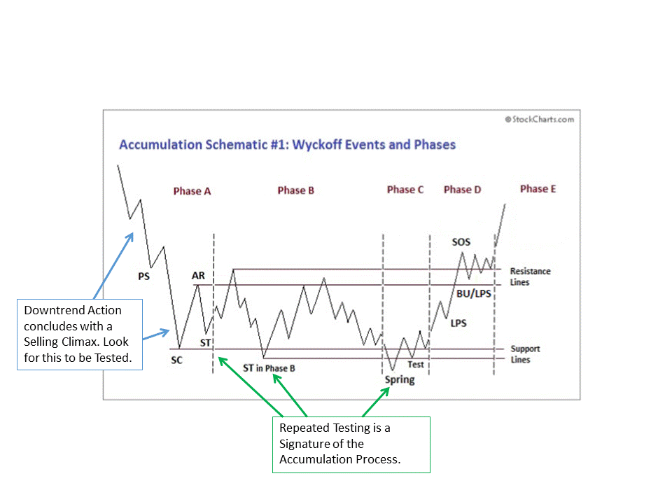
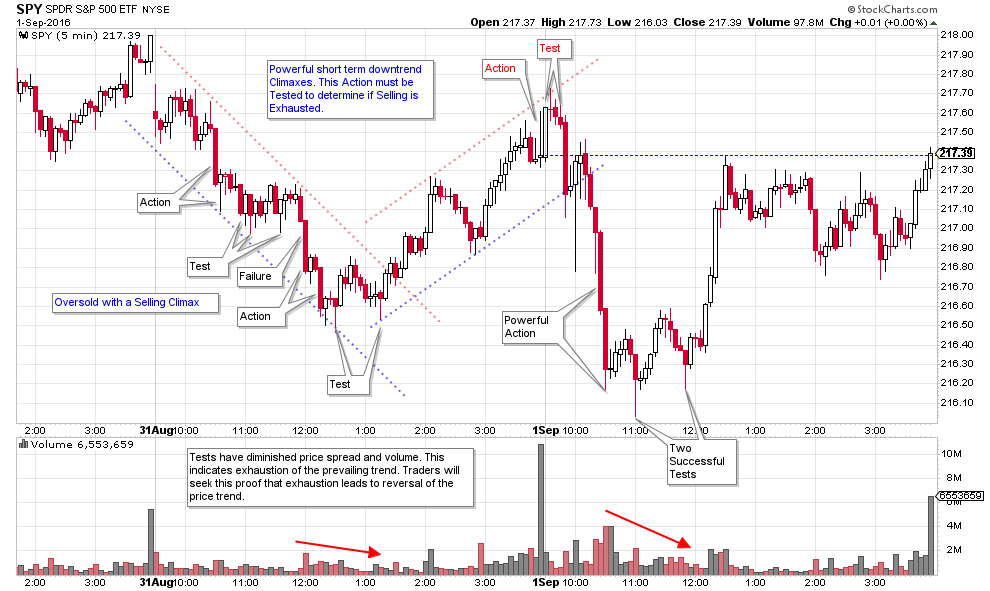

# Action - Test

URL: https://articles.stockcharts.com/article/articles-wyckoff-2016-09-action--test/
Date: September 02, 2016 at 01:00 AM
Author: Bruce Fraser

A cornerstone of the Wyckoff Methodology is the concept of the Action and the resulting Test of prices. Price has a surge of power when it emerges into a Markup Phase or a Markdown Phase. During the Markup Phase prices rise on an imbalance of buying power that exceeds the available supply of shares being sold. The conclusion of an uptrend is typically a Buying Climax. A Climax is an Action. Such an Action must be Tested.

Actions and Tests are occurring in all markets, in all timeframes, all the time. An essential part of the Wyckoff Method is learning to judge this two-step process. Over the course of this blog we have evaluated many examples of this phenomena. Becoming a judge of the Action – Test will put the Wyckoffian well down the path to trading mastery.

---

Some Tests are successful, while others are not. Gauging the quality and effectiveness of a Test is important in determining whether a price reversal is at hand. A Test is the ‘tell’ when judging if the Action (Climax) has exhausted the trend. We might say that if the Action is the scene of the crime, the Test is the return to the scene of the crime.

A Selling Climax after a powerful downtrend results in the exhaustion of the supply of stock available for sale (at least for the time being). The Automatic Reaction is a sharp, but short lived, rally that indicates that buyers are present to tip the scales. The Test that follows is important. If the Test fails, the downtrend resumes. A successful Test can occur above, at, or below the Selling Climax low and still be successful. Notice that within the schematic of Accumulation that Testing is happening throughout. The bigger the magnitude of the prior trend, the more times it may need to be Tested before it can be reversed. The Test is a visual question: Is the majority of the selling exhausted?

The drama of the Action and Test plays out in all timeframes. Above is a 5 minute chart with about two days of trading. Note the phenomena of the Action and Test repeating multiple times. Traders in all timeframes will seek proof of the exhaustion of the prevailing trend, in the form of Tests, before committing to the new trend.

The signature of the Action phase is volatility, wide spread, and high volume. In contrast the Testing should have compression of the price spread, less volatility and diminishing volume. These indications all point to exhaustion of the prior trend.

As can be seen on this 5 minute chart these concepts are at work continually. Each larger timeframe may be telling a different story, even though the same principles of Action and Test are occurring.

More attention will be placed on the nuances of these trading concepts in future posts. Mastering this Wyckoff cornerstone will prove beneficial to many aspects of your trading success.

All the Best,

Bruce

ChartCon 2016 is fast approaching. It will be an information packed two days with legendary technicians presenting their best work. My presentation is titled: Understanding Wyckoff's Approach to Technical Trading. I am working on this presentation now. My mission will be to reveal tools, tips and tricks for making the Wyckoff Method a powerful ally for you. We will explore how to determine the action points, where they are and techniques for identifying them. I hope you can join me during this exciting two day event.
