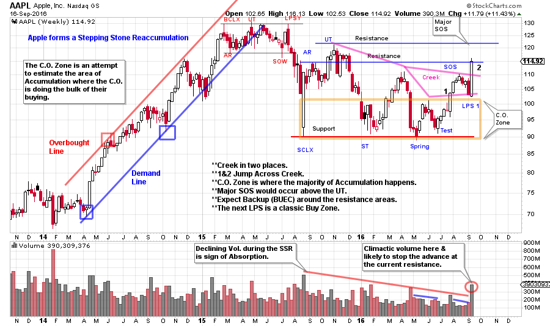
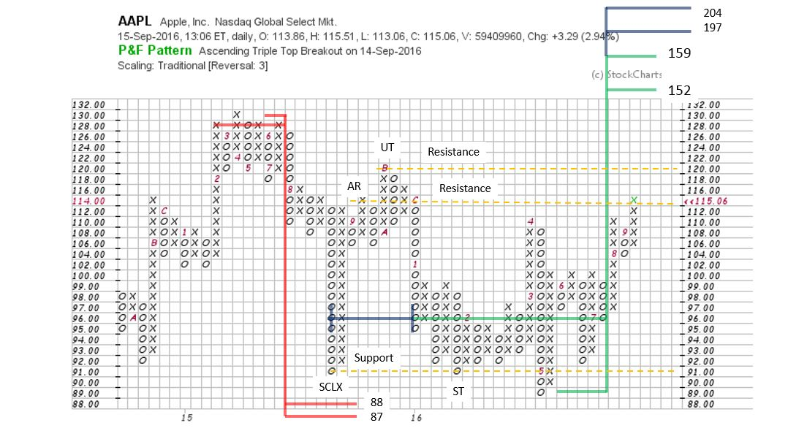

# An AAPL for Your Thoughts

URL: https://articles.stockcharts.com/article/articles-wyckoff-2016-09-an-aapl-for-your-thoughts/
Date: September 17, 2016 at 03:46 PM
Author: Bruce Fraser

So many important events happen in the fall of the year; school starts, football season begins, new television programming is introduced. But, for many, the momentous event is the reveal of the latest Apple iPhone. This year the pundits had a collective yawn over the new features of the iPhone 7, but the preorders were record setting, and very quickly the initial inventory was sold out. There is only one thing a Wyckoffian can do when their iPhone order has been delayed; evaluate the Apple chart (of course that is the Wyckoffian answer to nearly everything).

We must always keep in mind that markets are a discounting mechanism. The tendency of the market is to look out into the future and anticipate the important changes coming. This discounting phenomena is why Mr. Wyckoff counseled to read the motives and actions of the large interests by their conduct on the tape. As we discussed last week, this is best done by interpreting their footprints with the study of price and volume on the vertical bar chart. Was it a surprise to the large interests that Apple Inc. had such a favorable consumer response to their latest iPhone offering? Let’s consult the charts for some clarification.

---

(click on chart for active version)

During 2015 AAPL breaks the stride of its uptrend and then completes a Distributional formation. A rapid markdown concludes with a Selling Climax. At the low of the SCLX a Support Line is extended into the future. At the Automatic Rally (AR) and the Upthrust (UT), Resistance Lines are drawn. It is expected that price will retest the SCLX at a later date, and that is the case here (labeled a ST). The SCLX is a higher low (above the 2014 low) and therefore the consolidation is being treated as a Stepping Stone Reaccumulation (SSR) and should result in eventual new high prices. A Spring and a Test successfully hold at the Support area. Wyckoffians would expect a successful Spring to result in a rally to the Resistance area, and that is what has happened. Note the Sign of Strength (SOS) that preceded the low volume LPS1. This is a classic change of character where price can no longer return to the Support area quickly and unexpectedly. Higher lows at the Test and the LPS1 are entry zones to begin buying stock to be in harmony with the motives and actions of the Composite Operator (C.O.). The most recent big price bar jumps to the first Resistance area on a spike of volume. This will likely lead to a consolidation in the weeks to come. The C.O. is using this strength to lighten some of their massive position while prices are whooping up on the excitement of the news of a very successful iPhone launch. The Backup to the Edge of the Creek (BUEC) forming around either Resistance area would present additional opportunities to purchase stock during a dull and quiet trading range. It is possible that an imbalance of demand over supply could take AAPL to the Resistance area formed at the UT before there is a BUEC, which would be interpreted as being even more bullish. Strategy would always be to wait for the low volume periods of backing up (before buying or adding shares) into a LPS to prove that all of the excess Supply has been absorbed.

Turning to the Point and Figure chart we attempt to estimate the potential generated during the SSR. Note that the Distribution count produces a price objective of 88 / 87 and Apple touches 88.99 at the Spring low. This near perfect ‘hit’ of the price objective gives additional confidence for future PnF count objectives. Taking the conservative PnF count, an objective is generated that takes AAPL to a new high price of 152 / 159. There is formidable overhead resistance between the current price level and the prior high price at 130. If these new price objectives can be reached, expect that it will take a number of weeks to months to overcome the supply that is directly above. Patience in waiting for the best places to add or initiate positions is very important as prices work their way higher. Note that a larger PnF count is available by counting to the SCLX. This larger count currently reaches an objective of 197 / 204. But this count may not be complete as an extended LPS could increase the price objective. It is best to work with conservative counts first and then consider the larger objectives once the smaller counts have been fulfilled.

Into the iPhone announcement, the price of AAPL stock was completing an 18 week advance and Climaxing into the Resistance area. Someone was not surprised by the consumer response to the latest offerings by Apple, Inc. If we allow Mr. Wyckoff to be our guide in navigating the investment landscape, we might be able to ride along with the C.O. as they anticipate important events and the impact they will have on stock prices.

All the Best,

Bruce

ChartCon 2016 is fast approaching. It will be an information packed two days with legendary technicians presenting their best work. My presentation is titled: Understanding Wyckoff's Approach to Technical Trading. My mission will be to reveal tools, tips and tricks for making the Wyckoff Method a powerful ally for you. We will explore how to determine the action points, where they are and techniques for identifying them. I hope you can join me during this exciting two day event.
