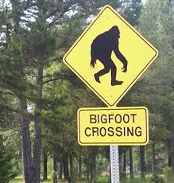
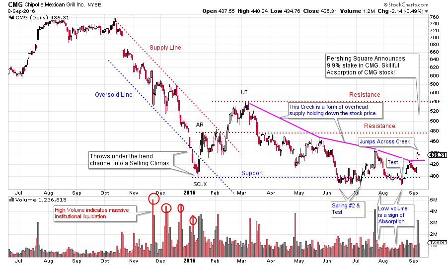
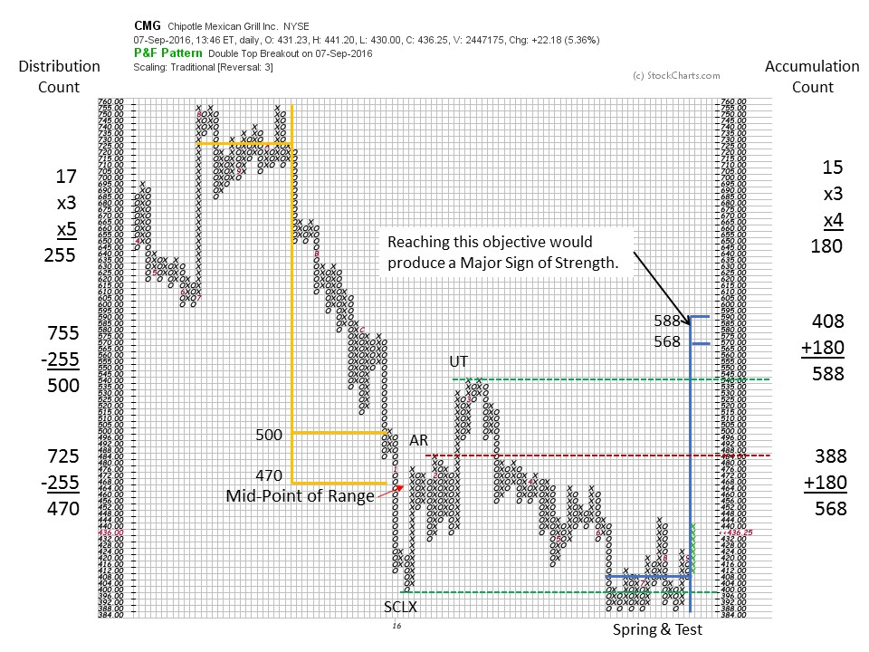

# Tracking Big Footprints

URL: https://articles.stockcharts.com/article/articles-wyckoff-2016-09-tracking-big-footprints/
Date: September 10, 2016 at 11:00 AM
Author: Bruce Fraser

Two of the most elusive and rare phenomena in the world are; 1) a Big Foot (Sasquatch) sighting and 2) evidence of the Composite Operator. In both cases we start by tracking their footprints. By stalking and following these footprints we hope for an infrequent sighting of these elusive creatures. In Big Foot’s case we look for actual tracks in the woods of their rather oversized feet. With the Composite Operator, the tell-tale tracks are discovered in the characteristics of price and volume. Both Bigfoot and the Composite Operator are widely considered to be fictitious. And while the sighting of Bigfoot might win a bet, the identification of the presence of the C.O. can lead to profitable trading.

The Composite Operator is a heuristic (a useful fiction). The C.O. is an aggregation of the trading activities of numerous, very large, and highly skilled stock market operators. As a group they can and do shape trading in the markets. When they conduct a campaign of Accumulation or Distribution their activities can be seen in the charts. Mr. Wyckoff counseled to learn how to identify and follow the activities of these large and expert operators. The Wyckoff Method provides the tools and skills to track the activities of the Composite Operator.

---

(click on chart for active version)

Chipotle Mexican Grill is a highflying stock that recently has fallen out of favor with the investment community. Note the long downtrend in CMG that began in August of 2015. High spikes of volume on price weakness in November, December and January are signs of massive institutional and public liquidation. Year-end 2015 selling from 580 to 400 is Climactic in price spread, volume and duration. An Automatic Rally (AR) lifts CMG back from an Oversold condition (falling below the trend channel). We now can draw a Support line at the low of the SCLX and the peak of the AR. Note the volume on the AR rally. Very high volume is a sign of the Composite Operator’s presence. The rally to the Up Thrust (UT) is on much lower volume which means the C.O. is not sponsoring this stage of the rally. The UT is likely the top of a very wide Accumulation range, and where a Resistance line is drawn. Short sellers could sell the mid-March test of the UT peak with the idea that a new leg of the downtrend could start from here and return all the way to the Support line. In late April a gap low is a classic place to cover that short. The decline grinds downward to the SCLX low where a Spring #2 forms. Note the March and late April volume spikes. CMG is still being actively liquidated. But in both cases this drop in price and rise in volume occurs above the SCLX low which implies Accumulation by C.O. forces. An attempt to drop below the SCLX low will be the important test of the exhaustion of the supply of shares. This test should be on less volume. In early June, six down days lead to a marginal new low on much less volume than the prior March and April declines. The lack of follow through by price leads a Wyckoffian to conclude that CMG is being supported here by large interests. As volume did expand on the Spring (#2) we must expect one or more Tests. For most of June and into July CMG hovers near the low price but cannot breakdown. This means there are still more shares for sale at these low prices but they appear to be Absorbed. With a Spring #2 it is best to wait for a rally on rising volume followed by a dip back toward the lows on declining volume. In July that is what happens. Volume on the down days is diminishing and the late August lows get close to the Spring low but the test is good. The classic trade is to buy (a one third position or less) the turn off the Test low when some good up bars with expanding volume show strength. Stops are placed under the Spring low. A Backup action shows little ability to decline and volume is not expanding.

This entire sequence illustrates a stock that is under intense selling pressure. CMG has a Creek of overhead supply that is keeping the stock price in the bottom half of the Accumulation range. Wyckoffians see the footprints of the C.O. and their buying operations during the unfolding of this large Accumulation structure. Then CMG Jumps the Creek on the news that Pershing Square has announced the purchase of a 9.9% stake in the company. Now this news is as exciting to a Wyckoffian as a Bigfoot sighting. Imagine one large and skillful operator vacuuming up nearly 10% of a large, important stock right under everyone’s noses. Also, keep in mind that members of the C.O. community are always in competition with other C.O. types Accumulating in the same time period.

As Wyckoffians we now seek confirmation that all of the large sellers are done. This would suggest that Phase D is in force now. So we expect a rally to the top of the Accumulation area with pauses and Backups along the way.

Horizontal PnF targets could help clarify strategy. The conservative PnF Distribution count is exceeded on the final decline to the SCLX. The price snaps right back into the target zone on the AR. The Accumulation is not complete and it is too early to attempt a count of the entire range. The Spring area can be counted and it projects to just above the Accumulation range. This would be a potential Sign of Strength (SOS). This PnF price objective (568/588) would be an attractive target for a trade from the Test of the Spring. We now want to see an ease of movement in the (Phase D) rally that can get above the mid-point of the Accumulation range (above 468). Any big Backup activity should stay well above the Spring low to demonstrate strength of ownership (shares in strong hands). Successful Backups during the rally out of the Accumulation would be the ideal places to add or initiate positions.

It appears that Bigfoot and the Composite Operator Live!

All the Best,

Bruce

Homework: CMG has a potentially larger Distribution structure spanning all of 2015. Try to count the larger PnF structure. How does this information impact long term tactics?

ChartCon 2016 is fast approaching. It will be an information packed two days with legendary technicians presenting their best work. My presentation is titled: Understanding Wyckoff's Approach to Technical Trading. I am working on this presentation now. My mission will be to reveal tools, tips and tricks for making the Wyckoff Method a powerful ally for you. We will explore how to determine the action points, where they are and techniques for identifying them. I hope you can join me during this exciting two day event.
