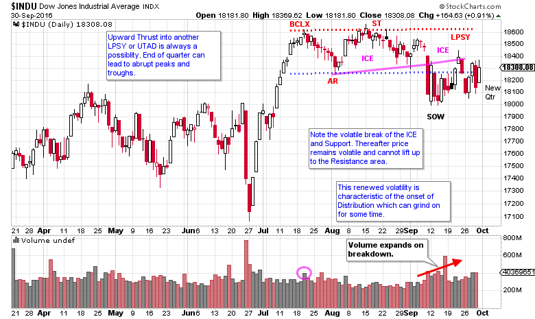
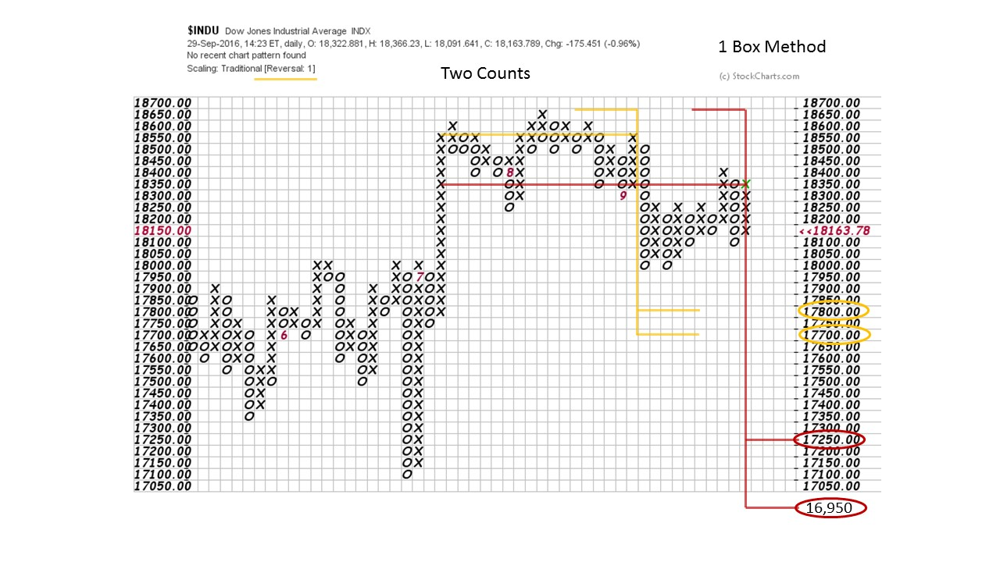
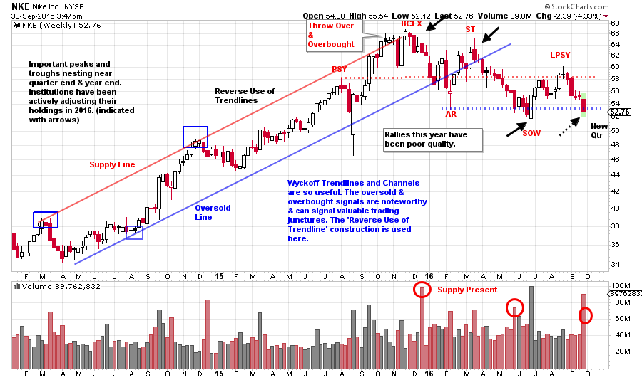
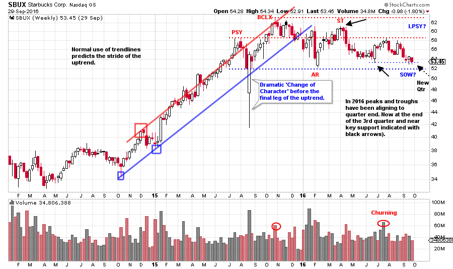

# Wyckoff Chartfest

URL: https://articles.stockcharts.com/article/articles-wyckoff-2016-09-wyckoff-chartfest/
Date: September 30, 2016 at 04:04 PM
Author: Bruce Fraser

In the glow of the great ChartCon event, I am simply at a loss for words. It was a festival of charts and technical analysis. Being in the company of these super talented (and legendary) technicians was an experience. I am sure this vibe was oozing out of your computer as it was mine. I am looking forward to replaying all of the presentations. The charts are always telling a story, let’s have them do the talking this week.

---

(click on chart for active version)

Of the major indexes, the Dow Jones Industrials appear to be revealing the clearest message. Where the volatility was very low during July and August, this false tranquility was shattered when the $INDU dropped through support. Recall that Distribution is accompanied by increasing volatility as the formation matures. $INDU tries to rise back into the trading range and the ICE, but without success. This structure is not large and we suspect that a PnF count will produce only modest downside objectives. The end of the quarter looms large with the potential for surprising twists and turns. Stocks and the market can experience dramatic character shifts going from one quarter to the next. Institutions wait for the new quarter to execute meaningful changes in their strategies. When enough institutions are thinking the same thoughts, even small strategy shifts can result in big seismic market changes. So when the new quarter arrives, hang on to your hat.

Here is an attempt to estimate the potential generated in the recent Dow Jones Industrials structure. Two counts are flagged. We can’t rule out an attempt to jump to new highs which could result in an Upthrust After Distribution (UTAD). Such a move could add to the PnF count.

The current downside count is modest as a result of the minimal volatility. Recall that PnF counts are the product of volatile price swings and not of time. The recent active price swings (under the ICE) will generate horizontal columns of count much faster.

(click on chart for active version)

Here are two, previously high flying and high end consumer stocks, for your review. Though they are in different areas of retail their charts have a family resemblance. For Nike there appears to be a rhythm of peaks and troughs that coincide with the end of the quarter (black arrows on the chart). At the start of 2016 a character shift occurred as institutions began distributing. The rallies have been poor and the reactions pronounced. Volume is expanding on the declines and off the peaks. A new quarter looms as NKE declines to the SOW and through Support. A Major Sign of Weakness may be directly ahead and result in a rally to a second Last Point of Supply, but this is not necessary. NKE is weak and vulnerable.

(click on chart for active version)

NKE and SBUX were leadership with robust uptrends. Both consumer stocks have stalled this year and are leading lower. Is this an indication of the consumer becoming exhausted? Starbucks is slightly stronger as it has not generated a Sign of Weakness, yet. The family resemblance is undeniable. Until SBUX has a SOW we will not look for a LPSY. A break below Support and the inability to lift back above it would be another very vulnerable juncture for the stock.

Homework: Compare and contrast another important, high-end consumer stock to NKE and SBUX. That stock is AAPL. It is similar to NKE and SBUX, but appears to be about six months ahead. Does AAPL provide a roadmap for the trajectory of this week’s case studies?

All the Best,

Bruce
