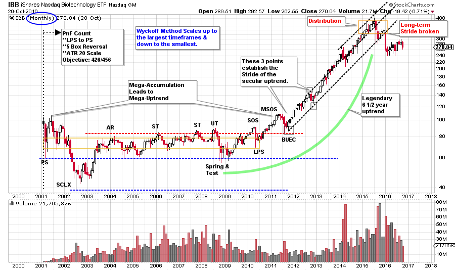
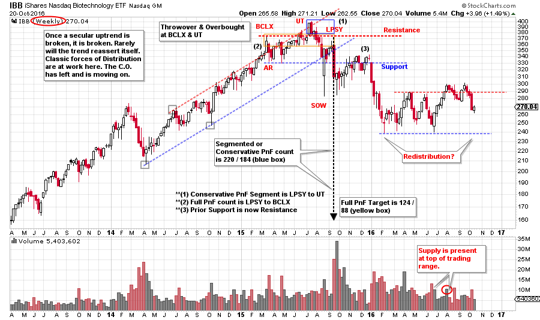

# Does Lightening Strike Twice?

URL: https://articles.stockcharts.com/article/articles-wyckoff-2016-10-does-lightening-strike-twice/
Date: October 22, 2016 at 08:00 AM
Author: Bruce Fraser

The Wyckoff Method is a trend following and trend management system. It seeks to identify the pre-conditions to the emergence of a rising (or falling) trend, with the intention of participating in that trend for the duration of it. The Method is timeless and is often used for other means, such as trading range scalping and option trading. In keeping with the prior post, we will scale out to the larger timeframe and discuss the value of Wyckoff context and how one timeframe can speak to what is happening in others.

Every bull market has a mega-leadership theme. In the current cycle, an epic uptrend took place in biotech (we will study the IBB as a proxy for the biotechnology industry group). Can Wyckoff help us find these large trends and help us manage such trends? The big returns reside in the big trends and the Composite Operator fully understands this principle.

---

(click on chart for active version)

A 10 year Accumulation leads to a 6½ year trend. The principle of the Point and Figure (you are encouraged to generate and count the PnF objectives discussed here) horizontal counting method is illustrated here. Proportionality of the Accumulation phase informs the magnitude of the subsequent bull market uptrend. Absorption of shares of the important biotech stocks went on for a decade. These shares were strongly held and became very, very scarce by the conclusion of the Accumulation. PnF attempts to estimate the Cause and Effect of this phenomena in the form of a price objective.

Note how the stride of the uptrend is set very early on. This apprises us of the rate at which IBB intends to advance for the foreseeable future. Study this uptrend and rehearse how you would participate. Also, keep in mind that this trend, most trends, persist much longer than anyone expects. This persistency is why the trend is your friend. And when speculating in markets it is good to have friends (an edge). Once a legendary trend like this comes to an end, it is over, really over. It is a work of art to watch the C.O. extract themselves from the trend, which is the process of Distribution. The result is the emergence of a long-term downtrend. A stair stepping decline that can last a long, long time. It is not common for a dominant secular uptrend to resume after it has been broken and failed. Consider the dilemma of many institutions. During the uptrend they have become over-exposed, over-committed to the biotech theme because it has contributed to their performance (for years). Once the downtrend asserts itself, over-performance becomes under-performance. Some institutions will leave the biotech theme quickly, while many will wait. The resulting effect of all of this is continual selling that produces a condition where a new uptrend is unlikely. Any attempt at a rally will be met with supply from late sellers.

As Wyckoffians we choose to jump on the uptrend train, and we are quick to leave when Distribution arrives. There will always be other trends to discover and participate in.

(click on chart for active version)

Distribution forms quickly. Distribution is sneaky. Notice how the Buying Climax (BCLX) and the Upthrust (UT) form in the final stages of the uptrend. Only after the Sign of Weakness (SOW) does the structure of the Distribution become evident. Wyckoffian mastery is learning to see the attributes of Distribution forming while the uptrend is concluding. This will come with time and practice.

Secular bull market themes are virtuous, glorious and fun. When they are over… not so much! When the trend is over Wyckoffians don’t hang around. For some earlier chart work on the biotech theme go here and here.

All the Best,

Bruce

## Back by popular demand! Roman Bogomazov and I are offering a two part webinar series on Setting Price Targets Using Wyckoff Point-and-Figure Charts starting November 3, 2016. These live interactive classes will be 2 ½ hours each. Take advantage of this opportunity to sharpen your Wyckoff PnF skills. Please click here for more information and to register!
