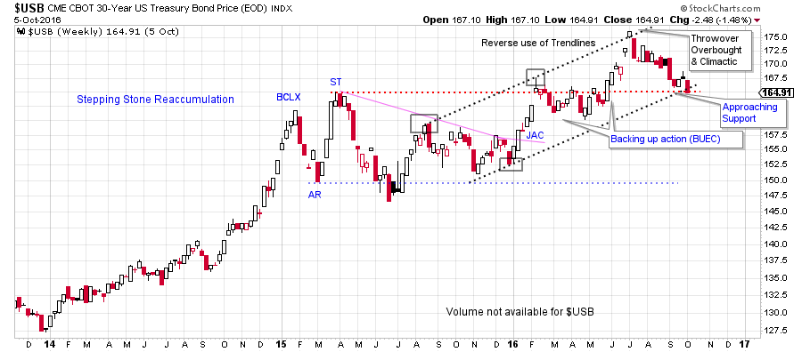
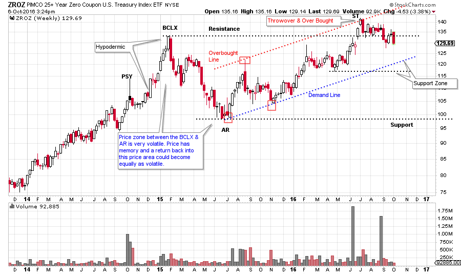
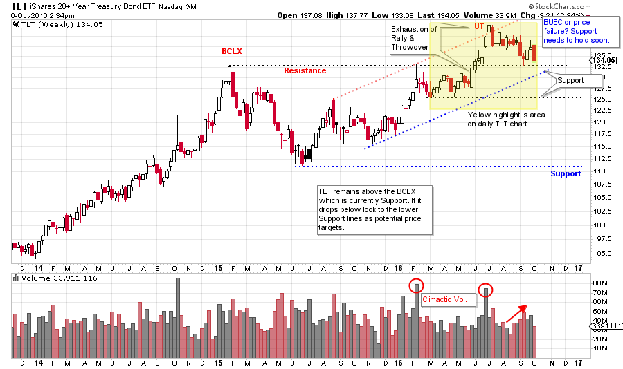
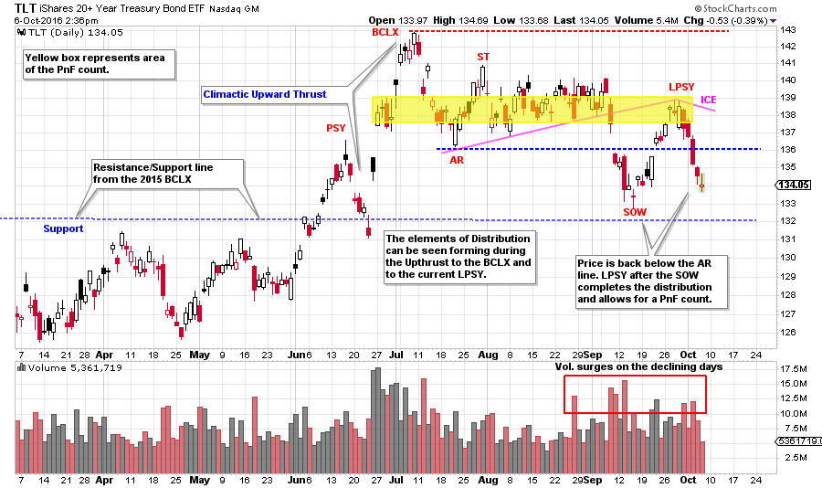
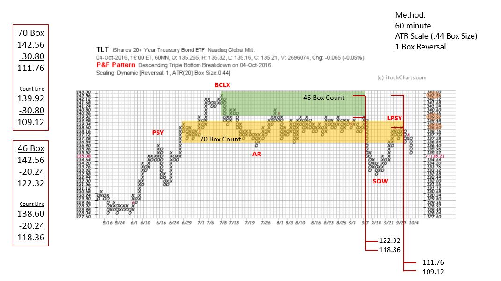

# Wyckoff Bonding

URL: https://articles.stockcharts.com/article/articles-wyckoff-2016-10-wyckoff-bonding/
Date: October 07, 2016 at 09:00 AM
Author: Bruce Fraser

The US Treasury Bond market is largely dominated by the activities of the Federal Reserve Bank. For seven years the Fed has maintained a policy of zero to one quarter percent interest rates. In December 2015 the Fed raised the Fed Funds rate to a range of ¼% to ½%, and since that time they have taken no action. In addition, the Fed is a major buyer and owner of US Treasury Notes and Bonds. With this in mind, is it possible to evaluate the US Treasury Bond market with our Wyckoffian tools to make a cogent and useful conclusion?

With interest rates near the zero bound, small changes in rates can result in large swings in bond prices. Interest rates can rise a modest amount and result in large declines in the price of the bonds. Therefore the risk of owning bonds (the longer the maturity the more volatile) could be high. Now the Fed is indicating the intention of raising interest rates in December. The pressure seems to be building in the economy for interest rates to climb. We should pull out our Wyckoff Toolbox and get to work on bonds. Being a Wyckoff tape reader may be the best method for navigating the bond market in the years ahead.

---

(click on chart for active version)

The current price structure of the 30 year US Treasury Bond goes back to the beginning of 2015 when a Buying Climax concluded an important bull run. The Automatic Reaction (AR) and the Secondary Test (ST) set the bounds of the trading range. The outer boundaries of this range were respected for 16 months. A jump out of the range resulted in a 6 week Upthrust that touched the top of the trend channel creating an overbought condition. Since then $USB has retreated back to the breakout level. Old Resistance needs to become new Support here. Falling back into the trading range will make bond prices vulnerable to declining back toward lower Support at 150. Note the price peak at the BCLX and the ST. The declines that followed were volatile and quick. Often price has memory and if there is a return into this price zone look for volatility to develop.

(click on chart for active version)

Zero coupon treasuries present an interesting view. Zero coupon bonds have had their interest payment or coupon stripped from the bond. Therefore Zero Coupon Bonds trade at a discount to the interest they will earn over the life of the bond. These treasuries are a pure price reflection of the present position and future trend of bond prices. Can they help us to understand the big picture? For this analysis we will use the PIMCO 25 year Zero Coupon ETF (ZROZ).

There is a ‘Hypodermic’ type advance into the January 2015 peak that has the clear appearance of a Buying Climax. A deep Automatic Reaction followed which we expect to stall bond prices, and that is what happened. It took 18 months for prices to get back to the BCLX peak. An Upthrust of the BCLX has occurred where prices churned and are now returning back into the trading range. Support needs to hold here. The next lower Support level is the trend channel. Again, note the volatility of prices on the decline from the BCLX to the AR. If price begins to fall back into this range, there may not be much Support to hold prices up.

(click on chart for active version)

A Climactic Upthrust has jumped above the BCLX where TLT then stalled and returned back to Support (old Resistance). US Treasury 20 year bonds (TLT) become vulnerable to declining if that Support does not hold. Let’s zoom into the daily chart of TLT.

(click on chart for active version)

For TLT the jump above the Resistance (blue line) of the 2015 peak should hold with the backing up action (BUEC) that follows (see weekly chart above for another perspective). Backups characteristically are low volume, low volatility affairs that are pausing prior to another upward leg. That does not appear to be the case here. After the BCLX, a series of lower peaks follows until a SOW sets up the conditions for a final rally into a LPSY. Now a potential Distribution is complete and a PnF can be used to estimate price potential. Volatility and volume have expanded into the conclusion of the formation (red box). Wyckoffians look for this as evidence that Distribution is present. Let’s turn to the PnF chart.

Both the conservative count and the aggressive count have their objectives in areas of Support. Reference the weekly TLT chart and note the price target areas, both of these counts are logical price targets on this chart. The larger count returns the price to the 2015 low and would validate the wide trading range marked by the BCLX and the AR. This also illustrates how much risk is inherent in bonds at these ultra-low interest rates.

All the Best,

Bruce
