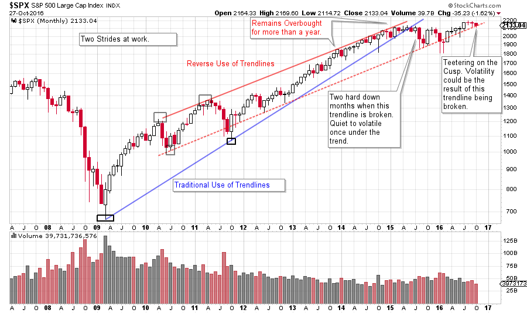
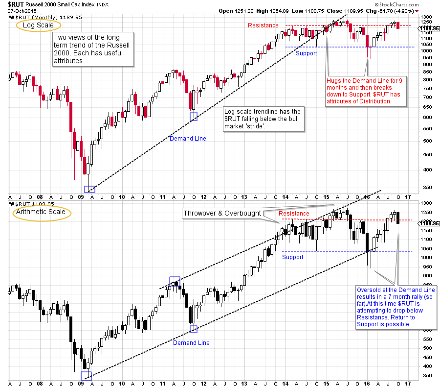

# Wyckoff Doodles

URL: https://articles.stockcharts.com/article/articles-wyckoff-2016-10-wyckoff-doodles/
Date: October 29, 2016 at 08:00 AM
Author: Bruce Fraser

When markets become dull and listless, Wyckoffians tend to doodle. Currently equity markets seem to be marking time while waiting for the results of the presidential election. The best way for the Wyckoff Nation to prepare is to keep reading the tape (in the form of chart analysis). One of my favorite activities is to doodle on the charts by drawing trendlines.

These lines can bring a chart to life and illuminate possibilities that would otherwise remain hidden and obscure. Doodling is best done on charts that you typically do not spend much time studying. Longer term charts are ignored in many cases. Recent posts have shown the value of these very large timeframes for anticipating big moves.

---

Proper trendline construction is one of the most powerful Wyckoff tools. Let’s doodle on some monthly vertical charts and try to identify points of interest and thresholds of vulnerability.

(click on chart for active version)

The steeper S&P 500 trendline (blue line) sets the stride of the advance for over 6 years before price fails and breaks down with a two month jolt in 2015. The low of that price break becomes important support. Nearly two years of a trendless trading range is in force, and remains so to this day. The Reverse Use of Trendlines (the red channel) is rising at a slower rate and is still in force. Note the oversold condition during the first two months of 2016. $SPX falls below the lower line of the trend channel and cannot stay below. The rally of 2016 follows from this oversold condition. Once again $SPX is flirting with the lower boundary of the channel. A break of this line (possibly on election news) could make the market vulnerable to increased volatility and a sharp decline. The bullish case would be to become oversold around this line (a brief shakeout of the trend and reverse back up) and then rally to new high prices. This trendline is an important cusp for the market and could result in a dramatic price pivot point. We will be watching this boundary closely. Note how trendlines and channels bring this chart to life.

(click on chart for active version)

Here are two views of the Russell 2000. The top chart is on a log scale and the lower is arithmetic scale. This illustrates how the stride of the advance takes on a different character based on the scale used. Monthly charts are most often scaled using the logarithmic method (log is better for capturing large trends). Both the log and the arithmetic styles can reveal useful, and different information. So we will look at both in this case.

Note how the bull market stride of the log chart is maintained for six years, while the $RUT traded ever closer to the trendline. Then the monthly bar of June 2015 committed below the trend and the $RUT tumbled into year-end. To this day the $RUT is below that trendline. Support and Resistance lines illustrate that $RUT has been trendless for nearly three years. The price is now stalling at Resistance, and is attempting to fall back into the middle of the trading range. If this happens, the risk is a quick drop to the Support line.

The arithmetic view shows the stride of the advance to still be in force. At the beginning of 2014 an overbought condition develops and stalls the advance for more than a year. In 2015 $RUT falls to the Demand Line and finds support. This oversold condition is an excellent trading juncture. The current rally is still under the 2015 high and puts $RUT at risk of making a lower high and forming a negative divergence versus the larger capitalization indexes.

Well drawn trendlines can reveal points of opportunity and vulnerability in markets. Doodle with these different markets and see if trendlines can illuminate and improve your chart analysis.

All the Best,

Bruce

Homework: The NASDAQ Composite is as interesting as the charts above. Make a monthly chart of the $COMPQ and do some doodling.

Back by popular demand! Roman Bogomazov and I are offering a two part webinar series on Setting Price Targets Using Wyckoff Point-and-Figure Charts starting November 3, 2016. These live interactive classes will be 2 ½ hours each. Take advantage of this opportunity to sharpen your Wyckoff PnF skills. Please click here for more information and to register!
