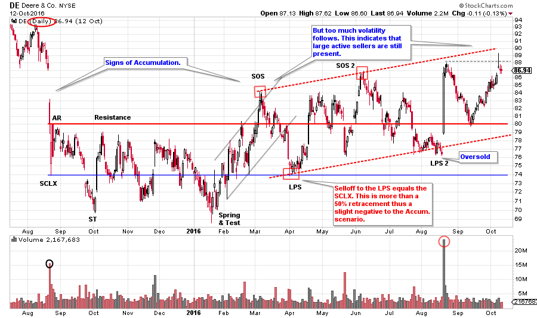
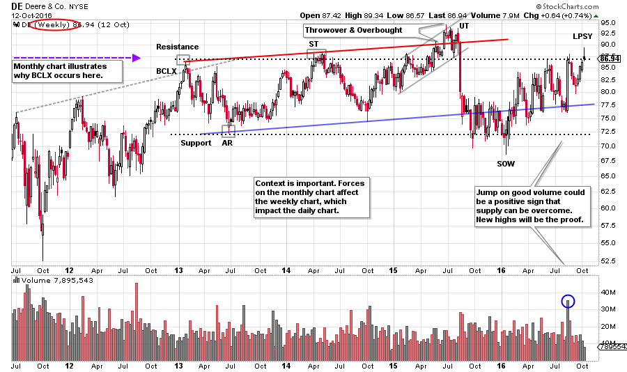
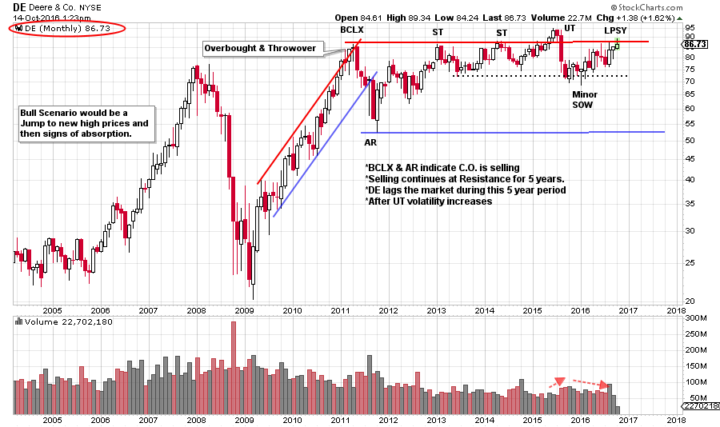

# Wyckoff Nation

URL: https://articles.stockcharts.com/article/articles-wyckoff-2016-10-wyckoff-nation/
Date: October 15, 2016 at 01:00 PM
Author: Bruce Fraser

In the Wyckoff Nation we appreciate how the Wyckoff Method provides context. This is an advantage unique to this approach of chart analysis. We have learned that a process unfolds during the formation of Accumulation and Distribution. The perspective of context follows from becoming intimate with the nuances of this evolution observed on the charts. This edge develops into mastery. In this blog, and in your individual practice, we are devoted to raising the skills of our Wyckoff Nation.

When we tackle the analysis of a stock it is valuable to follow a process. A process has multiple benefits. When evaluating a stock a good process will make for a more thorough analysis. It will provide a viewpoint that will minimize the potential to make an erroneous evaluation. It will improve the likelihood of selecting the best candidates. Also, with time, we become more efficient at researching candidates therefore covering more ground.

---

What does the Wyckoff Nation always want to do? Study charts. Let’s do a case study that emphasizes the value of context and the importance of process.

(click on chart for active version)

We see here a daily chart of Deere (DE) that has a familiar Wyckoff structure with a Selling Climax (SCLX) and Automatic Rally (AR) which sets the trading range (and possible Accumulation). A Spring and Test in January begins a rally that results in a Sign of Strength (SOS). A reaction to the Last Point of Support (LPS) returns to the level of the SCLX. The return to the LPS at the 74 level and the Support Line is successful, but too deep, as it retraces more than one half the prior gain. Our objective is to buy and hold a markup that follows a LPS. But the rally that follows only matches the high of the SOS before falling back into the potential Accumulation area. It is not uncommon to have another SOS (which would exceed the high of the prior SOS) and then a second LPS. But there is not another Sign of Strength prior to the next decline. This is a slightly negative development.

Absorption of supply is the condition we seek in our Accumulation studies and chart analysis. Context is the principle of progression in chart analysis, progression of absorption of shares during Accumulation (or the selling of shares during Distribution). As buying removes supply from the marketplace during Accumulation the nature of price and volume change to reflect this fact. The goal for the Wyckoffian is to buy when the majority of stock is in strong hands and price begins marking up.

With DE we can see wide price swings after the SOS and a slight upward tilt to the price trend. Volatile swings indicate that supply is still present. We will zoom out into a larger timeframe. Let’s find the reason for the additional supply that has surfaced after the SOS.

(click on chart for active version)

Here is an interesting and different set of conditions from our daily chart. DE completes an uptrend in 2013 with Climactic action (BCLX) and an Automatic Reaction. This sets the range that looks Distributional. A slight upward tilt contains the trading in DE into 2015. The Upthrust (UT) is followed by a sharp decline into a SOW. On the prior chart this SOW is labeled a Spring and Test. Also note the rally into the UT, it is of a poor quality on the way up (the rally is labored with a number of overlapping bars, volume surges on the down weeks and there is climactic volume near the peak).

Now we have an explanation for the wide swings on the daily chart. Latent supply is hanging over the market at the multi-year Resistance area. The Composite Operator arrived at the BCLX and began Distributing Deere. In 2016 there are three touches of the Resistance, in each case selling is the response. If DE cannot move up and away from Resistance soon, a return to Support is very possible. Recall that volatility increases as a range of Distribution forms and that appears to be what is happening here.

(click on chart for active version)

Evaluating the monthly chart adds a new dimension to our analysis. The monthly chart explains even more regarding the price behaviors we have seen on the daily and the weekly charts. Deere begins a two year uptrend in 2009. The trend is overbought and throws over the channel with a Buying Climax in early 2011. The Automatic Reaction confirms the BCLX and establishes the trading range. The BCLX sets up formidable Resistance at 86¾ that contains the DE stock price for the next 5½ years. DE has stabilized in the top half of this trading range, unable to return to the Support area (so far). Volatility is still expanding and we can see an UT, a SOW and a LPSY, therefore Distribution is a concern. Since 2011 Deere has significantly lagged the S&P 500 and this has persisted in 2016. If the stock market were to become weak, DE would be expected to be weaker than the market.

The monthly chart highlights large Supply that becomes apparent back in 2011. This resistance level explains much of the price behavior on the weekly and the daily charts. Thrusts to minor new high prices quickly fail and this makes sense within the context of the monthly chart view. Unexpected volatility follows what appears to be Accumulation on the daily chart. In the context of the weekly and monthly charts the narrative of Distribution appears to be at work when evaluating the daily price action. Price swings are large and there is not enough demand to markup through resistance.

Deere could become a buy candidate, but only after it Jumps above the formidable overhead resistance. Then Wyckoffians would look for evidence of supply having been absorbed during the Jumps and Backups.

Process and context help us to systematically uncover the Composite Operator forces, from larger timeframes, that could impact the instruments we are trading.

All the Best,

Bruce

Homework: In each time frame compare DE to the S&P 500.
