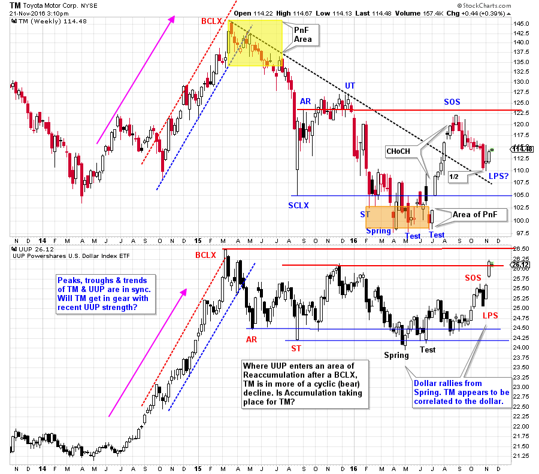
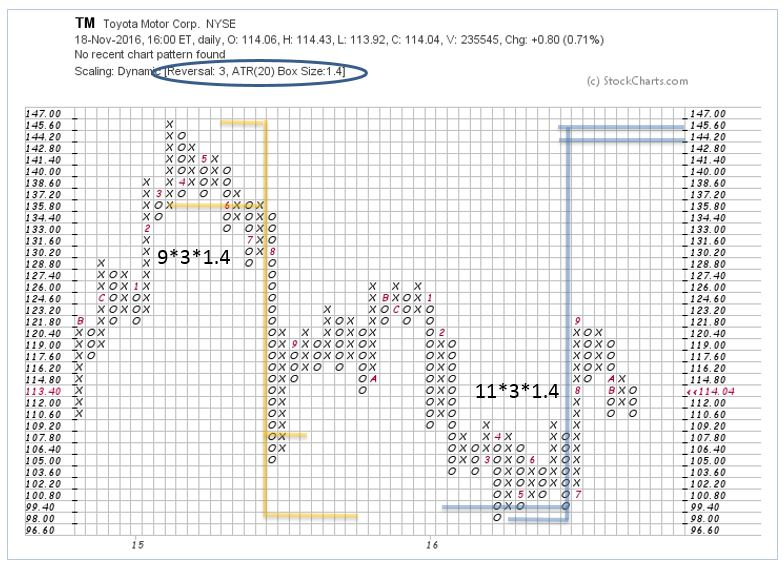

# Get Your Motor Going

URL: https://articles.stockcharts.com/article/articles-wyckoff-2016-11-get-your-motor-going/
Date: November 22, 2016 at 12:00 PM
Author: Bruce Fraser

Recently Toyota Motors (TM) has shown signs of life after a long cyclic decline. There seems to be a rhythm between the swings in the price of TM and the trend of the dollar. A strong dollar can improve profit margins of the Japan based auto manufacturer. The current rising trend of the dollar is likely improving business conditions for TM and other foreign companies doing substantial business in the U.S.

---

(click on chart for active version)

Whatever we think of business conditions, the action of price must be the final arbiter of the speculative position taken in a stock. The downward stride is established in TM with a basic trendline. Wyckoffians look for the downward stride to be broken and a Cause to be built and counted with a Point and Figure chart. We can identify the stopping action of a Selling Climax followed by a series of tests. This suggests that Accumulation is occurring. TM camps out in the price range of the Selling Climax for 22 weeks. This is a long time for the Composite Operator to get their work done building a position. A dramatic Sign of Strength (SOS) lifts TM above the downtrend line. A decline from the SOS sets up a Last Point of Support (LPS). The rally to the SOS is a classic Change of Character (CHoCH) where price leaps easily upward. A one-half correction of that rally takes place (which is as far as this correction should retrace). A deeper decline could signal redistribution instead of Accumulation.

Note the cyclic rhythm of TM to the UUP (U.S. dollar index ETF). In 2014 TM led the emerging strength in the dollar and then both rallied into a first quarter 2015 Buying Climax. This could be happening again now. Where the dollar traced out a Reaccumulation, concluding with a Spring and Test. TM has suffered a cyclic decline that returned TM to below the 2014 lows. The lows and the peaks of TM and UUP seem to be in sync with each other. The UUP has rallied to the 2015 peak prices. Will TM turn at the LPS and follow UUP upward?

A conservative PnF count generates a price projection that returns TM to the prior 2015 high. A larger count potential reaches from the LPS to the SCLX. Once (and if) TM can clear the Accumulation area by rising above the UT, we will take that count.

The legendary John Murphy has been documenting the recent strength in the NIKKEI Index with respect to the falling Yen. His study (link to his blog here) of how to capture the gains in the NIKKEI by hedging out the negative effects of the falling yen is must reading.

All the Best,

Bruce

Homework: Compare Honda Motor Co. (HMC) to Toyota. Which is more compelling as an investment? Why? Compare PnF counts.

Ps. We will take a break during the upcoming Thanksgiving Holiday week. Have a wonderful week.

Links to Helpful Blog Resources (click on title for link):

Wyckoff Walk Around the Clock

Wyckoff Power Charting. Let's Review

Context is King

Distribution Definitions
