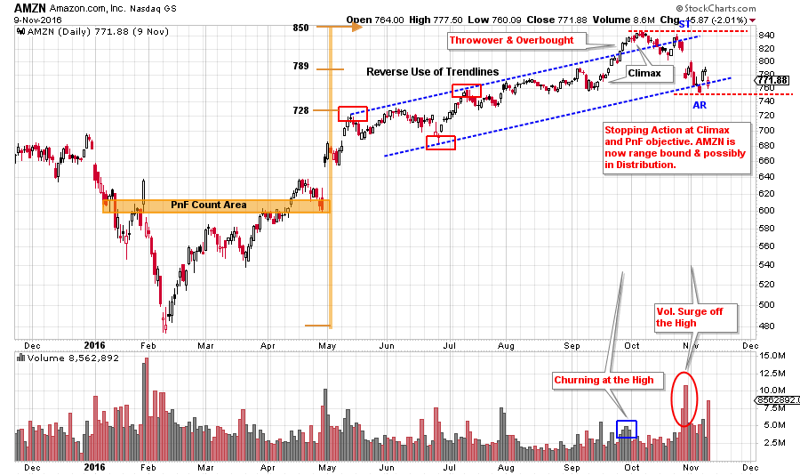
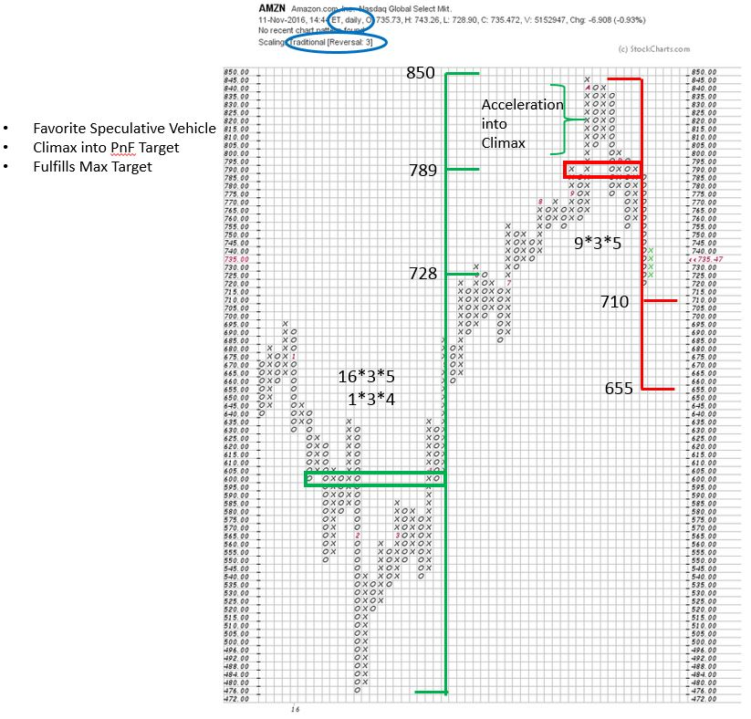
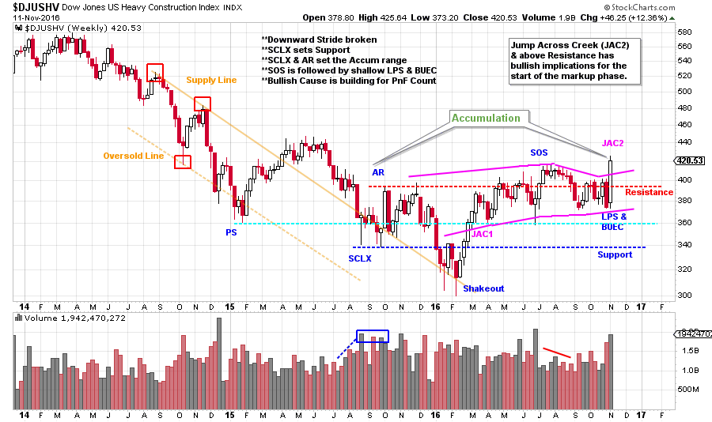
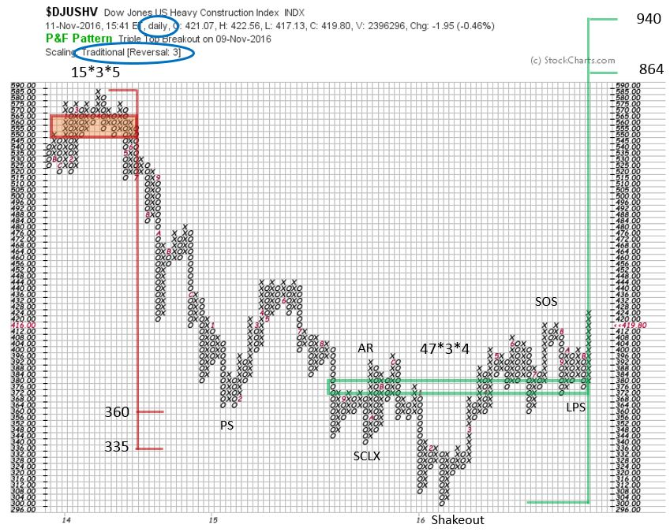

# Main Street vs. Wall Street

URL: https://articles.stockcharts.com/article/articles-wyckoff-2016-11-main-street-vs-wall-street/
Date: November 12, 2016 at 03:55 PM
Author: Bruce Fraser

When a bull market begins, near the end of a recession in business activity, the fed is actively pumping money into the banking system. This new money seeks a place to go where it can work the hardest. During the early stages of the economic recovery the real economy is running below its capacity to produce. There is slack in the system. It can take years for business activity to rise to a level where companies start to invest in new productive capacity. Generally, the first half of a bull market move in stocks is very robust because new capital is not needed by Main Street and thus finds its way to Wall Street where speculation is very profitable.

There is always competition for capital. So capital is continuously migrating to where it is perceived to be working most efficiently and profitably. We can think in terms of two big camps which are competing for capital in the domestic economy; Main Street and Wall Street. When the economy is slow and running below its capacity to produce, Main Street has no incentive to invest in new plant, equipment or to hire additional employees. The Fed pumps money into the banking system and it goes toward Wall Street speculation. During this time Wall Street is paved with gold and Main Street is full of pot holes. When the Animal Spirits of speculation are at work on Wall Street it is a very exciting time. Eventually that capital starts moving to Main Street (as the economy improves) when value and opportunity emerge.

---

Does this mean that investors and traders are out in the cold for the remainder of the business expansion? Absolutely not. It does mean that capital is rotating toward the beneficiaries of the real economy. Can we, as Wyckoffians, seek out and find the possible emerging Main Street themes and reduce our exposure to the Wall Street favorites where risk has become high?

The ‘FANG’ stocks are exemplary of the focus and intense speculation of Wall Street. These are great companies with superior growth rates and speculation has driven their valuations to extreme levels. Rotation to Main Street themes from Wall Street takes time and is a process. Money is seeking out new places where it can work hard, with less risk. We will study a FANG stock and a Main Street Industry Group to discern if money is migrating from one theme to the other. Again this does not happen all at once, but rather over a period of time. Is it time to pivot from the investment themes of Wall Street to the opportunities on Main Street?

(click on chart for active version)

Facebook, Amazon, Netflix and Google (Alphabet) are the classic FANG companies. They are immense, high growth and a favorite of institutions and individual investors. There are other stocks in the FANG mold. Is the FANG theme running out of steam? Amazon is an outstanding FANG stock and has been a super performer in 2016. A PnF Cause has been built which can be counted and a trend channel has formed. At the end of the run up there was an Overbought condition, which resulted in a swift break to the bottom of the trend channel. This was an abrupt change of character. The Climax, throwover and reversal all formed at the highest PnF price objective.

The fuel in the tank is all used up. The max count of 850 is almost a perfect hit and the acceleration into a Climactic Run-up coincides with reaching the count objective (these two conditions forming together is the best kind of confirmation of the exhaustion of a trend). A Distribution count can be taken to 710 and 655. This distribution count could grow larger. The sharp selloff after the Climax is a warning of a large stopping action. Further appreciation above the Climax peak will require a new Cause to be built and this could take months to years.

(click on chart for active version)

Our surrogate for the Main Street theme is the US Heavy Construction Index. While Amazon and the FANG stocks were trending into a Climax, this industry group was concluding a bear market decline and building a bullish Accumulation for a new uptrend. This week a Jumping action has put this group out of the Accumulation area. The Heavy Construction theme appears to be preparing for a new bull market. We can estimate the upward price potential by taking a PnF count.

With this 3 box reversal PnF, using standard scaling, we can count 47 columns which translates into an objective of 864 to 940. This is more than a double from current prices. This Accumulation count has the potential to grow larger which could promise an even higher price objective. The structure of the Accumulation is the opposite of the condition of AMZN. Does this suggest that capital is rotating out of the high-flying FANG themes and into the bricks and mortar stocks?

When Main Street begins to demand capital for growth the result will be new plants, filled with new equipment, and new employees to produce goods and services. Roads, bridges and infrastructure will be upgraded to move more goods. Expect the level of inflation to begin accelerating as more ‘stuff’ is being manufactured. Also, the cost of money (interest rates) will rise as the competition for capital heats up. Bond prices will fall as interest rates rise (link to a recent blog on the bond market here). Watch commodity prices and bond prices to further confirm that the Main Street theme is emerging.

All the Best,

Bruce

Homework: Evaluate the stocks in the US Heavy Construction Index to find the best leaders. What other Industry Groups reflect the Main Street theme? Evaluate all of the FANG stocks to determine if they have similar price characteristics to AMZN.
