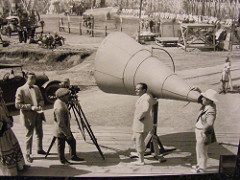
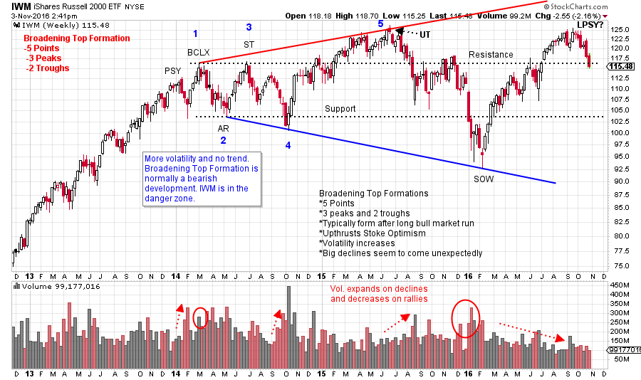

# The Broadening Top Formation

URL: https://articles.stockcharts.com/article/articles-wyckoff-2016-11-the-broadening-top-formation/
Date: November 03, 2016 at 02:50 PM
Author: Bruce Fraser

My very first technical analysis book was “Technical Analysis of Stock Trends” by Robert Edwards and John Magee (5th edition). How I loved that book! I read and reread it and endlessly studied the charts. In my estimation it is one of the most important technical analysis books ever published. Golden Gate University Professor, Charles Bassetti, has done a masterful job of keeping this series current with updated editions in recent years (click here for a link to the book).

In the early years of my chart studies the ‘Broadening Top Formation’ revealed itself on a few occasions. Edwards and Magee has an excellent section on this formation. The Broadening Top structure has a signature of increasing volatility within a trading range. This manifests as a series of higher highs and lower lows with the net effect that price is making no progress (a trading range of increased volatility). This price structure typically arrives at the conclusion of a bull market, is a bearish development, and can take months to years to develop.

---

The Edwards and Magee description of the Broadening Top Formation involves 5 points. Three peaks divided by two troughs. Each peak is higher than the prior and the second trough is lower than the first. On the IWM chart below the five points are labeled.

A Wyckoffian interpretation of the Broadening Formation is that a lengthy period of Distribution is unfolding with a series of Climactic Upthrusts forming near the Resistance area and Signs of Weakness (SOW) forming near Support. The Upthrusts (PSY, BCLX, UT and UTAD and LPSY type actions) are unsustainable because the Composite Operator is selling their stock holdings at the high price levels. Ever larger amounts of Supply weigh on the market, and the lack of C.O. Support, results in a series of SOW dips to new lows. The C.O. exit is destabilizing prices.

(click on chart for active version)

Here is the Russell 2000 ETF (IWM). Volatility is increasing within the trading range. Each rally and reaction is larger since 2014. The most recent advance from the 2016 low has very nearly made a new high, but not yet. Often the last rally fails to make that new high. For IWM the classic 5 points are complete and therefore this current advance is not expected to make a new high. This is a point of vulnerability near the prior peak, (after a Sign of Weakness). Wyckoffians would label this a potential Last Point of Supply (LPSY) and brace for another decline (with the two Support lines as potential price targets). If a push to a new high occurs, we would be on our toes for an Upthrust After Distribution (UTAD). In all cases we brace ourselves for sudden and wide price swings.

The views and interpretations of the broadening top structure above, are those of your blogger and should not be construed as the views of Mr. Bassetti or the Edwards and Magee series.

All the Best,

Bruce

Homework: Describe two Wyckoff scenarios where IWM could result in a bullish outcome.

Back by popular demand! Roman Bogomazov and I are offering a two part webinar series on “Setting Price Targets Using Wyckoff Point-and-Figure Charts” starting November 3, 2016 (today @ 3:00 p.m. PDT). These live interactive classes will be 2 ½ hours each (recordings will be available for your review). Take advantage of this opportunity to sharpen your Wyckoff PnF skills. Please click here for more information and to register!
