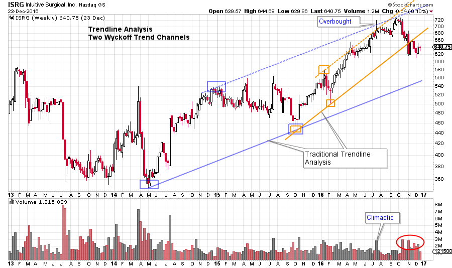
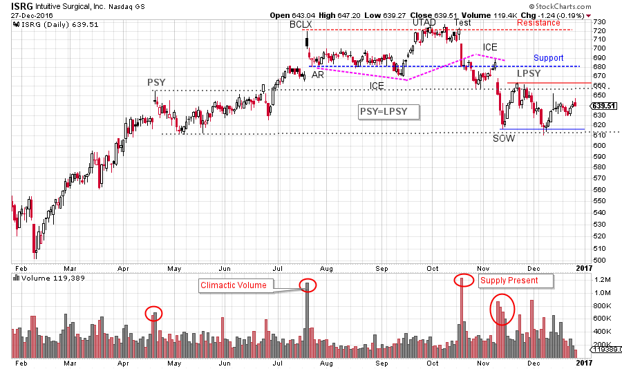
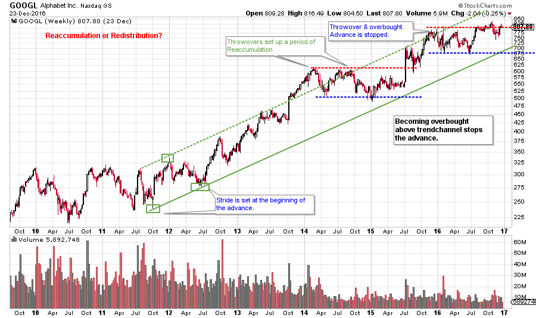
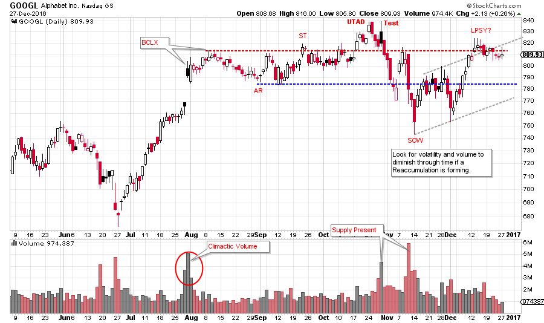
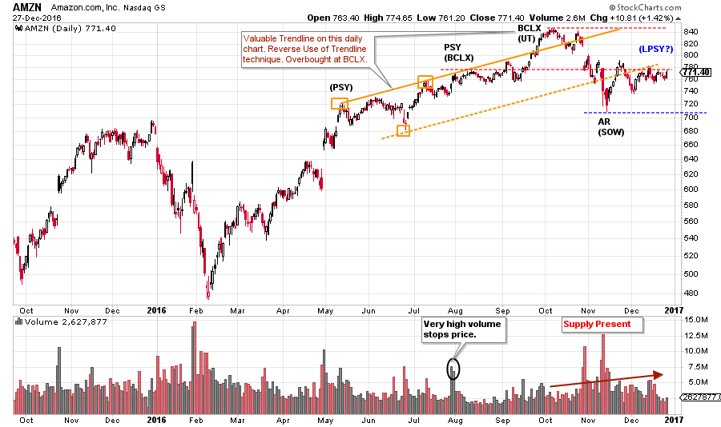
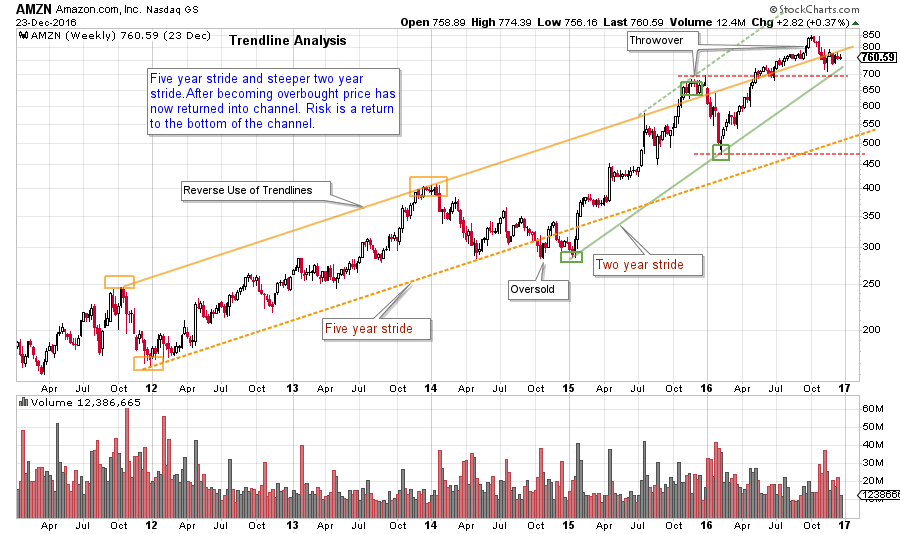
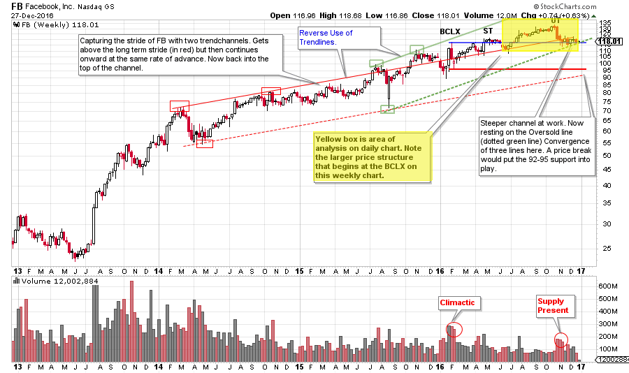
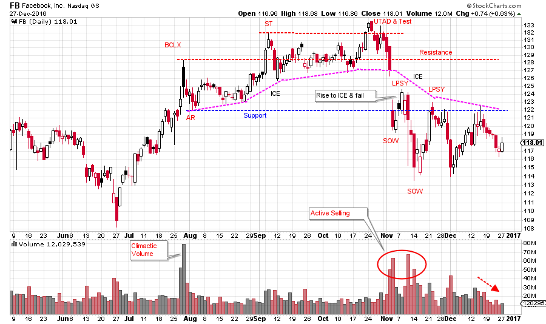

# Holiday Chartfest

URL: https://articles.stockcharts.com/article/articles-wyckoff-2016-12-holiday-chartfest/
Date: December 27, 2016 at 06:00 PM
Author: Bruce Fraser

The Holiday Season is a joyful time of year. Wyckoffians appreciate the year-end and anticipate the year to come. This period of reflection and planning is best enjoyed by studying lots of charts. Here we offer a few charts to enhance your year-end fun. May you find lots of additional charts to augment your Holiday Season!

---

(click on chart for active version)

Two trend channels establish the long term and near term stride on this weekly chart. ISRG becomes Overbought when it thrusts above both upper trendlines simultaneously. After an eight week pause, a test of the Climax ensues. Thereafter price weakness on expanding volume indicates Distributional activity.

(click on chart for active version)

Zooming into the daily chart view clearly shows the Buying Climax (BCLX) and the subsequent Test (labeled an Upthrust After Distribution). Following an UTAD expect a minor Test. How price declines to Support tells much about whether Distribution or another Reaccumulation is forming. Immense volatility follows the Test and volume is very high as price declines. After breaking Support price attempts to rise above it, but fails. Another leg down is wickedly volatile and results in a Sign of Weakness (SOW). Note how PSY equals LPSY, this is a common relationship. Currently there is an attempt to rally and so we will be on the alert for another Last Point of Supply (LPSY).

(click on chart for active version)

Alphabet (GOOGL) has the stride set very early in the 2011-12 uptrend. The throwovers of the Overbought line set up a series of Reaccumulations. Is the most recent, and current, formation a Reaccumulation or Distribution?

(click on chart for active version)

The Buying Climax is very evident on the daily chart view. We look for a combination of accelerating price (a gap in this case) and high volume, which are both evident. The BCLX forms important resistance that comes into play in the months after. After a UTAD and test, price rapidly weakens down to Support and then into a Sign of Weakness (SOW). Note the high volume on the decline which in combination with downward price volatility smells of Distribution. An LPSY is expected after a SOW. A natural place to stop the rally into the LPSY is the price area of the BCLX, where price is as of this writing.

(click on chart for active version)

Here is a tricky chart. Amazon has a stride that forms during 2016 (Reverse Use of Trendline). Each key point is labeled twice using different interpretations. At the PSY there is high volume, not much price progress, and price is right at the top of the trend channel. Selling by large interests is occurring here. We expect price resistance, later on, at this price area. The rush up to the Buying Climax (BCLX) includes a throwover of the channel and AMZN is therefore, overbought. The PSY, BCLX and AR all represent important forms of Support and Resistance. This interpretation implies that more work is likely to be done in the Distribution (or Reaccumulation) process. Note how high the volume is after the BCLX. This has us thinking of Distribution. If the alternative labeling works out (alternative labels are in brackets), then Distribution is much further along and a downtrend is likely to have already started.

(click on chart for active version)

For perspective, we study a longer view of AMZN. A Reverse Use of Trendlines illustrates the stride nicely. Two Throwovers establish an overbought condition. Currently AMZN resides just under the upper Trend Channel line and is close to the steeper two-year (in green) trendline. These conditions could put AMZN in motion toward the lower part of the longer channel.

(click on chart for active version)

There are two strides at work on this weekly chart. FB is just under the Supply line of the longer channel and is touching the oversold of the steeper channel. FB should rally from around here to keep the trend in force. Study how well these trendlines and channels can inform your trading. The trend really is your friend.

(click on chart for active version)

Zooming in we see classic ‘stopping action’ of an uptrend at the Buying Climax (BCLX). Either Distribution or Reaccumulation is forming. Thus, we are seeing a ‘Change of Character’ in price action. Study the Upthrust After Distribution (UTAD) as it is a very good example. Note how price tumbles after the initial UTAD break and test. Support is easily broken and then price lives under it. Declining volume hints that price may try to rally from here. See the prior chart for how the steep trendline is providing important Support here. Moving to the left note the BCLX where volume surges and price temporarily jumps. The BCLX and the AR (Automatic Reaction) form the emerging areas of Support and Resistance. Note how old Support is now Resistance.

The stocks above all lagged badly during the sharp post-election rally. In each case stopping action and evidence of Distribution was in place months prior. Wyckoff provides us with good tools for seeing changing conditions early on. Many stocks and groups came to life in November and they deserve our attention. Take some time in the final hours of 2016 and search for the leaders of 2017 and beyond.

This will be the last ‘Power Charting’ post for 2016. It has been a blast to ‘chart’ with you in 2016. Let’s do it again in 2017! Have a Joyous (and safe) New Year.

All the Best,

Bruce

Additional References for this post:

Distribution Definitions (click here)

Just Another Phase (click here)

Context is King (click here)

Making the Trend Your Friend (click here)

Upcoming Wyckoff Class at Golden Gate University in San Francisco: Dr. Hank Pruden will teach FI355 (I will be providing guest lectures during the semester), the Wyckoff II class, on campus beginning January 7th. Dr. Pruden has arranged for individuals interested in this class to attend a lecture and workshop on the Wyckoff Method on January 4th (from 4pm-6pm). This special workshop is intended for persons interested in FI355. As space is strictly limited to the capacity of the classroom, reservations are a must. Please contact Dr. Pruden at 415.442.6583, or by email at hpruden@ggu.edu, to reserve your space. (click here for additional information)

Complimentary webinar announcement:Fellow Wyckoffian Roman Bogomazovand I will be conducting our first “Market Outlook and Stocks Review” webinar of the year on January 4th, 3:00 – 5:00 pm (PST). Our special guest will be acclaimed author/traderCorey Rosenbloom. In this session, we will examine likely scenarios for the market in 2017, as well as prospects for specific sectors, industry groups, and stocks. To find out more and to register for this free webinar, pleaseclick here.
