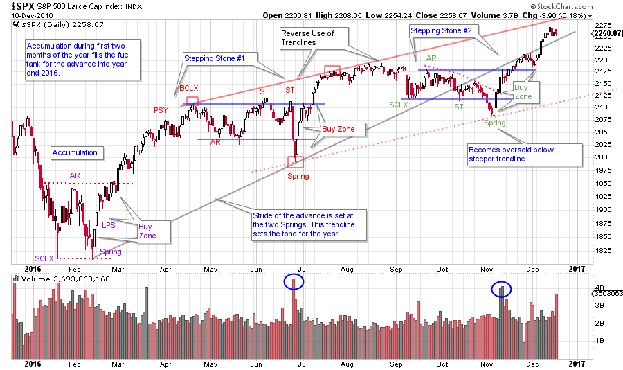

# The Inner Game of Wyckoff

URL: https://articles.stockcharts.com/article/articles-wyckoff-2016-12-the-inner-game-of-wyckoff/
Date: December 17, 2016 at 10:00 AM
Author: Bruce Fraser

Looking back over this soon to be concluded year could be a very useful exercise. Let us put a twist on this ‘lookback’ to supercharge the exercise and improve our Wyckoff Method of trading. Mental rehearsal can be a valuable technique for strengthening trading skills. With this technique we take a historical market structure that we are determined to master; and analyze it, evaluate it, label it and then paper trade it. The intention is to become nuanced with the many variations of price structures that develop in markets. Mental rehearsal is the ability to make this rehearsal process as real as possible in the mind’s eye. I believe that all successful traders employ this technique, in a very personal way, in the development and mastery of their vocation.

---

Shawn Green was a two time All-Star as a professional baseball player. He wrote a gem of a book; ‘The Way of Baseball: Finding Stillness at 95 mph’. This book studies the role of mental rehearsal (and the power of mind) in developing ability and then world class mastery in competitive sports. We get a peek into the mental practice of an All-Star caliber athlete. And from this we can get a glimpse into the importance of our mental rehearsal for trading. Hitting a baseball is among the most difficult tasks in professional sports. A hitter who can get a hit 3 out of 10 times is an all-star. When Green was a rookie he couldn’t get many practice swings during pre-game hitting practice because the team veterans were allotted most of the time. He was struggling and felt that he needed more swings if he was to survive as a professional ball player. So, Green attempted and succeeded in practicing his hitting by inventing a form of mental rehearsal. He acquired a batting tee like the kind that little leaguers use when first learning how to hit. The baseball sits on the tee, stationary and in the strike zone where the hitter then practices swinging and hitting the ball off the tee. Green would mentally visualize the pitcher throwing 95 mph while he practiced his swing mechanics for contacting the ball. He began endlessly hitting the ball off the tee into a concrete wall behind the stadium. His mental rehearsal became more and more nuanced as he practiced hitting (off the tee) different kinds of pitches, in different locations over the plate. After he started this rehearsal technique he began hitting the ball when he got into games (this was important as he was not a starter and didn’t get to play every day). He became a very good hitter, which eventually led to an all-star career. He ultimately concluded that baseball is a very much a mental profession. Green used this form of mental rehearsal with the batting tee throughout his entire career and it is a central part of the book ‘The Way of Baseball’.

When traders customize mental rehearsal for their trading process the opportunity is presented for endless practice. Just as Shawn Green hit countless baseballs off the tee, we can practice making many trades. Stockcharts.com makes it possible to go back into many varied market environments and practice trading skills. In your minds-eye while doing this mental rehearsal make the trading as real as possible. Study as many varied situations as possible. You will one day discover that you are trading as well as you practiced. Even the most grizzled veteran traders are mentally rehearsing ceaselessly. Just as Shawn Green, during his career, never got away from that batting tee and his mental rehearsal process.

Look back at 2016 with an eye toward practice. When Wyckoffians practice, they are developing their craft. The chart below is marked up with an interpretation of Wyckoff structures. In our practice, we must go beyond getting the structure right. We want to see the proper entry points and employ good tactics. And to have the experience of putting all of the elements together and then making the proper trade. So, go back over the past year and instead of studying it, purposefully practice it. Make your study time meaningful and valuable. When we came up with the blog title ‘Wyckoff Power Charting’, this mental process for reading charts is what I had in mind.

(click on chart for active version)

First note the stride of the advance for the year. It is still in force. It is drawn from a Spring low in February and June. To conclude Stepping Stone #2, the S&P 500 tried to breakdown but then rallied off another Spring in response to the November election. $SPX is now flirting with this trendline (grey line). Also, there is a Reverse Use of Trendline technique employed (solid red line) and an oversold line that is working very well. There are three zones that set up important rallies, an Accumulation at the beginning of the year and two Stepping Stone formations. Note that they all had a Spring that shook out prior to resuming the upward advance. Each Buy Zone has a robust Jumping action that demonstrates an important ‘Change of Character’. Zoom into these areas and study them closely. Mentally rehearse where you would enter your trades. Note how momentum builds into a liftoff with this Change of Character. Keep in mind that practice like this can serve you even if you are working in a different timeframe.

Homework: Choose other markets that you are interested in and continue this practice.

All the Best,

Bruce

Announcement: On January 4th Roman Bogomazov and I will be conducting our first 'Market Outlook and Stock Review' webinar of the year. Our special guest will be author/trader Corey Rosenbloom. This webinar is being offered free of charge. To find out more and to register click here.
