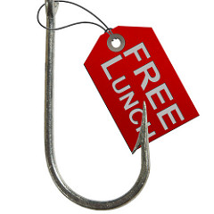
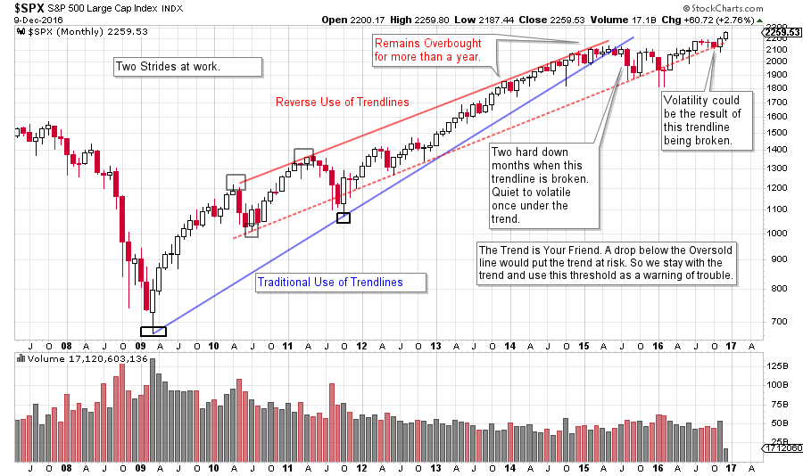
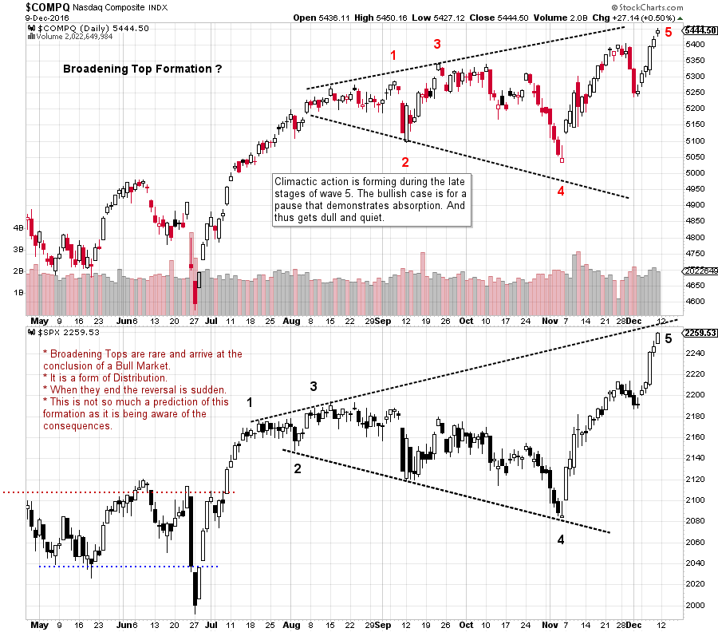
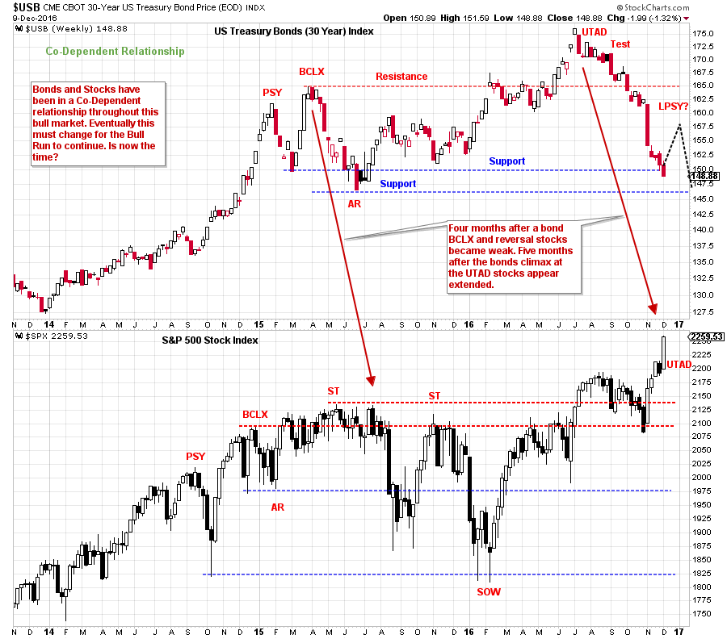

# There are No Free Lunches

URL: https://articles.stockcharts.com/article/articles-wyckoff-2016-12-there-are-no-free-lunches/
Date: December 10, 2016 at 03:40 PM
Author: Bruce Fraser

As this year comes to an end, investors and traders begin thinking about the year ahead. Wyckoff as a tape reading process is concerned with what the current position indicates about the future direction of markets. Ideally Wyckoffians develop their tape reading skills (chart analysis) to a level where market opinions are stripped away and replaced with an unbiased assessment of conditions.

Having said this, your blogger was invited to present a ‘2017 look ahead’ at the annual December TSAA-SF luncheon. As my mission in life is to stay in this moment and evaluate current conditions I knew attendees looking for prognostications would be disappointed. Therefore, I decided to focus on current conditions that may affect the future direction of the market.

---

Wyckoff is first and foremost a trend following method. The current trend is the most important thing to know about the market. We always work with the current trend until conditions indicate that the trend has been stopped. The Wyckoff Method does such a good job of identifying the trend, the stopping of the trend, and the reversing of a trend or its continuation.

Therefore, my plan at the luncheon was to confirm the present position of the trend and our mission of participating in it. Then to highlight three conditions that could bring the upward trend into question. Thus, giving us an objective framework for detecting market trouble, should it occur.

It is good to attempt to assess market conditions and how they may warn of the conclusion of a market phase and the emergence of another. But we never want to put environmental conditions ahead of trend. So with this in mind here is a summary of what I presented to the attendees of the TSAA-SF annual luncheon:

(click on chart for active version)

The Stride of the Market takes two trajectories. The blue trendline supports the $SPX’s rate of advance from early 2009 until 2015. After two months just below the trend in 2015, price tumbles into an oversold condition established by the other trend channel (in red), and there it holds. Well drawn trendlines can be so useful. Note how $SPX hugs the oversold line from 2015 to the present. The index has not been able to rally significantly away from the lower channel line and is currently within striking distance of breaking the upward stride. Conclusion: If price can stay above the lower trendline and rally away, we will stay in harmony with the trend. We will watch closely for a breach of the line with the expectation that markets will be volatile below the trend channel.

(click on chart for active version)

A Broadening Top Formation is a condition of Distribution. The NASDAQ Composite and the S&P 500 are compared here and may have the characteristics of a Broadening Formation. These formations usually occur in 5 legs. Distribution typically involves increasing volatility and that is the definition of this structure. The very large run from 4 to 5 makes the markets extended. The bullish scenario would be for these indexes to settle down here and become dull and quiet while digesting large gains. This would be a sign of Absorption. But if this is Distribution, it will turn back down without much advance notice. Conclusion: Expect a pause after a robust advance from point 4 to point 5. Use your tape reading skills to confirm absorption. If a Broadening Formation is at work here then expect a price break, followed by a weak test of the high. Thereafter price typically becomes suddenly, and unexpectedly, weak (click here for more on Broadening Formations).

(click on chart for active version)

Stocks and bonds have been in a Co-Dependent Relationship during this long bull market. At the rush up to the Buying Climax (BCLX) the bond advance is stopped. An Automatic Reaction (AR) follows. This stalls the upward progress of stocks and about four months later they tumble in two stages into the 2016 lows. Once again bonds have Climaxed into an Upthrust After Distribution (UTAD) and failed dramatically. Now, about four and a half months later the $SPX is making new highs. Stocks and bonds can and do diverge from each other as the typical business cycle matures. There is no reason that stocks can’t advance while bond prices drop (interest rates rise). During this bull market stocks and bonds have been largely in lock step. Currently they are out of step. This may raise the possibility of the need for stocks to pause while the economy begins to rev-up. Conclusion: In the second half of a business recovery stocks typically advance and bonds fall by the wayside. That may be the case this time. A long and robust economic expansion (while interest rates rise) can be very good for stocks. We may be at that juncture now. But we must remain aware of the co-dependent relationship that has been characteristic of stocks to bonds during this entire bull market.

The Wall Street favorite FANG stocks (click for a link) have suddenly become laggards (for the time being) and some commodities have come to life. Those that we covered earlier in the year include copper (click for a link), natural gas (click for a link) and crude oil (click here and here and here). Strength and leadership among these commodities is further confirmation of economic revival.

Time for lunch!

All the Best,

Bruce

For membership information on The Technical Securities Analysts Association of San Francisco (TSAA-SF) (Click here)
