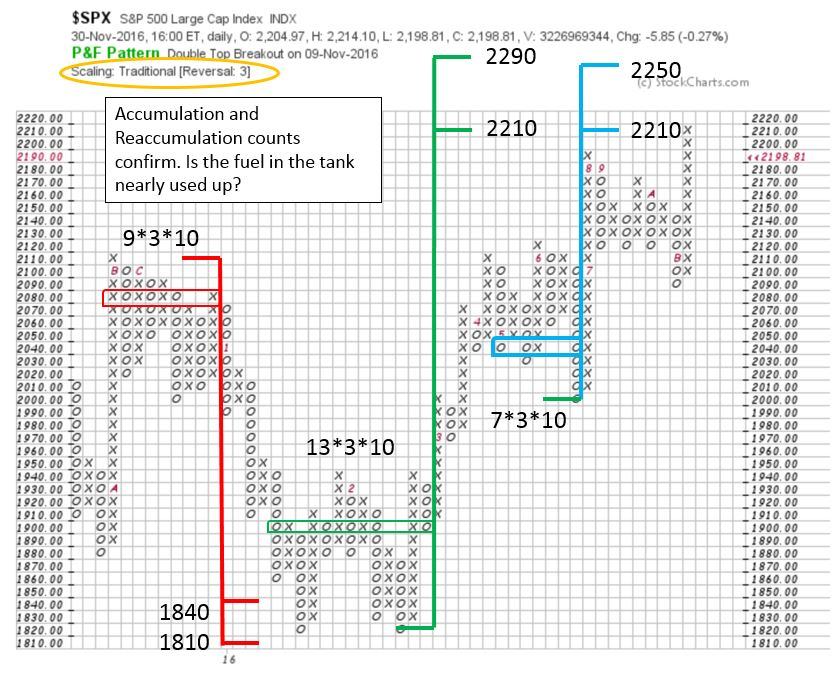
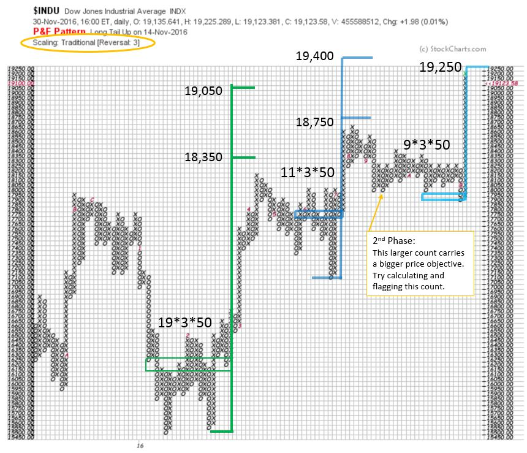
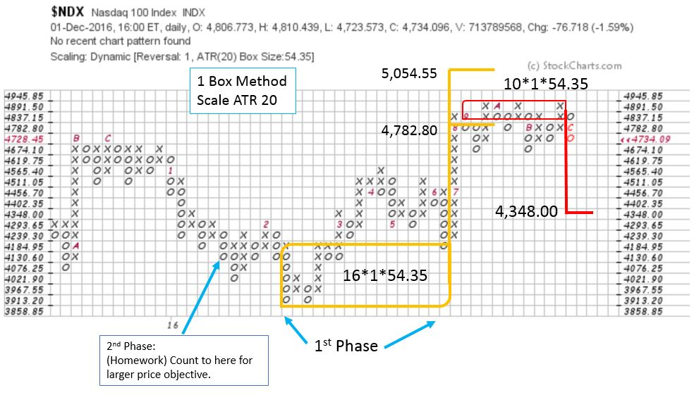
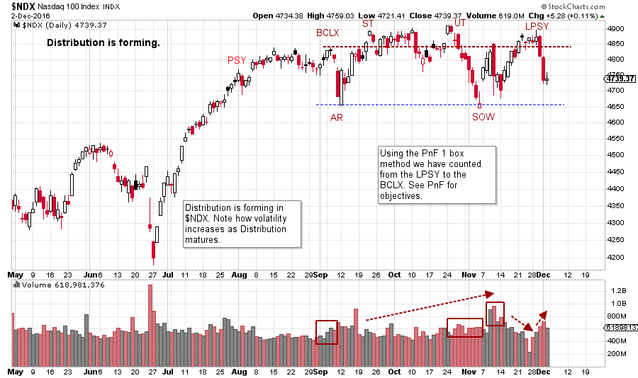

# Why Point and Figure Works

URL: https://articles.stockcharts.com/article/articles-wyckoff-2016-12-why-point-and-figure-works/
Date: December 03, 2016 at 02:40 PM
Author: Bruce Fraser

We are often asked to explain the rationale for why the horizontal Point and Figure (PnF) method works for estimating price objectives. The horizontal PnF method which requires judgment and nuance to employ, is rarely used these days, yet it works surprisingly well. The judgment required is in knowing how much of the horizontal congestion area to count for the purposes of estimating how far a price move could extend. To understand why counting a horizontal congestion area could systematically and consistently measure the potential for a price move, we must review the role of the Composite Operator in the Accumulation and Distribution processes.

An abundance of volatility allows the C.O. to Accumulate the shares of a stock they intend to campaign. A wide trading range with many upward and downward swings provides cover to the C.O. to absorb the many shares needed for a sizable position. Therefore, the key element necessary for the C.O. to Accumulate shares is volatility. If there is less volatility during the trading range, it will take longer. With more volatility it will take less time.

---

In the construction of a vertical bar chart, time is a constant on the ‘X Axis’. Each period gets equal space on the chart. In the construction of a Point and Figure chart each column gets a price posting only through the generation of volatility. A post in the next column to the right only occurs when there is a reversal of price of a predetermined minimum amount. On a PnF chart, the size of an Accumulation (or Distribution) is purely a function of the number of reversals of price.

As Wyckoffians we believe this volatility to be the footprint of the C.O. doing their work. Based on this logic, we conclude that by counting the columns in an Accumulation (or Distribution) we can estimate how much stock the C.O. has absorbed, and the extent of the price trend that should follow.

Point and Figure charts seem like magic when we see them work again and again. Point and Figure charting is among the oldest forms of charting. Horizontal PnF counting has been in use for a very long time. Conventions for how to count and calculate price objectives is a very ancient, tried and true, process. But taking the proper count requires much practice to achieve a level of mastery. Let’s look at some PnF counts of the current market to hone our skills.

Has the fuel in the tank been used up? The mid-year Reaccumulation count (in blue) matches the Accumulation count (in green) generated early in 2016. Now the minimum objective of 2210 in the $SPX has been met. Wyckoffians would look for classic evidence of stopping action of the uptrend (Buying Climax and Automatic Reaction) on the vertical chart to confirm the uptrend is stopping. Either a Reaccumulation or a Distribution is possible thereafter. But the uptrend is likely over for the time being once these conditions are in place. Keep in mind there are higher objectives in these counts that could still be met.

Here is an Accumulation count and two Reaccumulation counts in the Dow Jones Industrials ($INDU). There is a nesting of counts that are confirming each other. There is a counting nuance in the middle Reaccumulation (marked in blue). Note that eleven columns are counted and not the entire range. Note that the downtrend ends at the eleventh column (counted right to left) and then reverses up to set the trading range. We count to there with the logic that the C.O. steps in there, supports the market, and price rises to Resistance. We conclude that the C.O. doesn’t show up until the range is set.

The NASDAQ 100 is beginning to show evidence of Distribution on the 1 box reversal PnF chart. A conservative count takes $NDX to the middle of the bigger trading range. The $NDX appears to be the first major index to exhibit stopping action and a potential reversal.

The NASDAQ 100 appears to be in Distribution. Note the increasing volatility as the Distribution matures. In a prior post (click here for a link), we have discussed the rotation from Wall Street to Main Street. Rotation away from the FANG stocks continues!

All the Best,

Bruce

For additional resources on PnF charting: (click here)

Stocks and Commodities Magazine article: "The Composite Man's Bull Market Campaign", by Pruden, Fraser and Bogomazov (click here for a link)
