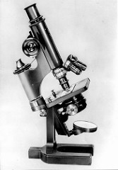
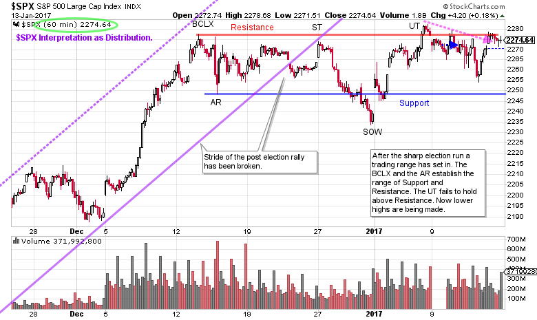
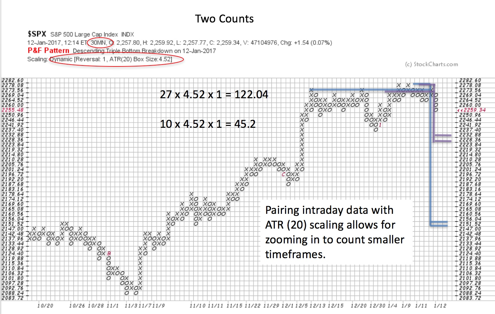

# Enjoying the Short Term View

URL: https://articles.stockcharts.com/article/articles-wyckoff-2017-01-enjoying-the-short-term-view/
Date: January 15, 2017 at 01:54 PM
Author: Bruce Fraser

Wyckoff has a fractal quality, and thus, the Method essentially works in all timeframes. The trained eye can see the price structures unfolding whether it be on a weekly vertical chart or the shortest term intra-day chart. Let us see if we can drill into the shorter timeframe and find a nuanced interpretation of the current market from the intraday data. After a robust advance in the aftermath of the November presidential election it seems possible that the market could have a retracement, of sorts. As Wyckoffians we would seek to identify a Cause being built, in the form of Distribution prior to a corrective decline. This retracement of prices typically would be in proportion to the advance that preceded it. To capture the minutia of the Distribution we would want to zoom into the smaller timeframes where the elements of the structure can be seen.

In this case-study we focus in on the trading range that has formed since mid-December in the S&P 500 Index ($SPX). The 60-minute vertical chart captures the entire trading range (which may not be complete).

---

(click on chart for active version)

In the final stage of the uptrend a gap forms prior to a Buying Climax (BCLX). The sharp break that follows the BCLX is an Automatic Reaction (AR) and indicates a trading range is directly ahead. A Resistance line is drawn at the BCLX level and the Support line under the AR. Thereafter the long-term stride of the uptrend is broken (the purple trendline break). $SPX rallies to test the underside of the trendline and the Resistance level (at the Secondary Test). After the ST, persistent selling takes the price below Support and is labeled a Sign of Weakness (SOW). During the trading range $SPX can rise above Resistance and below Support, but only temporarily. The rally beginning at the SOW goes through Resistance and concludes with an Upthrust (UT). Since then lower highs and lower lows are unfolding. If the entire trading range is Distribution we would expect a break of Support soon and then, after a pause, another Sign of Weakness. We will next turn to the Point and Figure chart to estimate the price targets of this trading range, if this is Distribution.

To take the horizontal count of the PnF chart we use the 1 box method and ATR (20) scaling. A 30 minute PnF timeframe is selected as it fully captures the entire trading range with good detail. The count is broken into two segments, a conservative and a full count. The conservative count is 10 columns and generates 45.2 S&P 500 points of price potential. The larger count is 27 columns and generates 122.04 points of $SPX potential. We subtract these counts from the high and from the ‘count line’. There is enough cause in the trading range to project a correction of part of the post-election rally, but not all of it. The smaller count would be considered a ‘Shakeout’ of the formation if the uptrend resumed thereafter. Reaching the objective of the larger count would be considered a normal retracement of an uptrend. Either of these count objectives being met still leaves the primary trend of the market as firmly upward.

Tactically pay close attention to the behavior of $SPX if it gets below Support. Under a (short-term) bearish scenario, if ICE or Support is broken there is typically a pause. Then if price becomes listless and cannot lift (and stays under Support) expect a markdown to follow.

All the Best,

Bruce

Next time we will zoom out to the next larger timeframe for the S&P 500 and do a PnF case study of important counts made in 2016 and what they suggest for 2017.
