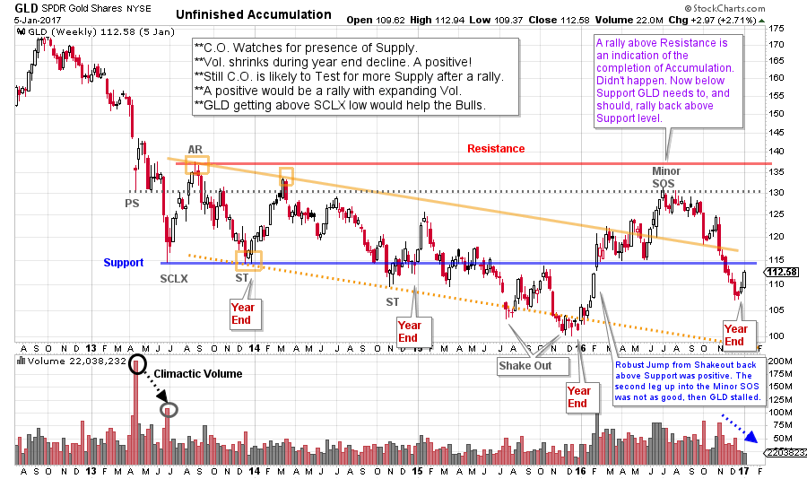
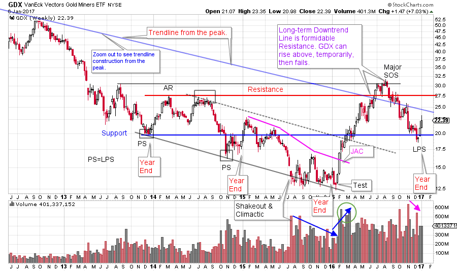
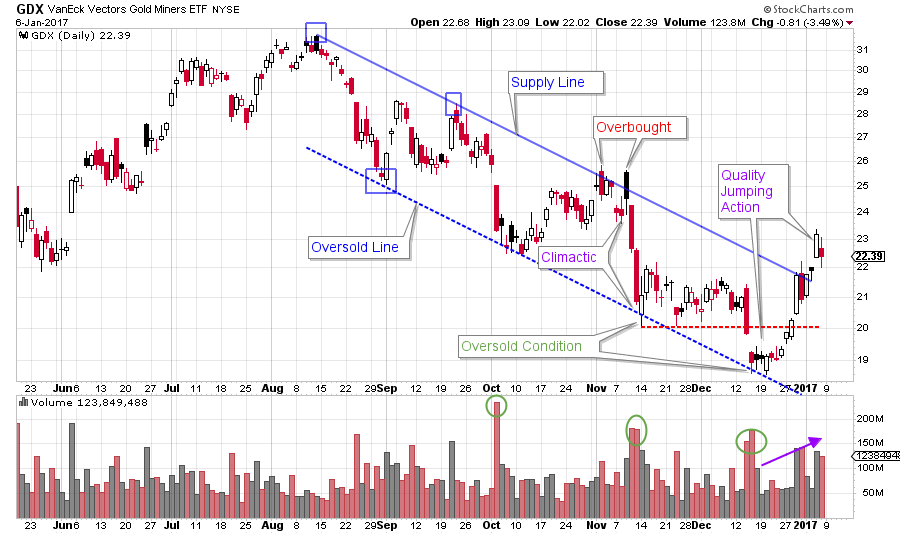
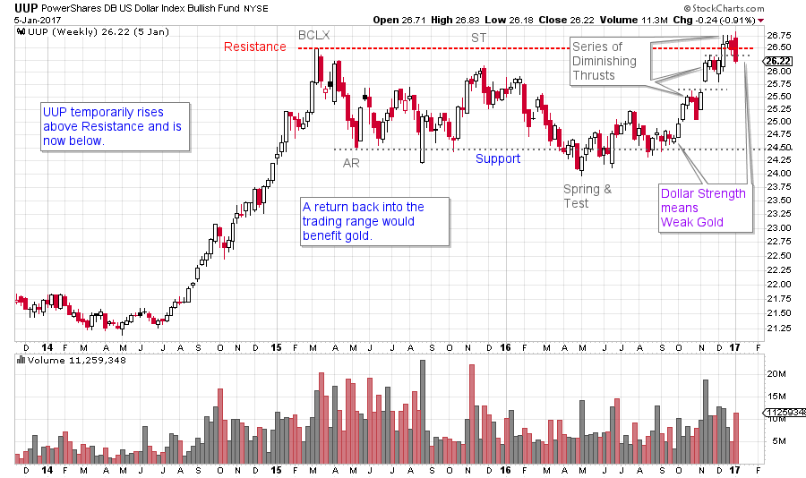

# Going for the Gold

URL: https://articles.stockcharts.com/article/articles-wyckoff-2017-01-going-for-the-gold/
Date: January 07, 2017 at 01:41 PM
Author: Bruce Fraser

Group rotation has recently brought to life moribund sectors such as the financials, materials, and industrials. Gold was largely forgotten in the aftermath of the election. At times, it is in lockstep with the broad stock market, and at other times it is marching to its own drummer. After a long bear market gold rallied at the beginning of 2016 and was a bright spot into mid-year. Then it went into a grinding decline that was a huge disappointment to many gold watchers.

Now that we are entering 2017, let us turn a Wyckoffian eye toward the metal and try to make sense of the prior year and the possibilities going forward.

---

(click on chart for active version)

Beginning in 2013 the bear market for gold (we use GLD as a proxy for gold) had a ‘Stopping Action’ in the form of Preliminary Support (PS) and Selling Climax (SCLX). With the subsequent Automatic Rally (AR) the Accumulation Range appeared to be set. More than 3½ years later this Accumulation structure slogs on. Within the structure there is a declining trend with a gradual descent. Support generally holds until mid-2015 when a Shakeout type decline (note the low volume) drops through the floor of Support. After the Test of the Shakeout a six month rally propels gold to Support and then through it. This is a key ‘Change of Character’. The very robust rally into the Minor Sign of Strength (SOS) doesn’t have the oomph to get to Resistance. This is a SOS as it exceeds the two prior peaks in the Accumulation, but not the AR before turning down. This downturn is deep and drops below the Support line. A more than 50% retracement of the 2016 rally follows, and is too deep for our liking. Also, gold is now back into the downtrend (defined by the yellow lines). Could gold still be in Accumulation? Absolutely yes! The first decline after a SOS can be substantial, like this one. It demonstrates the presence of Supply, and the need to absorb this Supply before an uptrend can start.

Note how the important lows came at the end of each year (marked on the chart). This seems to indicate that gold holders are accelerating their sales into year-end (for portfolio and tax reasons). Once this flurry of year-end selling was exhausted, gold was able to rally in the new year. The best rally, so far, was in 2016 (the SOS). A key characteristic of the decline into the end of 2016 was the higher low. Each of the preceding lows was below the prior low.

What we would look for, in the near term, are some modest improvements to suggest a recovering gold market. First is a return above the prior Support Line. Next is to climb above the downtrend channel. And finally, a good Jumping action that exceeds the 2016 peak and can hold near the Resistance area. Robust Jumping action with big bullish leaps on good volume is the ideal scenario and will further confirm strength. The opposite conditions will indicate that gold is still being liquidated (supply is present). Poor rally quality, a lower high and difficulty getting to and staying above the Support Line and downtrend channel will reveal much.

A near-term rally is expected and it’s quality will be very telling about the future of the gold market.

(click on chart for active version)

GDX is a Gold Miners ETF and has a family resemblance to gold. But there are distinctions that are informative and interesting. Note that two Preliminary Support (PS) points are labeled and the Shakeout is also the Selling Climax. This is primarily because of the very high volume at the Shakeout. After the first PS, an AR is marked and those points set the Support and Resistance for the Accumulation (or potential Redistribution). The downtrend that follows is in force for two full years (down-sloping trend channel) and at the Shakeout it is oversold. The test, test, testing that follows the Shakeout is on diminishing volume which is absorption by strong hands at very good prices.

Study the rally that follows for GDX. It is distinctly better than the GLD rally, climbing all the way to Resistance before stopping. This is a Major SOS. The decline that follows is shallower than GLD’s. A common relationship is that Last Point of Support will equal Preliminary Support (LPS=PS) and that could be the case here. The volume at the 2016 lift off is notable for its intensity. Gold mining shares are acting more constructively than the metal here. Let’s see if GDX can lead gold upward.

(click on chart for active version)

Zooming in we focus on the decline during the second half of 2016 (daily chart). The downtrend channel is textbook. The Overbought and Oversold conditions work very well. The quality of the Jumping action, following the final Oversold, has set up a robust rally which takes GDX out of the trend channel. We might expect a Backing Up action to return to the Supply Line from above before moving higher. If this is an LPS and the Accumulation is complete, then a Markup to Resistance and the prior $31 peak could be surprisingly strong (an indication of the completion of absorption).

(click on chart for active version)

One of the reasons cited for the weakness in gold has been the strong dollar. UUP (US Dollar Index Fund) has been rallying strongly in the 4th quarter of the year, while gold has been weak. UUP had a Buying Climax (BCLX) in early 2015 followed by an Automatic Reaction (AR) which set up a big trading range. The recent rally has pushed UUP into Resistance. Now UUP is slipping back under this Resistance (on volume) which could mean a period of correction. This would provide relief for gold.

Gold has spent nearly four years in this large trading range. Is it Accumulation? Or Redistribution? As Wyckoffians we follow the action of the market, the tape. We now have the makings of a plan for gold and gold shares. We will take it one step at a time and seek confirmation from each step to then go to the next.

All the Best,

Bruce

Homework: Study the large and mid-capitalization gold stocks. Find the best leaders and the laggards. Markup a few of the stocks you find most interesting.

Additional References for this post:

Wyckoff Power Charting: Let's Review (click here)

Francis Bacon Reveals the Nature of Trends (click here)

Accumulation Phase; Absorbing Stock Like a Sponge (click here)

Gold Fever (click here)

Roman Bogomazov will be conducting a complimentary webinar on Monday, January 9th. This is an introduction to his online series: Advanced Wyckoff Trading Course (AWTC) - Wyckoff Structural Price Analysis (3:00 – 5:00 p.m. PDT). For more information and the registration link, please click here or if you would like to just register directly, please click here.
