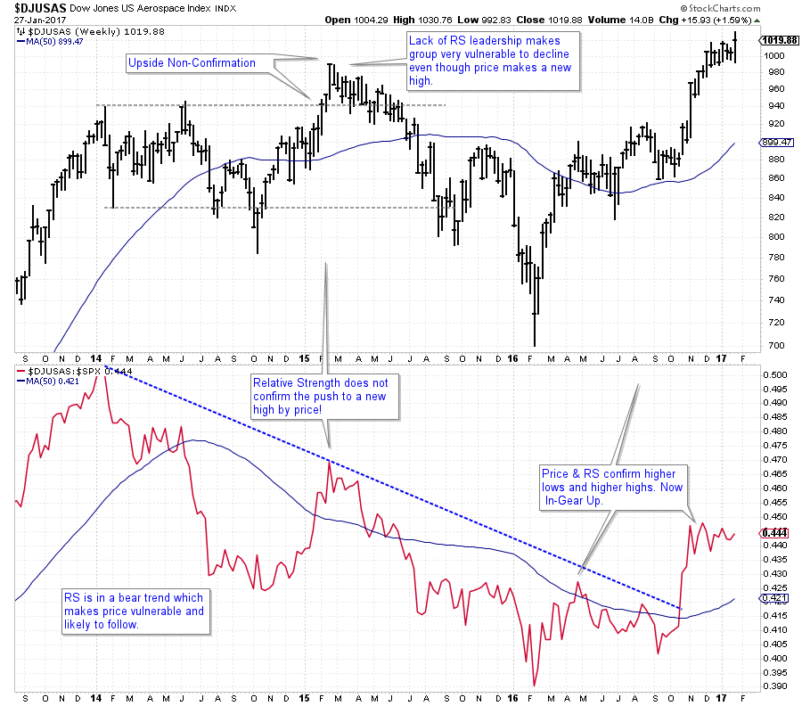
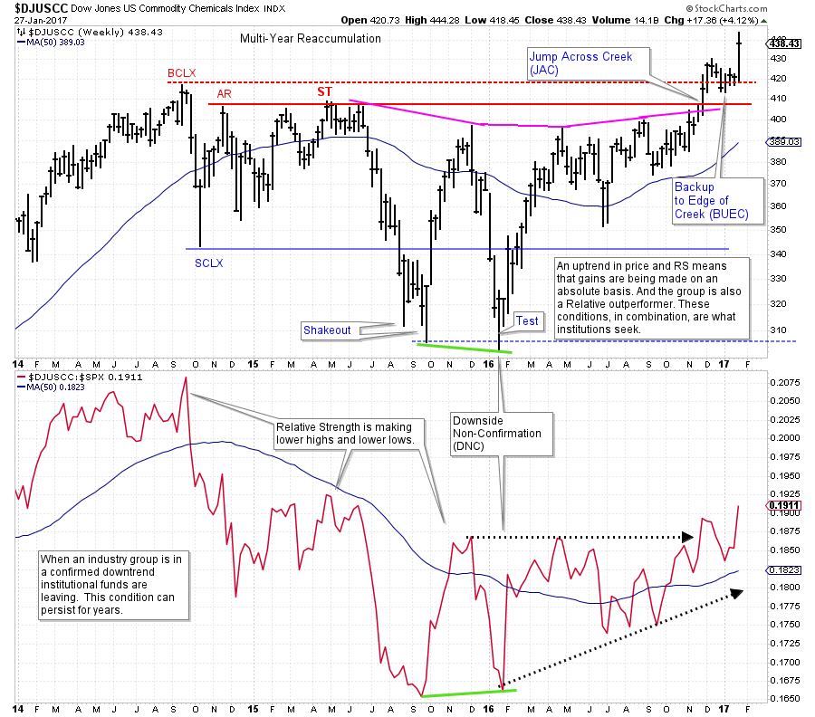

# In Gear with Relative Strength

URL: https://articles.stockcharts.com/article/articles-wyckoff-2017-01-in-gear-with-relative-strength/
Date: January 28, 2017 at 10:00 AM
Author: Bruce Fraser

Wyckoffians find Relative Strength analysis to be very useful and illuminating. Relative Strength studies can be like having X-ray vision. With Relative Strength tools, one can see important hidden secrets about the health of a stock or industry group. Relative Strength analysis is simple and straightforward to apply and is one of the most useful tools in the Wyckoff toolkit.

---

(click on chart for active version)

Relative Strength gauges leadership, or the lack of it. My preferred method of market study is to drill down from Sector studies, to Industry Groups, to stocks. Always seeking the leading stock, in the leading industry group, in the leading sector. Evaluating weekly data puts us in synch with the major trends and their rotation in and out of favor. Once a price trend forms it tends to persist for a long time. This is also true of Relative Strength. Once a stock or an Industry Group emerges into a Relative Strength trend, it can go on for months and years. Big trends and how to trade those trends is our Wyckoffian edge.

During a healthy long term uptrend, price and Relative Strength will mostly be in gear with each other. They do this by making higher highs and higher lows in unison (in downtrends the opposite condition is seen). When price and RS fall out of synch the existing trend becomes suspect. In the above case study, note the US Aerospace Index ($DJUSAS) price pushes to a new high in early 2015 while RS lags and makes a lower high. This lower peak has us drawing a downtrend line. Here is where the x-ray vision comes in. If a healthy uptrend in price is accompanied by a higher peak in RS, we would consider them ‘in gear up’. A lower high in RS while price pushes to a new high is an ‘Upside Non-Confirmation (UNC). This condition gives us cause for concern that price will follow RS lower. Which it does. The veracity of the decline that follows the Upthrust in price is surprising unless compared to the Relative Strength which is issuing a large warning.

At the beginning of 2016, $DJUSAS and RS made an important low at the same time. Thereafter the price and RS began uptrending (note the rise above the downtrend line). Now price and RS are ‘in gear up’ and $DJUSAS is making a new high.

Our goal is to make positive returns year-in and year-out. And to have relative outperformance to our benchmarks (here we use the S&P 500 for Relative Strength comparison purposes as many institutions use the same). When both the price and the RS are in gear upward these goals are being met. If either condition is out of gear, this goal will most likely not be achieved.

(click on chart for active version)

The DJ US Commodity Chemicals Index ($DJUSCC) entered a multi-year Reaccumulation in 2014. Note how severe the break in the Relative Strength was after the Buying Climax (BCLX). Though the industry group recovered into 2015, we can see from the badly lagging RS that this condition was Distribution. At the Secondary Test (ST) in price another stiff decline begins. This deep decline is signaled and explained by the badly lagging RS which is well below the prior high and the long term moving average. A Downside Non-Confirmation (DNC) arrives at the Test of the Shakeout low. This is a subtle, but valuable, clue of a change of character in Commodity Chemicals. An uptrend is beginning where higher highs in price and RS are developing. Our view is that such an in gear uptrend will remain in force for potentially years to come.

In future posts we will dig deeper into this very useful concept. In the meantime practice drilling down from Sector, to Industry Group, to Stocks to find the best leadership themes. Stockcharts.com has created outstanding tools to leverage your analysis time finding these leadership themes.

All the Best,

Bruce
