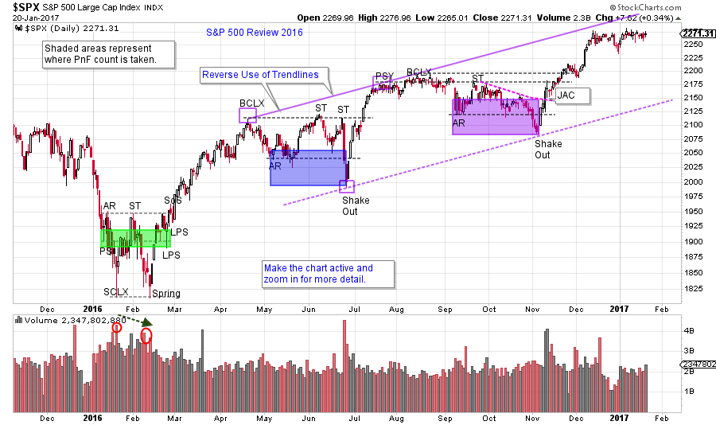
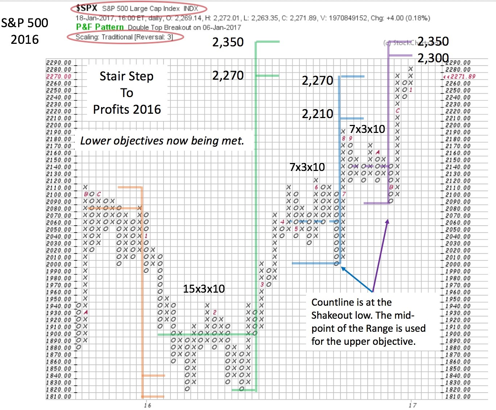

# Stair Step to Profits

URL: https://articles.stockcharts.com/article/articles-wyckoff-2017-01-stair-step-to-profits/
Date: January 21, 2017 at 08:00 AM
Author: Bruce Fraser

Let’s look back at 2016, Wyckoff style. As Wyckoffians, our mission is to sharpen our skills and to gain some ideas about how 2017 could unfold. The past year began with a stiff correction that cascaded into a Selling Climax in January. A classic Accumulation formed between January and March when the large informed interests of the Composite Operator absorbed stock. Once the absorption was complete the market (here we study the S&P 500) jumped into an uptrend. Calculating the Point and Figure return potential, the S&P 500 generated a Cause of over 19% (this price objective was exceeded in mid-December).

Following the Accumulation and the jump into an uptrend, two Reaccumulations formed during the year. Each Reaccumulation was over two months in duration and resulted in the continuation of the uptrend. We look to these stair stepping pauses to generate PnF counts that confirm the price objective of the Accumulation (click here for more on Stepping Stone Confirming counts).

---

Now that the minimum price objective has been met is the uptrend over? What should we expect to happen in 2017 for the broad market averages? Let’s start by studying the past year and see if this provides a glimpse into the future.

(click on chart for active version)

An Accumulation and two Reaccumulations provide the C.O. opportunities to Absorb stock during the overall bullish trend of 2016. Much of the year (nearly eight months) is spent in trendless trading ranges with intervening robust uptrends. We measure the horizontal PnF ranges to estimate the price objectives. On this chart, each formation has a Wyckoff interpretation. Activate the chart and zoom into each horizontal area for study purposes (under ‘Chart Attributes” select ‘Range’ and then ‘Select Start/End”). Near year-end the uptrend approaches Overbought in the trend channel simultaneous to the lower PnF price objectives being met. Also, there is evidence of climactic activity.

The shaded areas on the vertical chart represent the points between which the PnF counts are generated. These points are then identified on the PnF chart and counted. The Accumulation at the beginning of the year generates a count of 2,270 to 2,350. From the countline at 1,900 to the lower PnF projection of 2,270 more than a 19% return potential is generated. At year-end that minimum objective is met and slightly exceeded. The two Reaccumulations also confirm or slightly exceed the Accumulation count.

So, what might we expect in 2017? This may not indicate the end of the larger bull market (click here for a PnF study projecting even higher prices). It may mean that another Cause must form for a further advance. If either Distribution or a Reaccumulation are to emerge, time will be needed to generate a Cause on the PnF charts. The first part of the new year could reveal these new motives on the part of the Composite Operator. At the conclusion of the current advance a new trading range is likely. We have seen that most of the fuel in the tank has been burned. We observed in early 2016, formidable Causes can be generated in a short period of time. As Wyckoffian ‘tape readers’ we will watch the charts for the clues to the next meaningful moves in the market.

All the Best,

Bruce
