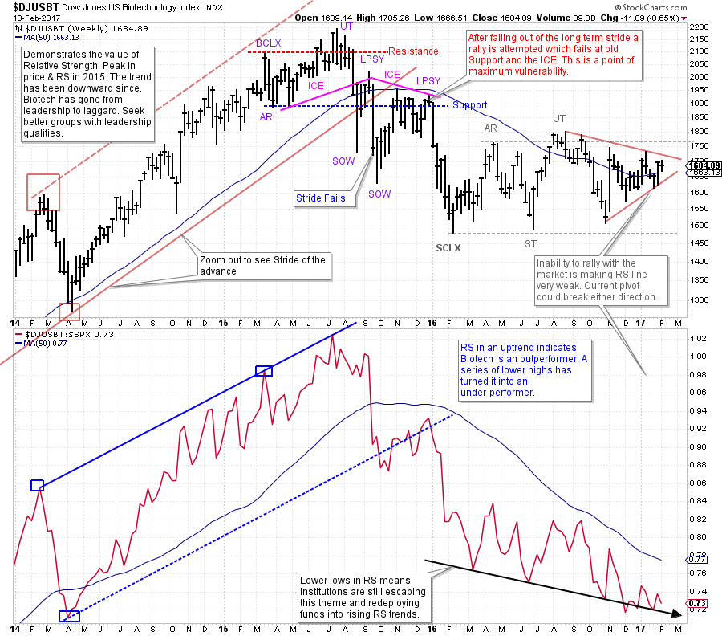
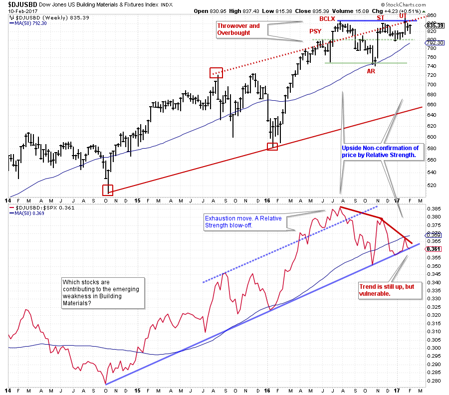
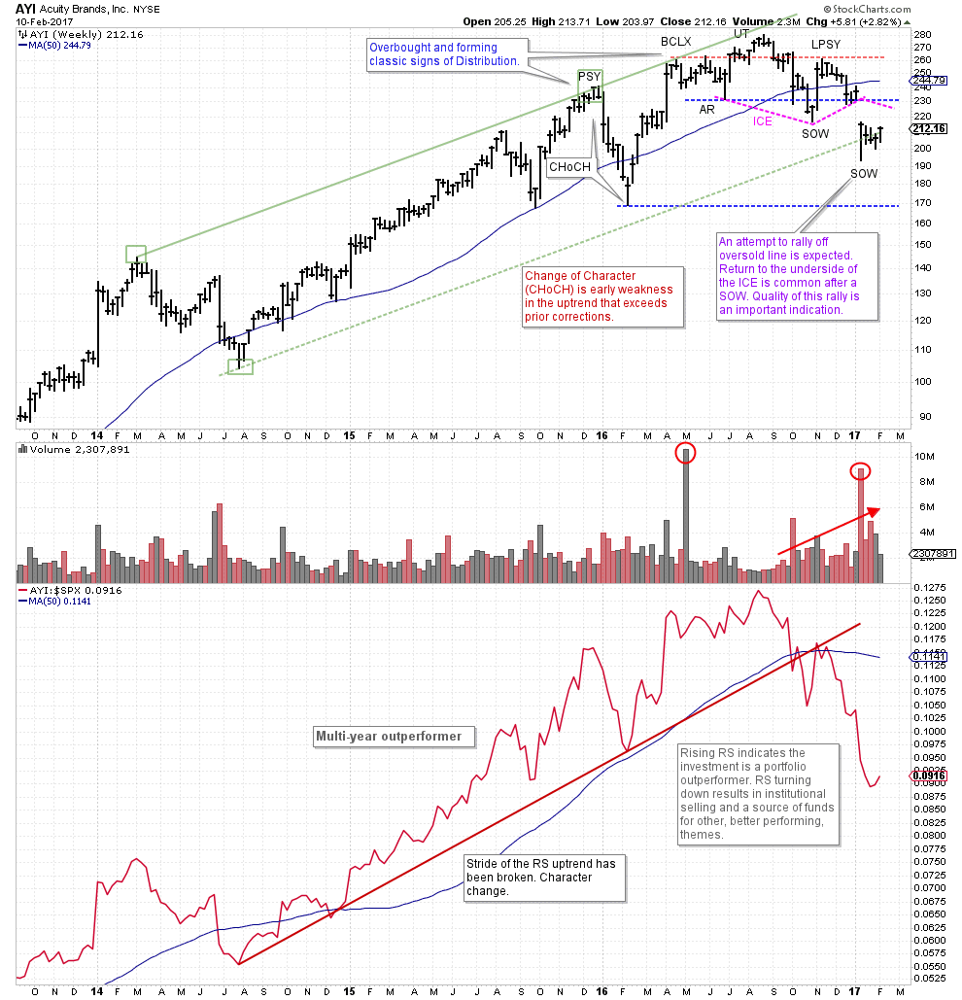
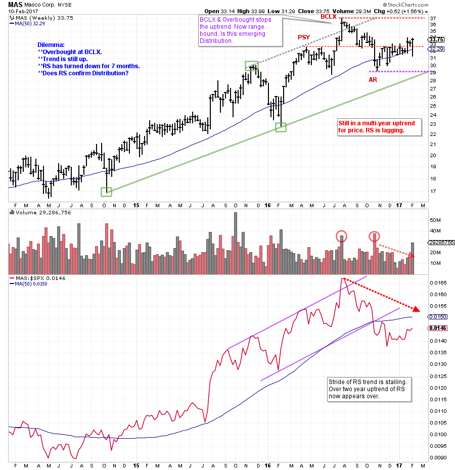

# Avoidance Strategy

URL: https://articles.stockcharts.com/article/articles-wyckoff-2017-02-avoidance-strategy/
Date: February 11, 2017 at 08:00 AM
Author: Bruce Fraser

The Wyckoffian mission is to trade and invest in the best stocks in the leading Industry Groups. We have been studying examples of leadership characteristics using Wyckoff Analysis in combination with Relative Strength. Recall that our workflow is to drill down from Sector to Industry Group to Stock. Always seeking the strongest stocks in the strongest groups. It is also a worthwhile exercise to study groups that are stalling and falling from favor. Once an Industry Group transitions from leadership to laggard it can remain there for a long time. In an uptrending bull market we might call this our ‘Avoidance Strategy’. It is always good to know where the leaders and the laggards are in any market and when important transitions are brewing.

---

(click on chart for active version)

Biotechnology was one of the stellar leading themes of this ongoing bull market, until 2015. On the above chart zoom out in time to see the entirety of the uptrend. Note the fall from grace beginning mid-year 2015 in both price and Relative Strength. The Relative Strength helped to confirm the Distribution structure of price. Since the beginning of 2016 an attempt has been made to stabilize the price, but note the message of RS. It continues to make lower lows and lower highs. Meanwhile the price of $DJUSBT is bounded by well defined Support and Resistance in the current trading range. Note the wedge or pivot currently forming. Price could exit this area in either direction and then rush to the outer bounds of the trading range. Often the last act of the trading range is either a Spring below Support or an Upthrust above Resistance to shakeout traders. We would avoid this group until a period of Accumulation forms with improving Relative Strength characteristics. Once the long term uptrend failed, the biotech group has become a source of funds for institutions as they liquidate and rotate into more productive Industry Groups and stock themes.

(click on chart for active version)

The trend is still upward for Building Materials ($DJUSBD). Price and Relative Strength are still in-gear together and the group has been an outperformer since 2014. Relative Strength is flirting with a key trendline and is below the moving average. Since July 2016 each RS peak has been lower while price has put up some markers of stopping action. A Buying Climax (BCLX) and Automatic Reaction (AR) have set a range that is either the beginning of Distribution or a Reaccumulation. Either way $DJUSBD has been lagging for six months. Price is within striking distance of a new high, but we suspect that some stocks in this group are weaker than $DJUSBD. When a group turns up or down some important stock components are necessarily leading the way.

(click on chart for active version)

Acuity Brands (AYI) is a large capitalization member of the Building Materials group. Note that while $DJUSBD appears to be stopping the uptrend AYI has completed Distribution and RS has decisively turned down. Price is on a second Sign of Weakness (SOW) and oversold in the trend channel. AYI is likely to attempt to rally toward the ICE and off the trend channel. The quality of the next rally will tell much about the technical position. A big lesson to take away from the above example is that large capitalization leadership stocks will emerge early to turn an industry group from up to down (or down to up). AYI has been leading $DJUSBD downward.

(click on chart for active version)

Masco (MAS) is in the same group and has fewer characteristics of Distribution. But we are on notice because of the BCLX late in a beautiful multi-year uptrend. Both the price and RS throwover the trend channel and become overbought at the BCLX. The uptrend is still intact for MAS but the RS is warning that money is leaving this theme to find a more productive home. Notice how the RS attributes help inform our analysis of price. This can massively improve our confidence in where the price cycle is and what to expect next. For now, we expect MAS to remain range bound between the BCLX and the AR. From here forward,Distribution markers would be an Upthrust (UT), SOW, LPSY and evidence of ICE.

Relative Strength, in combination with Wyckoff price analysis, can strengthen our trend and turning point analysis. The goal is to stay in the leadership themes and to warn when Industry Groups and stocks are turning from leaders to laggards.

All the Best,

Bruce

Prior posts of interest click here and here.
