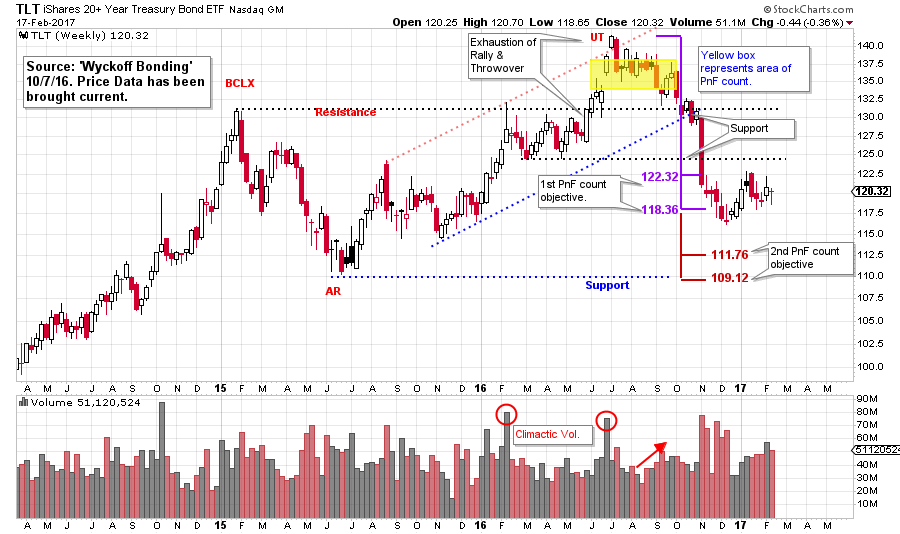
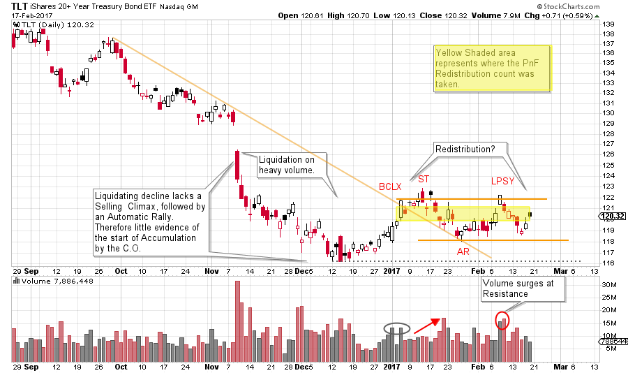
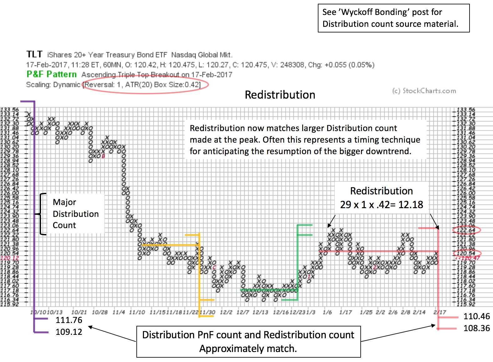

# Bonds. Shaken, Not Stirred.

URL: https://articles.stockcharts.com/article/articles-wyckoff-2017-02-bonds-shaken-not-stirred/
Date: February 18, 2017 at 02:02 PM
Author: Bruce Fraser

It is time to circle back and update our studies of the US Treasury Bond market. On October 7, 2016, we did a Wyckoffian analysis of Treasury Bonds as they appeared to be at a critical juncture. Take a few minutes now and go back to that post (click here for a link) and review this prior analysis. To summarize; at that point bonds were in a well advanced state of Distribution that was 21 months along. After an exhaustion rally (or Upthrust) bonds returned back to the Resistance level. By zooming into the UT area, we identified completed Distribution on a smaller scale and took two Point and Figure counts. The larger of these two counts projected a sizable decline to the major Support line for bonds at about 110 on the TLT chart.

---

(click on chart for active version)

Subsequently during October, November, and December, bonds marched downward to just below our minor PnF count to the 116 level and then stabilized in the zone of the count (122.32 - 118.36). Since mid-December, bonds have been range bound in the area of this first PnF count. Are bonds in a Redistribution winding up for another decline into the weekly Support levels and the major PnF count that was identified last October, or is this an emerging Accumulation?

(click on chart for active version)

Here we can see the aftermath of the price destruction in bonds after the completion of Distribution. Using the US Treasury Bond ETF (TLT) as our proxy, a PnF count to 122.32 to 118.36 was the first price objective. After almost touching 116, TLT became range bound around this count level. We would expect price stabilization in the zone of a PnF price projection. If a larger PnF count is also at work (as is the case here) we would be on the alert for a Redistribution forming in this price zone, resulting in the continuation of the downtrend.

We are open to the possibilities of Accumulation or Redistribution. So, let’s look for clues. Note the gap down in November and how TLT is being liquidated on expanding volume. Selling is heavy. What is not evident is a Selling Climax (SCLX) and a sharp Automatic Rally (AR). A SCLX and AR are clues that buying by the Composite Operator has arrived and Accumulation is beginning which puts quality support under the market. Here it appears that selling has subsided but very little buying has emerged. The rally off the December low begins a structure that has the signature of Redistribution. The confirmation of Redistribution will be a price failure below the Support line and the December low. Note that volume is expanding as the formation is maturing. At the LPSY peak, very heavy volume accompanies the reversal downward. This is a clue there is active and skilled selling in bonds. We tentatively label this a Last Point of Supply (LPSY) as the rally does not have the power to rise above the Secondary Test (ST) and show us a Sign of Strength.

When the Distribution PnF count and the Redistribution PnF count match, the trend often resumes. This is a slick timing tool (which was discussed in ‘Stupid Chart Tricks’, click here for a link). The PnF count in red now matches the large Distribution count made at the peak. The Redistribution objective approximately equals the Distribution objective. The yellow shaded box on the above daily vertical chart illustrates where the Redistribution count was taken.

Two smaller trading range PnF counts proved useful. The count in yellow is a small Redistribution count and the green count is an Accumulation count that identified the trading range peak.

These are techniques we can employ while conducting a Wyckoff campaign. Our original Distribution PnF count warned of major decline potential in bonds which has begun. These tools help us to take full advantage of the energy stored up in this unfolding trend. Bonds can remain trendless for very long periods of time. It is essential to wait patiently for the evidence of a change of character. We must now turn our attention to tape reading skills to determine when, and if, this range bound bond market will start trending.

All the Best,

Bruce
