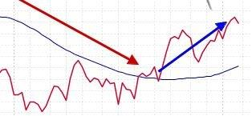
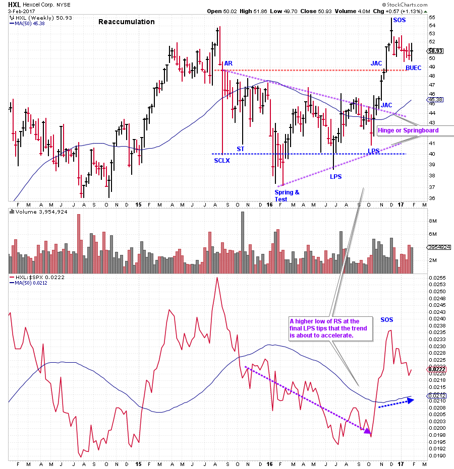
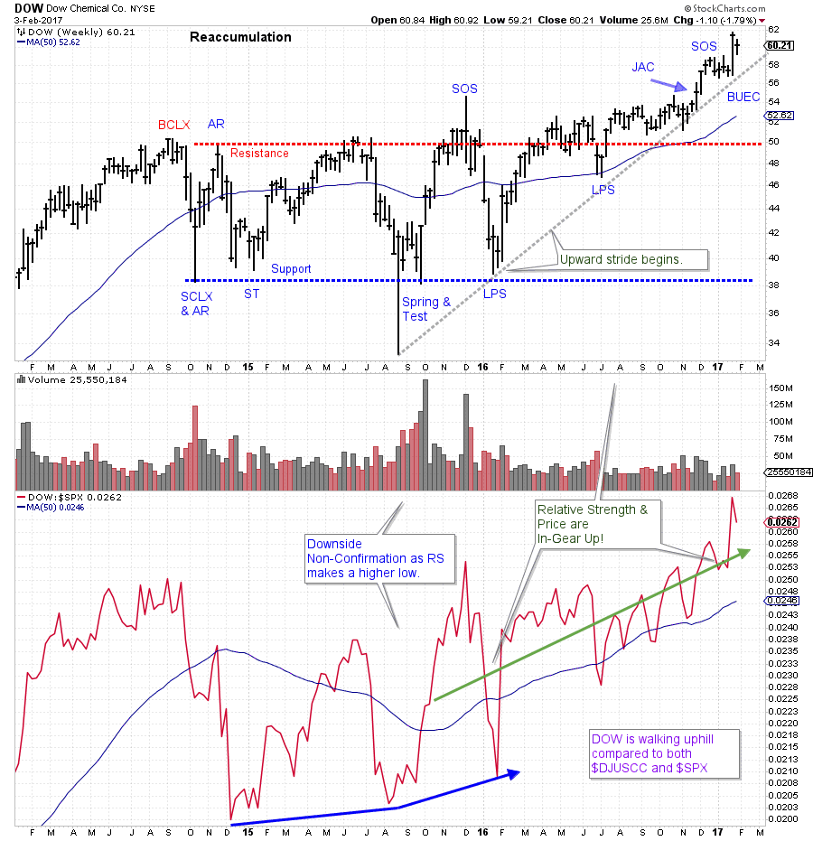

# Sectors. Groups. Stocks.

URL: https://articles.stockcharts.com/article/articles-wyckoff-2017-02-sectors-groups-stocks/
Date: February 04, 2017 at 11:50 AM
Author: Bruce Fraser

Let’s continue our discussion about using Relative Strength Analysis to find leading stocks. A blend of Wyckoff analysis and Relative Strength analysis offers an efficient method for zoning in on the best leading stock candidates. In the prior post, Industry Group analysis was explored. Here we will jump into stock analysis. The concept is the same, find the leading stocks in the best Industry Groups. We know that when an Industry Group enters a leadership position there are individual stocks forging the way within that group. These early leaders will generally be mostly large capitalization stocks. Institutions will begin to favor the dominant big-cap stocks first and then turn to the mid-cap and smaller companies later. Relative Strength analysis will assist in identifying each of these emerging themes as they become active. When Relative Strength becomes In-Gear it tends to support the continuation of the price trend for long periods of time (this is either up or down). Let’s drill down and explore how Relative Strength helps with Stock selection.

---

(click on chart for active version)

Begin with a review of Dow Jones US Aerospace Index ($DJUSAS) from the prior blog (click here for link). Notice that in 2015 Hexcel (HXL) made a Relative Strength new high while the Aerospace Index was over a year into a downtrend. Hexcel rallies but then becomes weighed down by the weakness of the entire group and rolls over. HXL is in a RS downtrend throughout most of the Reaccumulation (absorption) process. Relative Strength makes a higher low in October of 2016 for $DJUSAS and HXL. Both the stock and the group are In-Gear together making higher lows in price and RS. This is an early leadership clue.

We put our Wyckoff analysis hat on and identify the elements of Reaccumulation at work in HXL. A sharp break off the high forms a Selling Climax (SCLX) and an Automatic Reaction (AR). This forms the boundaries of the trading range where the absorption of stock will take place. Volatility diminishes as the range grows older, a classic sign of shares being absorbed. Relative Strength continues to be weak which is not uncommon during Reaccumulation. But the higher low in October for RS and price is a critical clue. A classic ‘hinge’ or ‘springboard’ explodes higher in price and Relative Strength. This results in two ‘Jump Across the Creek’ actions that leads to a new high followed by a ‘Backup to the Edge of the Creek’ (BUEC). This strength has turned up the RS and puts us on alert that a new long term uptrend is brewing. Also note the large Accumulation structure. For homework make a PnF chart of this area and construct some counts. Also drill into the Aerospace Group and find other leadership stocks.

(click on chart for active version)

Dow Chemical Co. forms a Reaccumulation beginning in 2014. The character of trading in DOW is stronger than $DJUSCC and the S&P 500 throughout the Reaccumulation structure. Note how RS is making a higher low at the August 2015 Spring low. RS is making a series of higher highs and lows from 2014 onward. Price jumps above Resistance at $50 in early 2016 and generally stays above it. Note the higher high thrusts of Relative Strength. This sets up DOW to lead the market and the Commodity Chemical Group during the post-election rally. Price and Relative Strength confirm an upward trend and such trends can persist for a long time. The leadership of DOW is also likely to light the way for the entire Commodity Chemical Group for the foreseeable future. What other stocks in this group are leading the way higher?

All the Best,

Bruce

Additional Reading on Relative Strength Analysis:

Wyckoff Group Think (click here)

Group Stink (click here)
