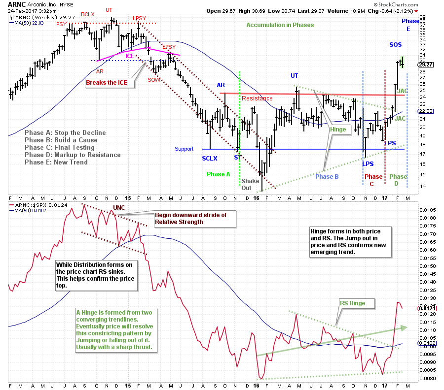
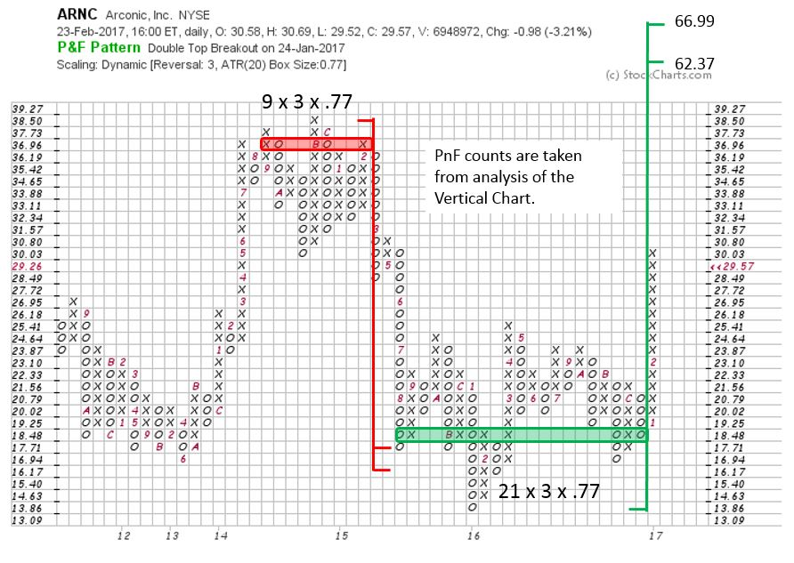

# Three Legged Stool

URL: https://articles.stockcharts.com/article/articles-wyckoff-2017-02-three-legged-stool/
Date: February 25, 2017 at 12:00 PM
Author: Bruce Fraser

Let’s do an integration case study. We have spent much time on two robust processes; Point and Figure analysis and Vertical Bar Chart analysis. Recently Relative Strength studies have been added to the mix. A stool has three legs, any fewer would make it unstable. Our Wyckoff stool has three strong legs. In this case study, we will combine these tools and see if it makes our analysis sturdier and more cohesive.

---

(click on chart for active version)

A persistent uptrend accelerates into Preliminary Supply (PSY) and a Buying Climax (BCLX). The Automatic Reaction (AR) indicates a range bound stock. At the Upthrust (UT), Relative Strength (RS) is making a lower high, an early clue of potential Distribution. Relative Strength is providing clarification by entering a downward stride. Note the sequence of the Sign of Weakness (SOW) and Last Point of Supply (LPSY) and the complete breakdown of RS. Price breaks away from the trading range which is labeled as ‘breaking the ICE’. The price lift into Resistance is of poor quality and quickly fades away. This is the last opportunity for holders of the stock to sell before the markdown takes over.

RS and price freefall and accelerate into a Selling Climax (SCLX). There is no reason to expect a sustainable advance while price and RS are making new lows together. But a SCLX and Automatic Rally (AR) suggest a stopping action resulting in a range bound condition for the foreseeable future. Note how the downtrend channel largely contains price until the reversal of the ‘Shake Out’ in Phase B. The rally that follows is a ‘Change of Character’ where price marches to the top of the trading range marked by the AR. This Upthrust (UT) coincides with a RS push above the two prior RS peaks, an early sign of changing conditions for ARNC. But the next eight months is more grinding Phase B trendless activity designed to frustrate investors while the Composite Operator is systematically Accumulating ARNC shares. Study the final dive of price down to the Support area which is labeled a Last Point of Support (LPS). RS is weak on this decline, but it cannot make a new low. As Wyckoffians we are on alert for a reversal upward from Support and toward the top of the Accumulation Range. A ‘Hinge’ is forming on both price and RS. Jumping out of a Hinge can result in a robust price move (up or down). We work hard at sharpening our Wyckoff skill of identifying the completion of Phase C; which concludes the Testing of the lower areas of Accumulation, and begins the Markup and push out of the Accumulation range. This is the expected start of the new Uptrend. The more robust the Jumping action the more complete the absorption of available shares of stock by the C.O. Here we see that price marches easily to the top of the range and out. Accumulation now appears complete. Noteworthy is the Jump by the RS line which confirms price by exceeding the prior peak. Price and RS are ‘In-Gear’ up. The character of this stock has changed from trendless to trending.

The third leg of our stool is Point and Figure which provides a technique for measuring the amount of fuel in the tank to propel prices higher. The vertical chart illustrates a large Accumulation range and leads us to believe that the potential of this trade is attractive. Using 3 box reversal method and ATR 20 scaling we count from the LPS to the SCLX points. A count of 21 columns is generated. This gives an objective of 62.37 to 66.99 which exceeds the 2014 peak price level.

We have a stock that has jumped out of the Accumulation area into Phase E (an emerging uptrend). It is making higher highs in price and RS. This indicates ARNC is in a Relative and Absolute uptrend, it is leadership.

We suspect that a Backup toward the breakout area will follow the recent Sign of Strength (SOS). This could take an extended period of time or happen quickly. Once an uptrend begins it will manifest in its own good time. We have a price objective estimate but the time and exact path are unknown.

Homework: Study the Monthly vertical chart. Compare it to the 5-box reversal PnF chart using ATR (20) scaling. Does this reinforce or change the analysis? For a review of Phase analysis click here.

All the Best,

Bruce

As always please approach this as a Wyckoff integrative case study and not as an investment recommendation.
