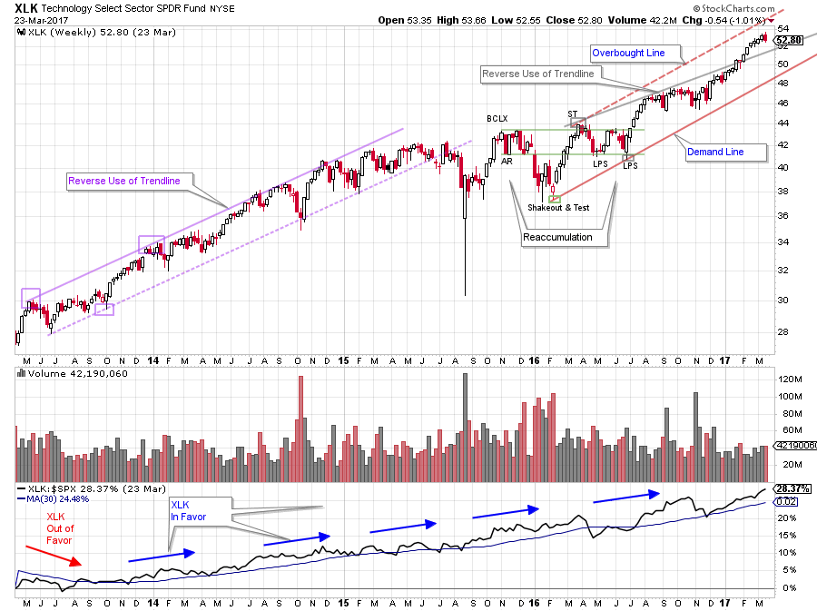
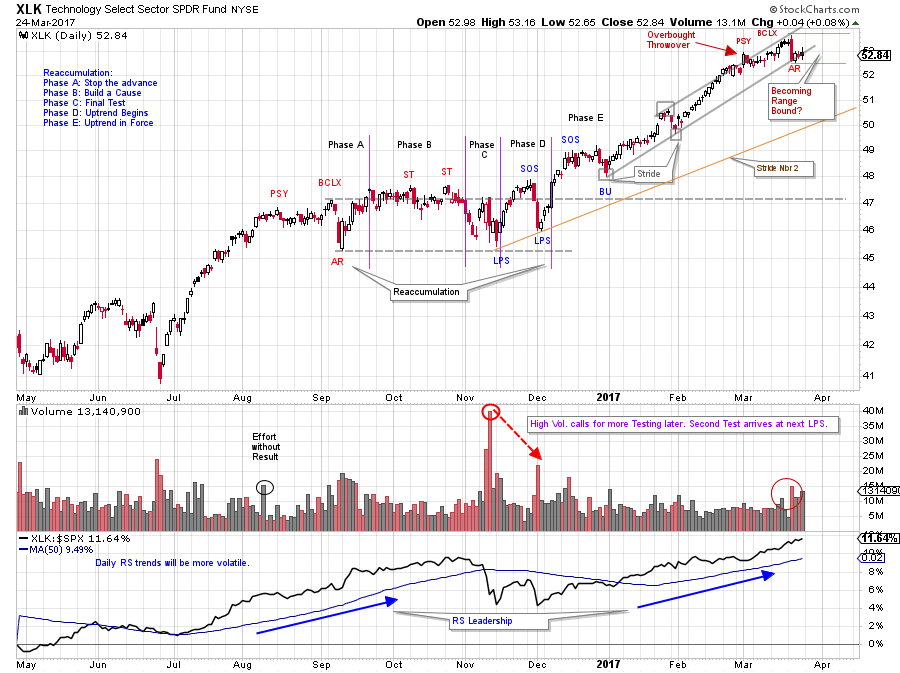
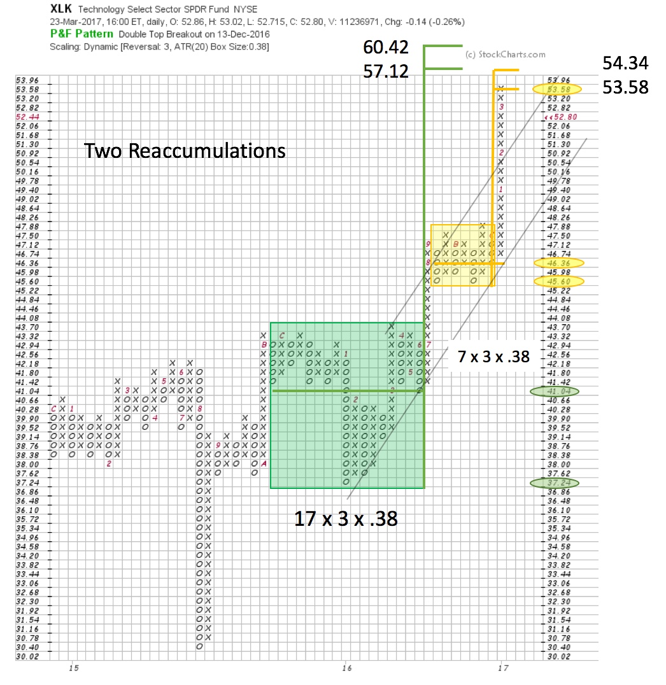

# Animal Spirits

URL: https://articles.stockcharts.com/article/articles-wyckoff-2017-03-animal-spirits/
Date: March 25, 2017 at 12:00 PM
Author: Bruce Fraser

Leadership in the Technology Sector is generally a very good sign for the entire stock market. It bodes well for the market when technology stocks, as a group, are leadership as a rally starts. Speculative animal spirits are heightened by the emerging leadership of the Technology Sector. Conversely when technology stocks are generally laggards, caution is warranted for the market as a whole.

What is the current state of the Technology Sector and can we draw any Wyckoffian conclusions about the general health of the broad stock market? Using the Technology Select Sector ETF (XLK) we will put together a Wyckoffian analysis of the present position and likely future direction of this most important segment of the market.

---

(click on chart for active version)

Relative Strength of the XLK has been leading the S&P 500 going back into 2013. The RS line is trending up and above a rising 30 week moving average, a classic measure of leadership. When the XLK Relative Strength line is rising, it is outperforming the index it is being compared to ($SPX in this case). We can see this in the bottom panel. Currently the XLK RS trend remains strongly upward and above a rising moving average. The end of leadership would be indicated by the RS line dropping below and staying below the moving average line.

The stride of the current XLK price advance is defined by a trend channel formed in 2016. The channel forms as a Reaccumulation becomes a new uptrend. XLK is marching higher and is still in the middle of the channel. The Reaccumulation provides the opportunity to take a Point and Figure Count and estimate the potential for the resulting advance. How much more fuel is in the tank? Technology has been on a tear since the middle of last year and the broad stock market has tried to keep up. The ebb and flow of the XLK will be important to gauging the condition of the overall market.

(click on chart for active version)

Zooming into the daily view we can see a smaller, and well formed, Reaccumulation. During this three month pause the RS line dips (this is a daily RS view which is more sensitive than the prior weekly chart). After two Last Point of Support (LPS) lows, the uptrend reasserts and leadership resumes for XLK. Take some time to study the Phase work. In Phase C, a final test of the Support area forms at the first LPS. This is a higher low above the Automatic Reaction (AR) on surging volume. The inability of XLK to breakdown after such high volume is a sign of good demand for shares by the Composite Operator (C.O.). Thereafter a strong rally drives XLK above Resistance to a Sign of Strength (SOS). This is classic Phase C behavior! The volume surge in Phase C means that the drop after the SOS is likely a deep test and a second LPS. The C.O. sees large volume on the first drop and wants to test the market for additional supply. The next LPS test is successful with a higher low and diminished volume. The turn up from each LPS can be bought with stops just below the low of the LPS.

XLK became Overbought with a Throwover of the Trend Channel at Preliminary Supply (PSY). This is a warning of impending stopping action. A Buying Climax arrived soon after (note the volume surge) the PSY. An Automatic Reaction (AR) arrives as a large down price bar. The PSY, BCLX and AR (and Throwover) take place while approaching a PnF price objective (see PnF chart below). At the BCLX and AR we draw Support and Resistance lines in anticipation of a range bound market. The big declining bar is a near term ‘Change of Character’ as the price becomes suddenly and unusually weak. Currently XLK is on the Demand Line of the Trend Channel. A rally toward Resistance would be expected. Range bound markets spend most of their time between Support and Resistance, building a Cause for future moves.

Two Reaccumulations are evaluated and counted. The first was larger, as would be expected. There is still more fuel in the tank for a higher price objective for XLK. But the more recent count (smaller) is now in the window of being fulfilled. What might we expect next? Considering the recent stopping action, reviewed above, a minor Reaccumulation could form here to generate an additional count for a run up to the larger PnF objective. Another possibility is that the very strong momentum that has been in force continues to the higher objective as a Buying Climax.

A strong Technology Sector helps to keep the market’s speculative spirits high. We will pay very close attention to the prospects for this theme in the expectation it will set the tone for the broader market.

All the Best,

Bruce

For additional material on the subject of Reaccumulation formations click here, here and here.

Two Complimentary Webinar Announcements:

1) Fellow Wyckoffian Roman Bogomazov and I will be conducting a “Market Outlook and Stocks Review” session on March 29th, 3:00 – 5:00 pm (PST). We are pleased to again welcome acclaimed author/traderCorey Rosenbloom. To find out more and to register for this free webinarclick here. To go directly to the registration page for this free event click here.

2) Roman Bogomazov will be conducting a complimentary webinar on Thursday, April 6th. This is an introduction to his online series: Advanced Wyckoff Trading Course (AWTC) - Wyckoff Structural Price Analysis (3:00 – 5:00 p.m. PDT). For more information and the registration link, please click here or if you would like to register directly, please click here.
