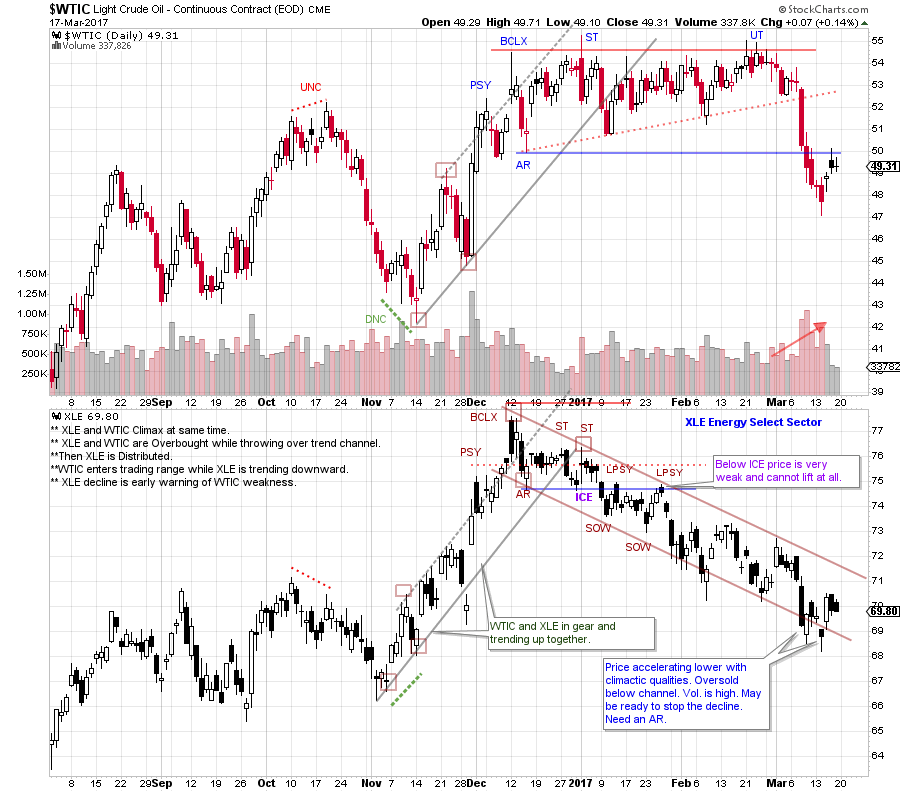
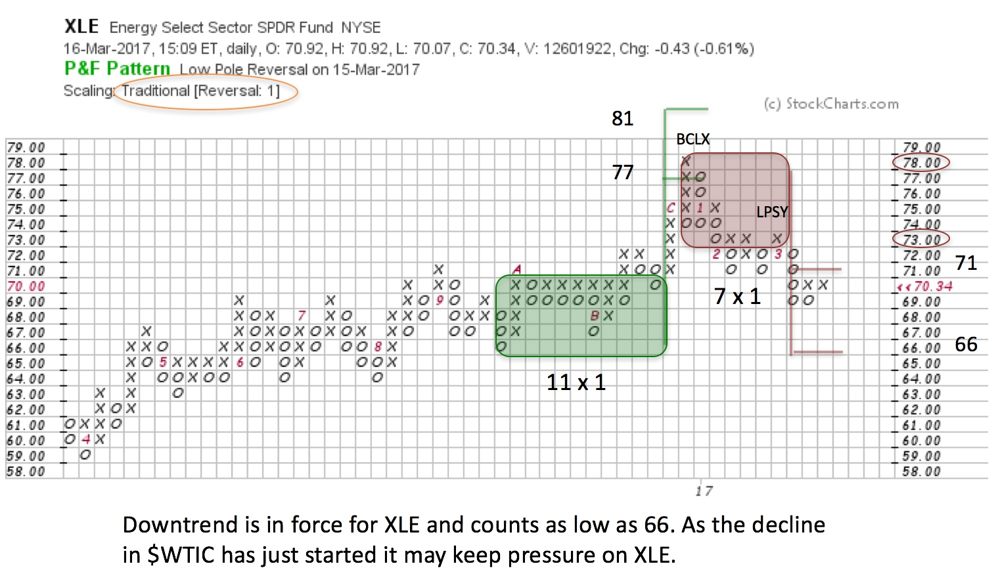
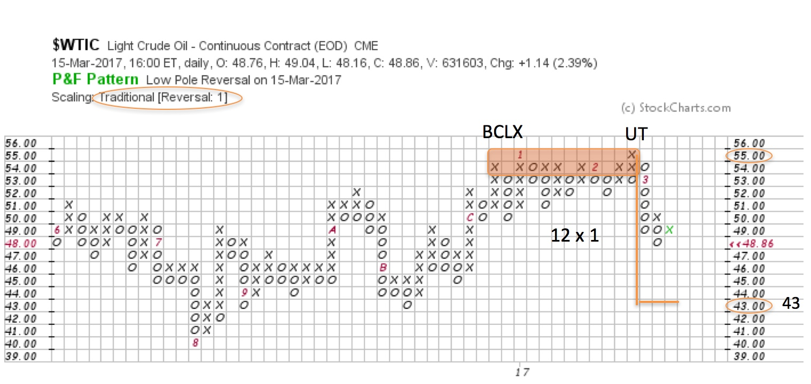

# Crude Oil's Slippery Slope

URL: https://articles.stockcharts.com/article/articles-wyckoff-2017-03-crude-oils-slippery-slope/
Date: March 18, 2017 at 09:00 AM
Author: Bruce Fraser

Crude oil is on a slippery slope downward. Was this completely unexpected or were there clues of the impending decline? The stock market is a discounting mechanism. Stocks traditionally light the way by starting to move prior to the underlying economic events. That, of course, is the argument for Technical Analysis of stock prices. If stocks are going to move first, investors who wait for the economic news will have missed much of the trend.

Does this Discounting phenomenon work only in larger time frames? Is it possible to harness the stock markets x-ray vision in the intermediate and shorter windows of time? Crude oil prices tumbled this month and continue to be weak. Let’s take a Wyckoffian look at crude oil in comparison to energy stock prices to see if this Discounting mechanism warned of trouble for crude oil.

(click on chart for active version)

Do Energy stocks anticipate (Discount) trend changes for crude oil? Here we compare the daily vertical chart of crude oil futures ($WTIC) to the Energy Select Sector ETF (XLE). A rising trend in XLE develops in November and the stride of the trend channel forms right away. Note how the low for XLE precedes the low for $WTIC by 9 trading days. This is a useful ‘Downside Non-confirmation’ (DNC) of XLE. Crude oil and XLE climax together at the end of the uptrend with an overbought throw-over of the trend channel. This is classic exhaustion of both trends.

A Buying Climax and Automatic Reaction (AR) form the approximate outer boundaries of two range bound markets. XLE only spends 3 weeks above the support formed by the AR low. Energy stocks are notable in their weakness. The downward stride for XLE forms early. Weakness sets up two Sign of Weakness (SOW) price breaks and two Last Point of Supply (LPSY) attempts to rise above the ICE. This is Distributional price behavior. An LPSY (there can be more than one) is a final attempt to rally, which fails at a lower high. The Distribution is complete after the final LPSY. Then Markdown begins.

Why are the Energy shares so weak while $WTIC continues testing the BCLX high prices and the Resistance area? After the Secondary Test (ST) of $WTIC there is a full two months of trading around the highs. Is this Distribution or Reaccumulation? XLE would argue that energy shares are Discounting trouble in the oil patch. After an Upthrust (UT), weakness in crude oil seems to emerge out of nowhere (XLE was warning of impending trouble). The price of oil suddenly tumbles below the Support at 50. Note the extent of the decline in XLE prior to crude oil becoming weak. This trendless range bound market was Distribution for $WTIC, and XLE was leading the way lower.

Now that Distribution is complete for both $WTIC and XLE, Point and Figure counts can be taken to estimate price objectives. XLE spent less time in Distribution prior to initiating a Markdown. Crude oil had much longer to be Distributed and that could explain the sudden, sharp price break.

XLE was in Distribution from 78 down to 71 with the count line at 73. Using the 1-box reversal PnF method, 7 columns are counted. Therefore, the objective is 71 to 66. XLE is in that target zone now. On the vertical chart, signs of an oversold condition and Selling Climax are emerging. We are on the alert for stopping action, until then the downward trend is still in force. Our expectation is that XLE will bottom prior to $WTIC. But how much downward potential is there for $WTIC?

The Distribution structure for $WTIC began forming last December. It has just resolved downward. From the Upthrust to the Buying Climax (BCLX) 12 columns are counted. The countline is 55 and thus an objective of 43 is projected. There are key prior lows and support at 43 and this adds validity to this price objective.

XLE has done a good job of leading and anticipating the moves in crude oil. We would expect this leadership to continue. A possible scenario is that XLE finds a low prior to $WTIC and becomes range bound (this would be expected between 71 and 66). There we can assess if this is Accumulation or Redistribution. In either case, we will watch XLE closely to light the way for the next move in crude oil.

All the Best,

Bruce

Complimentary webinar announcement: Fellow Wyckoffian Roman Bogomazov and I will be conducting a “Market Outlook and Stocks Review” session on March 29th, 3:00 – 5:00 pm (PST). We are pleased to again welcome acclaimed author/trader Corey Rosenbloom. To find out more and to register for this free webinar click here.
