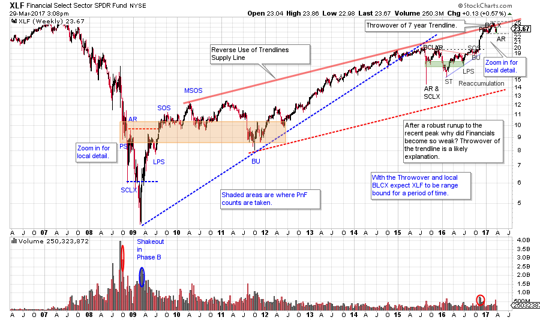
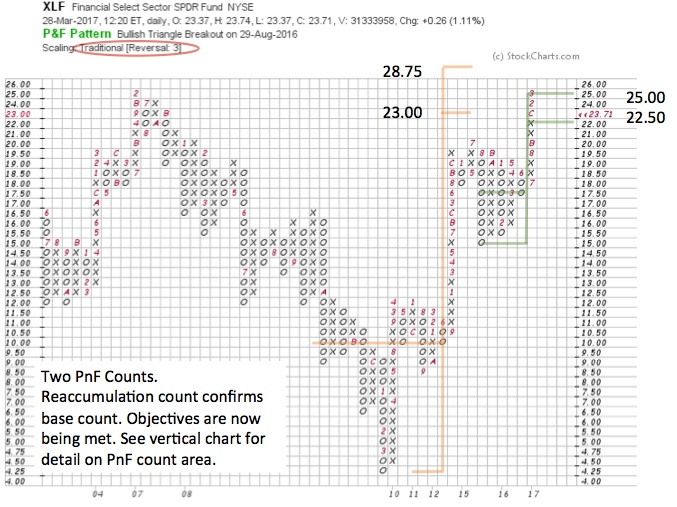

# Financial Sector Update

URL: https://articles.stockcharts.com/article/articles-wyckoff-2017-03-financial-sector-update/
Date: March 30, 2017 at 12:00 PM
Author: Bruce Fraser

We looked at the Technology Sector (XLK) in the last post (click here for a link). Another very important market sector is the Financials. Here is a high-altitude view of the Financial Sector from a Wyckoffian perspective.

---

(click on chart for active version)

The Financial Select Sector ETF has a wicked waterfall decline in 2008 and into 2009. Study this decline as it illustrates why Selling Climaxes (SCLX) are best avoided. This Selling Climax phase went on and on for nearly six months. A Wyckoffian may think the fever is about to break after the SCLX and the Automatic Rally, but note the Shakeout that follows. Shakeouts are not that common, and here is one worthy of careful analysis. Next there is a sharp rally that rips right back up through the SCLX low and thus confirms the decline is over. But the process of building a cause for a new bull market advance can come in many forms. Note that much of the cause building comes at well above the Shakeout lows. More than two years is spent in a trendless range before the uptrend can resume.

The Reverse Use of Trendlines produces a most interesting seven-year Supply Line over the XLF advance. Recently, on the post-election surge this Supply Line is thrown-over creating an overbought condition. Almost immediately XLF dipped back below the trendline. Make the chart active and zoom into the areas analyzed for additional detail.

A very large PnF count of the Accumulation area is taken (note the orange shaded area on the vertical bar chart) and projected. This is a cause that has formed over 15 quarters. Also, a smaller Reaccumulation count is generated beginning in mid-2015.

The large Accumulation PnF count appears much more symmetrical on the PnF chart above. The method used is Traditional Scaling and 3 Box Reversal method. The Reaccumulation count confirms the larger Accumulation count and XLF rallies once both counts approximately equal each other. Also, note that XLF has advanced to the prior 2007 peak at $25 where natural resistance is expected.

Does this mean the bull market run for Financials is over? Possibly not, but we would expect some work to be done building a new cause prior to the trend resuming. Resistance at the prior high, Throwover of a long term trend channel, and two major PnF count objectives being met are all formidable resistance. We will turn to our tape reading tools to navigate the ebb and flow of what is likely a new range-bound market for financial stocks.

All the Best,

Bruce

Roman Bogomazov will be conducting a complimentary webinar on Thursday, April 6th. This is an introduction to his online series:Advanced Wyckoff Trading Course (AWTC) - Wyckoff Structural Price Analysis (3:00 – 5:00 p.m. PDT). For more information and the registration link,please click hereor if you would like to register directly,please click here.
