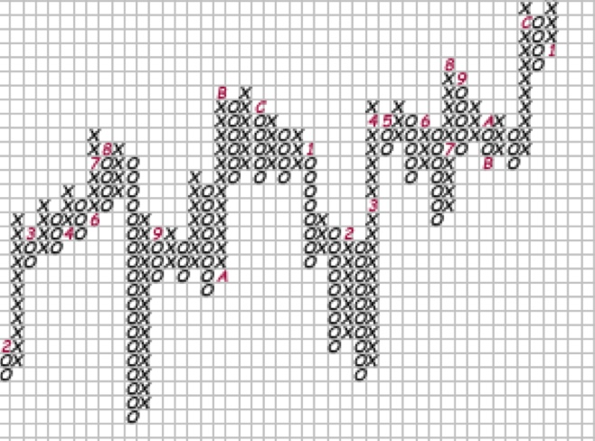
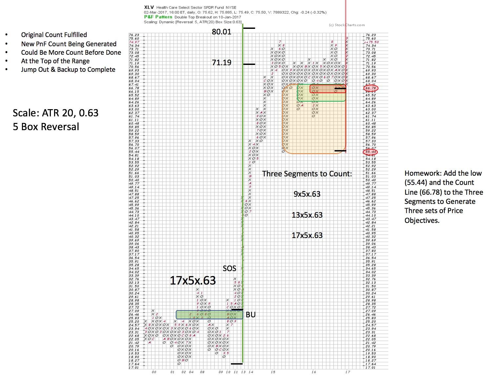
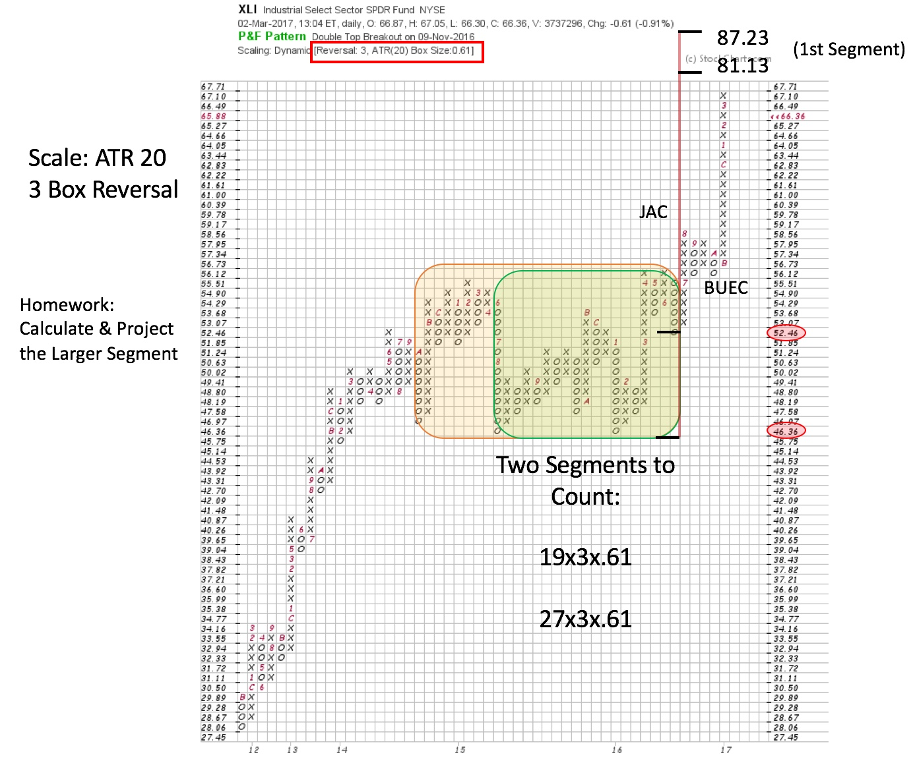
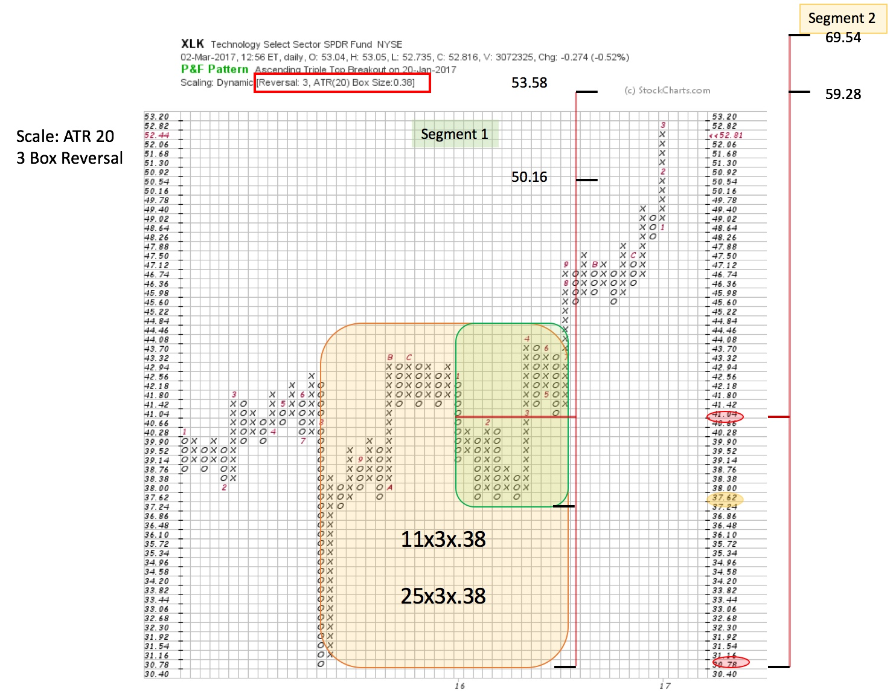

# Get to the Point and Figure

URL: https://articles.stockcharts.com/article/articles-wyckoff-2017-03-get-to-the-point-and-figure/
Date: March 04, 2017 at 10:30 AM
Author: Bruce Fraser

Sector activity can illuminate important thematic trends unfolding within the market. Point and Figure studies identify large Accumulation and Distribution Structures related to these themes poised to be campaigned over many months and years. The Sector can be campaigned using Exchange Traded Funds (ETFs). Also, by drilling down into the Sub-Industry Groups and stocks the very best leadership candidates can be identified and traded.

Here we will focus solely on the PnF studies and develop an eye for how these large formations help inform our strategy and entry tactics. This is, by no means, a complete list of current best sectors. Take the time to go through all of the sectors, generate PnF charts and hone your skills. The next step is to zoom into promising Sub-Industry Groups and continue the analysis. We know that best Sectors have within them best Sub-Industries, and within them, best stocks that are leading the way up.

---

A large Accumulation PnF count generates over many years (2001-2013). Healthcare is building a mega-count while remaining trendless. A Sign of Strength (SOS) and a Backup (BUEC) finish Accumulation and lead to the Markup. We construct a PnF to capture the magnitude of the Accumulation. Using a 5-box reversal method and ATR 20 scaling the entire structure can be counted. Notice how the price objective is fulfilled and the large trend is stopped for multiple years. With the stopping of the trend, massive volatility follows. It appears that a large Reaccumulation could be forming. If so a future campaign in Healthcare stocks may be brewing. XLV has rallied to the top of this big trading range. What do we need to see to put our Wyckoff Campaign hats on? At the top of the range Resistance is likely to turn price back downward. A shallow correction, followed by a Sign of Strength out of the Reaccumulation area, would be very constructive. Also, a Jump out from here would be positive. In the meantime, drilling into the Sector to find leadership stocks would be a good Wyckoffian activity. A count of the Reaccumulation area has been attempted to estimate the appreciation potential. You are encouraged to calculate and flag the three segments. As the Reaccumulation may grow larger or reverse back into the trading range area, we must be prepared to adjust our counts.

Consider our comments about the prior XLV example while studying this PnF of the Industrial Sector (XLI). The Industrial Sector was turned back down at Resistance and remained in the top half of the Accumulation. Thereafter it forcefully Jumped the Resistance, and while staying above Backed up (BUEC). Then XLI began marking up. This is one of our scenarios for Healthcare. Also, we notice that Industrial stocks are good leadership in this rally. Two segments are identified here and the smaller is flagged. There is more room to run in the first segment, with the promise of an even larger segment after. This PnF work speaks to us about the potential to campaign the Industrial theme currently and for the long term.

The Technology Sector has been stellar leadership last year and into this year. Will this leadership continue? Possibly this exercise will guide our thinking. There are two segments for our consideration. Note the big Climactic decline in 2015, followed by a range bound market. Resistance is formidable in the low $40s. Once XLK Jumps out and Backs up we can take a final PnF count. The first segment (in green shading) is flagged and notice that XLK is now in the window of that count objective. Technology became early leadership, and now, could it be early to rotate out of favor? We will look for classic signs of ‘Stopping Action’ in this zone while continuing to favor this theme (as there is still room in segment 1 to run). Also, look at the much larger segment 2 count, and the potential of a much larger campaign. The smaller segment may call for a period of Reaccumulation before this bigger uptrend can be realized. As we recall from the Healthcare example, once a big trend is in force it can go and go and go. We will keep this in mind.

All the Best,

Bruce
