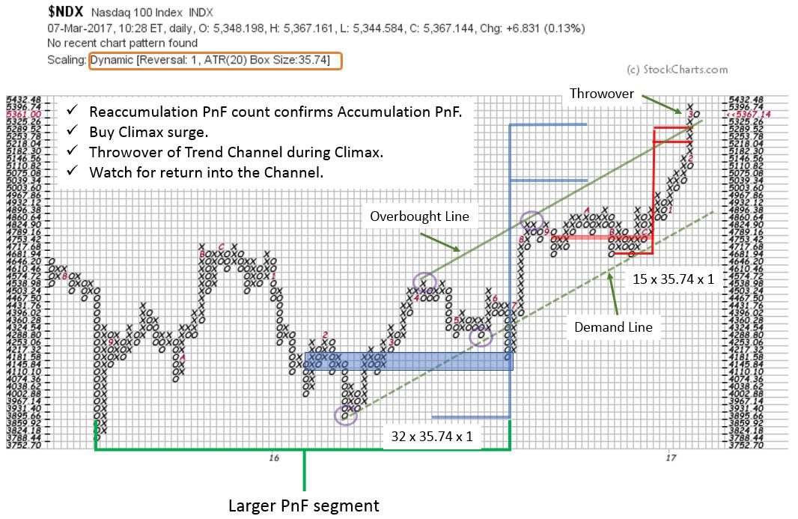

# NASDAQ 100 Index. A Current Case Study.

URL: https://articles.stockcharts.com/article/articles-wyckoff-2017-03-nasdaq-100-index-a-current-case-study/
Date: March 11, 2017 at 10:00 AM
Author: Bruce Fraser

Point and Figure charts are generated from price volatility, unlike a vertical (bar) chart, which is plotted as a function of time. This is particularly valuable to Wyckoffians who are always on the search for a Cause being built. Causes lead to Effects; Accumulation results in Markup and Distribution turns into Markdown. Point and Figure analysis provides a method for estimating the potential extent of that Markup or Markdown. We have spent considerable time on methods and procedures for PnF analysis, and will continue our skill building using these powerful charts.

Here is a current and fascinating Point and Figure case study.

---

The NASDAQ 100 ($NDX) is at an interesting juncture. Using a one box PnF chart (daily data) and ATR 20 scaling, let’s see how much can be learned about the present position of NDX. Accumulation evolves into a markup during the first part of 2016. A horizontal count is taken at 4,181.58 and projects to 5,039.34 / 5,325.26. This is a move of intermediate magnitude (potentially). And this is the first segment of an Accumulation that could include a larger PnF count. We can identify the stride of this advance with trend channel construction (anchor points are circled). In late 2016 a Reaccumulation forms which provides another PnF count (in red). This count approximately matches the larger base PnF objective, giving us added confirmation of the price target.

Notice what happens next. On the run from the bottom of the trend channel to the top, an acceleration of NDX throws over the upper trendline. This Climactic action occurs at the upper bounds of two PnF counts and the Overbought line of the trend channel. We expect this activity to stop the advance and result in a range bound market. This is a classic culmination of technical events. Confirmation of the conclusion of this Buying Climax surge would be a quick return under the Overbought line and a bout of price weakness (which would be labeled an Automatic Reaction).

Does this mean Distribution is forming? There are reasons to expect the upward trend to continue, after a pause. On the NDX chart only the first segment of the Accumulation has been counted (try counting the entire Accumulation). Also, the trend channel is still in force and it is expected that a return to the Demand Line (either suddenly or by drifting sideways) will result in an attempt to resume the rally. We will watch the progression of NDX closely for either the completion of another Reaccumulation or signs of Distribution.

All the Best,

Bruce

Review the PnF of the NASDAQ Composite (COMPQ) published a year ago by clicking here.

Thank you for checking in with comments and questions. It is clear that you are practicing and developing your PnF skill sets. My hope is that these case studies will answer many of your questions and provide additional tips and tricks for your Wyckoff toolbox.
