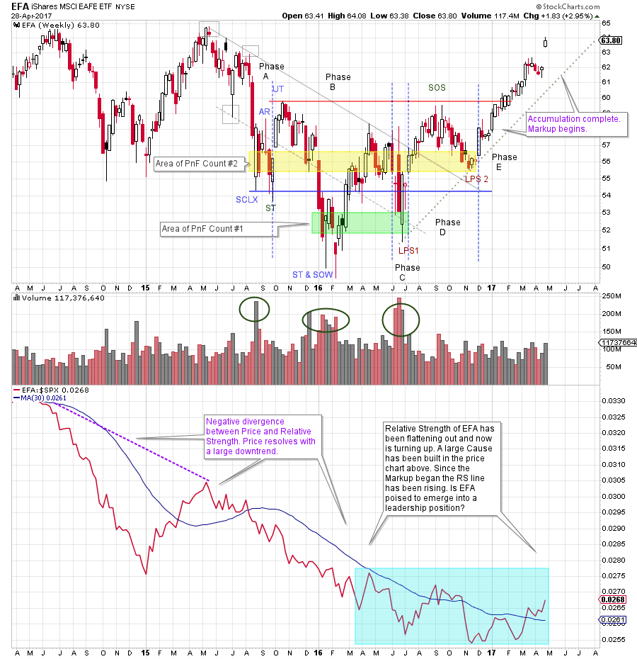
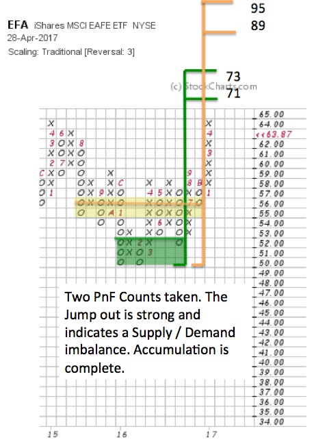

# Around the World in 21 Ways

URL: https://articles.stockcharts.com/article/articles-wyckoff-2017-04-around-the-world-in-21-ways/
Date: April 29, 2017 at 12:48 PM
Author: Bruce Fraser

The EAFE Stock Market Index includes the large and mid-cap stocks of 21 developed countries throughout the world. The U.S. and Canada are excluded from this index. The stocks in the EAFE represent more than $1.9 trillion of market capitalization.

Currently there is a worldwide movement toward nationalism. This could impact the flow of goods exported between countries. Many of the manufacturers of goods we rely on are based in these 21 countries. If trade competition and barriers are impacted by the winds of political change will the EAFE be affected? Often the markets act in ‘counter intuitive’ ways and confound investor logic. Let’s employ some Wyckoff analysis and attempt to get some clarity on the current state of the EAFE.

---

(click on chart for active version)

In May 2015, a downtrend in price began (within the structure of a larger Reaccumulation). A Relative Strength (RS) downtrend had been in force for much longer and put us on notice that weakness could develop at any time. RS often points the way with early and persistent weakness or strength (see the note regarding ‘negative divergence’ on the chart) as is the case here. Bulging volume and climactic price bars (SCLX) hint of stopping action in August. The following Automatic Rally (AR) confirms that early demand is starting to Support the market for EFA. The ST and the Upthrust (UT) begin Phase B and are further evidence of good demand under the market for EFA. Phase B is where C.O. Accumulation takes place and volatility is a tool of the C.O. and expected. After the UT, a decline on large volume takes price below the SCLX and ST lows. This is a deep Shakeout type action that we label a SOW and ST. Major volume surges on price weakness indicate to the C.O. that a large Supply of shares are still being liquidated (by the public and institutions) and more testing of these lows is needed. A rally in Phase B back above Support fails at a lower high and leads to the conclusion that a new low is possible straight ahead. A very high volatility decline with a surge of volume has a climactic quality. Because new lows are not made here we can conclude that C.O. demand is formidable and their appetite for the stock is long term bullish. This low is labeled LPS1. Note that RS is still producing new lows during this testing but momentum is slowing. The higher low at LPS1 results in a good rally and is labeled a Phase C test which would be the beginning of a larger uptrend.

The quality rally that follows LPS1 exceeds the April price peak and is labeled a Sign of Strength (SOS). But it does not rise above the Upthrust (UT) peak which would be a Major Sign of Strength (MSOS). The very high volume on the LPS1 drop almost demands another decline to test the quality and amount of remaining Supply. A Spring or Shakeout is not out of the question (a drive to new lows). A Spring or Shakeout would cause a revision of Phase B & C designations. But the decline is halting and has low volume, a very good sign. Another constructive sign; the corrective decline is about one half of the Accumulation trading range (one half or less is a positive development). The final low weekly bar of LPS2 is on low volume. A subtle but critical sign of the exhaustion of Supply. Note the big bullish bar that follows; an indication of good demand taking over. Good entry places are on the turn up from LPS1 and LPS2 with stops below those lows. A sizeable Demand bar starts Phase E and the emergence of a confirmed uptrend. EFA has a persistent rally up and out of the Accumulation range. The best rally so far. Note the gap on the last bar. With the completion of Accumulation after LPS2 we can take a PnF count.

Using traditional scaling and a 3 box method we look to the vertical chart to find our points to count. Note the green shaded box on the Vertical chart. From LPS1 to the SOW/ST, 7 columns of count produce 21 points of potential. This is a conservative count. An objective of 71 to 73 is generated. There is more fuel in the tank in the current rally to carry EFA to new high prices. There is a gap on the last bar that could result in an important Jump to this price objective and thereafter a Backup to the breakout area. This would set up a rally potential to the more aggressive PnF count objective (yellow shaded box). This count is 13 columns, produces 39 points of potential, and an objective of 89 to 91.

The light blue shaded area on the Relative Strength chart illustrates a possible base and reversal. Since December ’16, higher lows have been forming and now RS is rising above the moving average. EFA has been an underperformer for years on a RS basis. Is this a turn of the tide for these 21 countries? If RS and Price can get in gear together on an upward trajectory this new trend could persist for multiple years. It is early yet. But a good uptrend has formed in price and EFA has a compelling Wyckoff structure. A confirmed uptrend of the RS line (higher highs, higher lows and staying above the moving average) would be an additional tailwind for EFA.

All the Best,

Bruce

Additional Reading on Relative Strength Analysis:

Wyckoff Group Think (click here)

Group Stink (click here)

Sectors. Groups. Stocks (click here)
