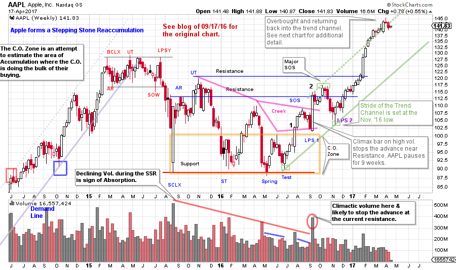
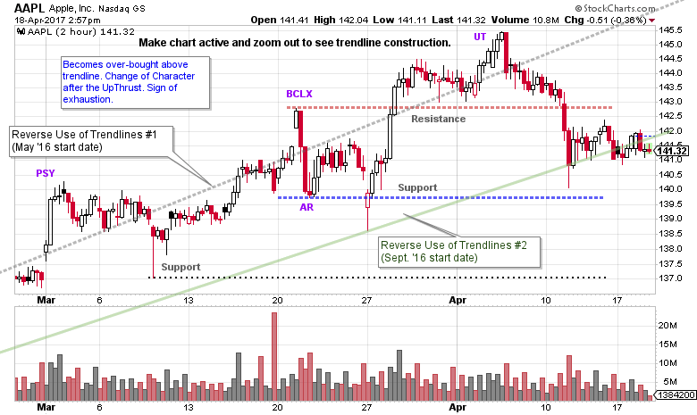

# The Big AAPL

URL: https://articles.stockcharts.com/article/articles-wyckoff-2017-04-the-big-aapl/
Date: April 18, 2017 at 03:55 PM
Author: Bruce Fraser

Wyckoffians are always on the search for Causes being built. A trend will end and a Cause will start. A Cause will end and a trend will start. The Wyckoff Method is centered around the interpretation of these conditions and the appropriate tactics. The Composite Operator (C.O.) is our ‘fictitious’ large investor who builds size positions in these campaign stocks. The C.O. Accumulation of these shares result in big bases. The Distribution of shares at the end of a major uptrend will result in a decline. In the case study of Apple Inc. (AAPL) we had the opportunity to study a small Distribution that led to a Stepping Stone Reaccumulation (SSR). Take a few minutes to review the post of September 17, 2016 (click here for a link).

---

The break of the uptrend (in 2015) and a multi-month Distributional Cause preceded a decline of intermediate proportion. A brief and dramatic price drop into August ‘15 formed the Climax low and began the Reaccumulation process. The Selling Climax (SCLX) and Automatic Rally (AR) set the range of Support and Resistance for the Reaccumulation that followed. The Reaccumulation was more than a year in duration, and thus the Cause was large for the next move. A decline of the magnitude of the SCLX on significant volume will typically be retested. There are three retests and the volume diminished on each. Which is evidence of the C.O. systematically vacuuming up AAPL. After the Spring and the Test, AAPL became buoyant and had an important rally back to prior Resistance. Point #2 on the chart is where our prior post stopped. We concluded that Reaccumulation had formed and an important Sign of Strength (SOS) was developing. The very large bullish bar at #2 arrived on huge volume and was likely a near-term climactic action. This also was at the Resistance formed at the AR level, therefore a pause should follow. The resulting nine weeks of reaction produced a Last Point of Support (LPS 2). This LPS 2 was a higher low above LPS 1 and represented a key area to add or initiate a position by following the strength upward off the turn. A stop is typically placed below LPS 1 or LPS 2.

(click on chart for active version)

The September LPS was labeled a #1 with the expectation that a LPS #2 was ahead. The LPS #2 arrived in November. Here is an excerpt from the September post:

“A Spring and a Test successfully hold at the Support area. Wyckoffians would expect a successful Spring to result in a rally to the Resistance area, and that is what has happened. Note the Sign of Strength (SOS) that preceded the low volume LPS1. This is a classic change of character where price can no longer return to the Support area quickly and unexpectedly. Higher lows at the Test and the LPS1 are entry zones to begin buying stock to be in harmony with the motives and actions of the Composite Operator (C.O.). The most recent big price bar jumps to the first Resistance area on a spike of volume. This will likely lead to a consolidation in the weeks to come. The C.O. is using this strength to lighten some of their massive position while prices are whooping up on the excitement of the news of a very successful iPhone launch. The Backup to the Edge of the Creek (BUEC) forming around either Resistance area would present additional opportunities to purchase stock during a dull and quiet trading range. It is possible that an imbalance of demand over supply could take AAPL to the Resistance area formed at the UT before there is a BUEC, which would be interpreted as being even more bullish. Strategy would always be to wait for the low volume periods of backing up (before buying or adding shares) into a LPS to prove that all of the excess Supply has been absorbed.”

What is the prognosis for AAPL now that an important markup has taken place? A trendline can be drawn at the Test and LPS 2 to establish the stride of the advance and the trend-channel. An overbought condition now exists. The PnF chart projects a count of 152/159 so there is still room to rise from the current price levels. Stepping Stone Reaccumulations can form at any time and pause the advance. Now that AAPL is overbought at the trend-channel, zooming into a closer timeframe could illuminate current conditions and tactics.

(click on chart for active version)

On the 2 hour chart, AAPL rides along Trendline #1 (make the chart active and zoom out to see entire trendline construction) while repeatedly becoming overbought and failing. Preliminary Supply (PSY) arrives on a throw-over at the start of March. A BCLX has a gap up and sharp failure. The AR becomes Support and a Test holds Support followed by an Upthrust (UT) rally. The UT is overbought above Trendline #1 and fails suddenly. The character of trading in AAPL is changing. Price is now hugging Trendline #2. Is AAPL becoming ‘Range Bound’?

The rumors of a major new iPhone release in the fall may subdue current sales demand and create an opportunity for the C.O. to help engineer a period of Reaccumulation (trading range) to discourage speculators who own the stock. The PnF points to higher prices in the future but it is normal to pause along the way (to see PnF chart in Sept. post click here). A period of Stepping Stone Reaccumulation provides the opportunity for C.O. Accumulation of additional shares that could help propel AAPL to the higher PnF counts of 197 / 204.

Let’s consider three scenarios using the weekly chart:

1. AAPL marches from here to the 152 / 159 near-term PnF count and forms a more dramatic BCLX and Overbought condition above the trend channel. A Reaccumulation would then form to build a Cause into the 197 /204 price objective.
2. A Reaccumulation begins to form at the current overbought juncture which could be big enough to fulfill the higher PnF count. This would be indicated by persistent weakness following the recent UT. A Reaccumulation structure could build across until the other Trendline in the channel is reached. See this trend channel on the weekly chart above.
3. The price of AAPL retreats down to the bottom of the trend channel (weekly chart) in a persistent downtrend and becomes oversold. This would shake many of the momentum traders out of the position and allow the C.O. the opportunity to absorb shares quickly. Remember that AAPL has a Cause already built to 197 /204. There is no need to rebuild that Cause. There is still fuel in the tank for higher prices.

Tactics would allow us to manage and participate in any of these scenarios (and others).

All the Best,

Bruce

We will not publish this coming weekend. See you next week.

For a review of the Wyckoff Method and terminology click here.
