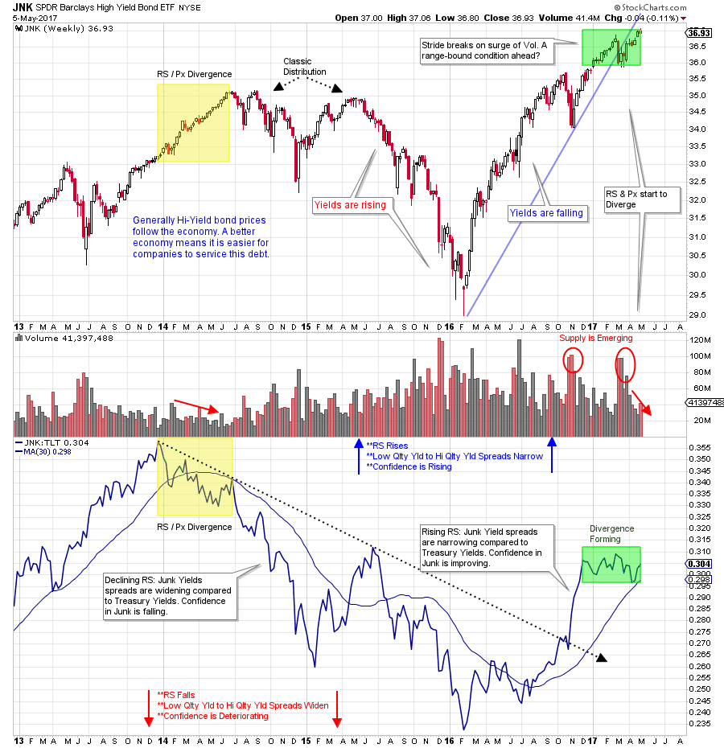
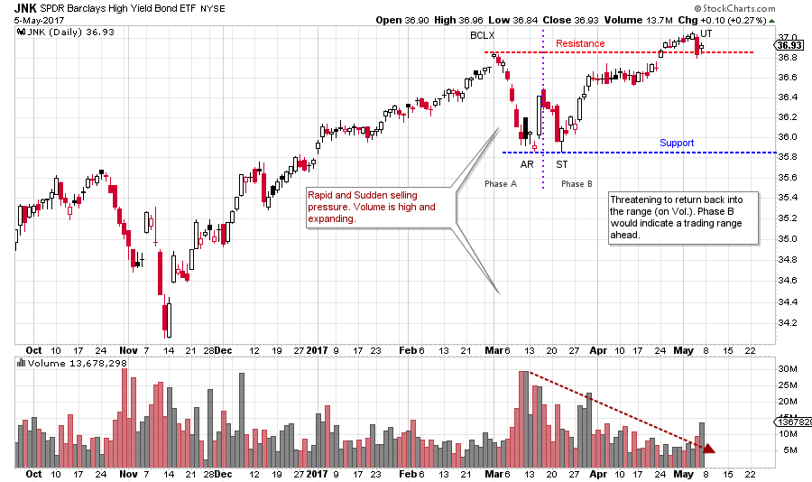

# Junk is in the Eye of the Beholder

URL: https://articles.stockcharts.com/article/articles-wyckoff-2017-05-junk-is-in-the-eye-of-the-beholder/
Date: May 06, 2017 at 08:00 AM
Author: Bruce Fraser

High yield bonds came into their own in the 1980’s and have become ever more important to the functioning of the economy. They are often referred to as ‘Junk Bonds’ because they are bonds of lower quality. Investors are attracted to them for the higher yields offered over treasury and investment grade corporate yields. As Wyckoffians we watch Junk Bonds because they offer a richness of information about the state of the economy and the risk appetite of investors for bonds and stocks. Let’s look at the current state of the Junk Bond market to see if there are any useful messages now.

Since early 2016, High-yield bonds have had a robust bull run. The Relative Strength Line (RS) has been climbing at the same time. This RS line is constructed by comparing the SPDR Barclays High-Yield Bond ETF (JNK) to the iShares 20+ Year Treasury Bond ETF (TLT). By comparing low-quality bond prices to high-quality bond prices, we can make some inferences about the bond market and the economy. When the RS line is rising, Junk is outperforming Quality bonds. This generally means yield spreads are narrowing. Investors are willing to pay more for lower quality debt, which is a sign of improving confidence in the economy and the stock market. When the RS line is falling, these spreads are widening. This indicates bond buyers are seeking quality and shunning the higher risk bonds. Confidence is falling.

---

(click on chart for active version)

When prices rise, yields are falling. When Relative Strength is rising, yield spreads are generally falling. In 2013-2014 during the rally in the price of JNK, the RS line topped and turned down (yellow box). A classic divergence. The result was a 2-year RS and price downtrend. A trendless and volatile period emerged for the stock market during this weakness in the high yield bond market. Confidence was waning. The current uptrend began in 2016 and has enjoyed a rise in prices (falling yields) and a lift in Relative Strength (narrowing spreads). The best of both worlds for lower quality bonds. A divergence is forming now as RS is stalled while prices continue to rise. The Stride of the uptrend (since the 2016 start) has also been broken (on a surge of volume). Is this the end of bond market leadership for the High-Yield sector?

(click on chart for active version)

Zooming into the daily view, after a persistent advance in JNK, a mini-climax (price gap up) forms. An abrupt ‘change of character’ follows with a steady string of declining days in March. The March 1st Buying Climax coincides with the climax in the S&P 500 (and other indexes). Resistance forms at the Climax (BCLX) peak and Support at the Automatic Reaction (AR) low. We make note of the surge of volume on the AR decline, Supply is clearly present. The subsequent rally Upthrusts (UT) the BCLX. But suddenly, in one day, weakness puts JNK back to the Resistance Line. A range bound market would mean an attempt to return to Support. If JNK does try to return to Support, a study of the volume will be informative. Further high volume on the drop would signal emerging Supply. Low and diminishing volume would suggest Reaccumulation is forming and higher prices are possible. A range bound market is expected after such a stellar run upward by JNK. Weeks and months could unfold before this market reveals its intentions.

Relative Strength is such a useful tool, particularly when combined with the Wyckoff Method. Stockcharts.com has provided a powerful platform for doing these RS studies. This bond study is one of my favorite RS relationships and I follow it regularly. At stockcharts.com we are very fortune to have two masters of these RS (intermarket) relationships: John Murphy and Martin Pring. Study their posts for many additional RS combinations. Then see if you can apply Wyckoff to some of them.

All the Best,

Bruce
