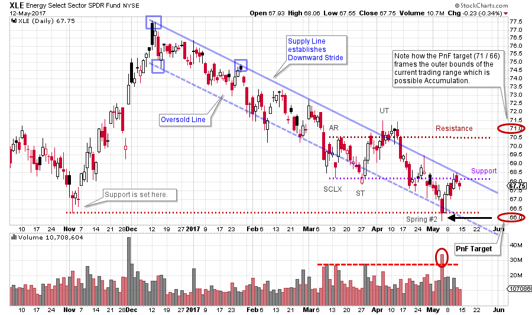
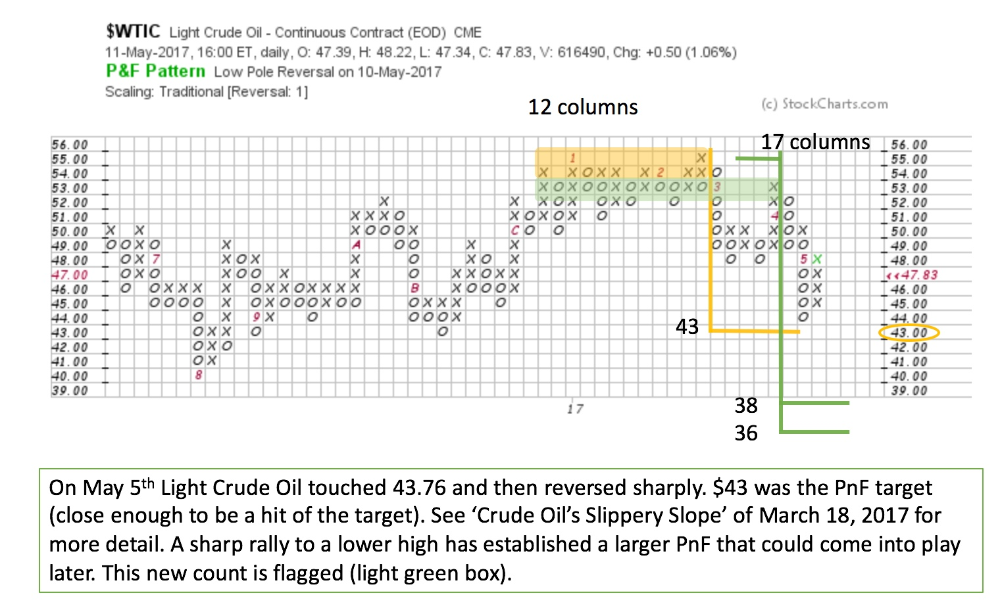
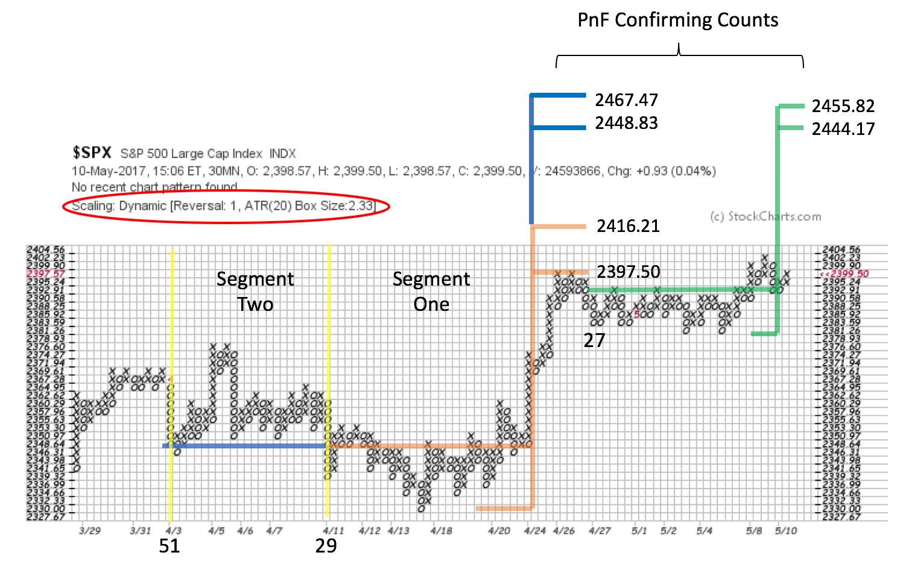

# Pedaling Wyckoff

URL: https://articles.stockcharts.com/article/articles-wyckoff-2017-05-pedaling-wyckoff/
Date: May 13, 2017 at 08:00 AM
Author: Bruce Fraser

Horizontal Point and Figure analysis is one of the great mysteries of technical analysis. Very few do this analysis, and even fewer do it correctly. An incorrect procedure leads to bad counts. But when it is done properly PnF is magical. We have spent much time here establishing proper counting technique. The next step is to use the excellent stockcharts.com PnF charting engine to make (and count) lots and lots of charts. PnF analysis is like learning to ride a bicycle. Once you know how, you’ve got it.

Here we will circle back and review some recent energy and oil PnF studies and then do some fresh analysis on the S&P 500. Wyckoffians simply cannot get enough PnF, it gets into our technical analysis DNA. Let’s get on our Wyckoff Bicycle and ride back to the March 18, 2017 post, ‘Crude Oil’s Slippery Slope’ (click here for a link).

---

(click on chart for active version)

In this prior post, we made the case that Light Crude Oil had completed a Distributional top. While this top was forming for Crude Oil, the Energy Select Sector SPDR (XLE) was already in a downtrend. The stocks were anticipating the weakness in Crude Oil ($WTIC) and warning of trouble brewing in the oil patch. XLE had a PnF count to the range of 71 to 66. On May 4th the 66 target was reached on a classic dive below the Oversold line of the trend channel. This was a Trifecta of Oversold conditions: 1) a dive below the November Support, 2) a breach of the trend channel on climactic volume, 3) achieving the $66 PnF target. Also, note the deep Spring #2 and the immediate snapback reversal to the Supply Line of the trend channel. A Cause appears to be forming (though incomplete) for XLE, and XLE is attempting to get back above the all-important Support Line. We will watch its ability to keep rallying and reach Resistance line.

Take a minute and study the chart published in the March 18th post. The yellow shaded box above is the original Distribution count. The PnF objective was $43. On May 5th $WTIC made a low of $43.76. A print of $43.00 (or lower) would be needed to put an ‘O’ in the 43 box. The low on the chart is $44, and we consider getting within a box on either side of the objective to be a PnF ‘hit’. Crude oil bounces quickly off this low and is now higher by 4 boxes. A very good sign of a near term low. Study the structure of the decline; after falling to the $48 level an intervening rally lifted $WTIC to $53 before turning back down and diving to the PnF count objective. We can now widen the PnF Distribution count (green shaded area). A count of 17 columns produces a new objective of $38 to $36. Crude oil could gyrate around the current price levels before an attempt to fall to the lower PnF price targets. Crude Oil traders must be on their toes as a result of this new larger count. With Distribution complete and the Markdown now in force, weakness may arrive quickly and unexpectedly. A bullish case for crude oil could result if an Accumulation builds on the PnF chart that counts to higher prices. The recent Selling Climax and Automatic Rally could be the start of such an action.

Above is a PnF chart of the S&P 500. It is a 1 box reversal method PnF chart constructed with 30-minute data and ATR (20) scaling. We break up our PnF count into two segments. Segment One generates a count that accurately flags the conclusion of the recent $SPX rally. Since touching the minimum price target (2397.50) $SPX has become range-bound with an Upthrust late in the structure. $SPX has still not exceeded the Segment One price objectives (more on this later). This case study illustrates why counting Segments is so valuable.

We now add Segment Two to Segment One and have a count of 51 columns (the countline and the objective for Segment Two is in blue). The entire count reaches to 2448.83 to 2467.47. Where $SPX became range-bound a Reaccumulation PnF count is forming (in green). Most recently $SPX is attempting to Upthrust and Backup to the breakout. When the Reaccumulation count approximately matches the base count (both Segment One and Two), as is the case here, the trend is often ready to resume. This is a cool timing tool and it happens frequently. When the Reaccumulation count approximately matches the original base count it is called a confirming count.

Tactics are important here. A robust jump by $SPX is needed here to clear the Reaccumulation area and the Segment One count objective. If $SPX fails to run up here we may be looking at a Distribution structure with the final move being an Upthrust After Distribution. A return into the middle of the current trading range would give weight to the UTAD scenario. The trend is our friend and therefore we will expect the trend to continue (with these contingencies).

Continue to practice taking those PnF counts. These charts will serve you well.

All the Best,

Bruce

Prior Point and Figure blog posts for reference:

'Intro to Point and Figure Construction' (click here)

'Point and Figure Analysis with Intraday Charts' (click here)
