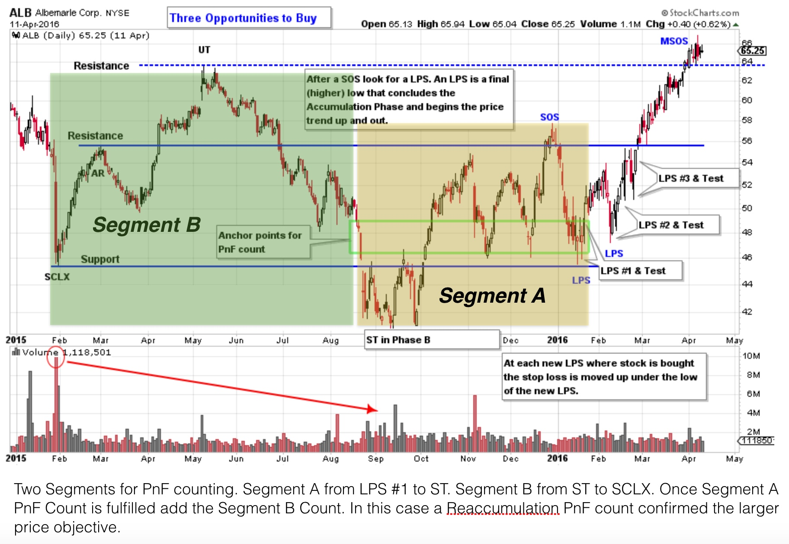
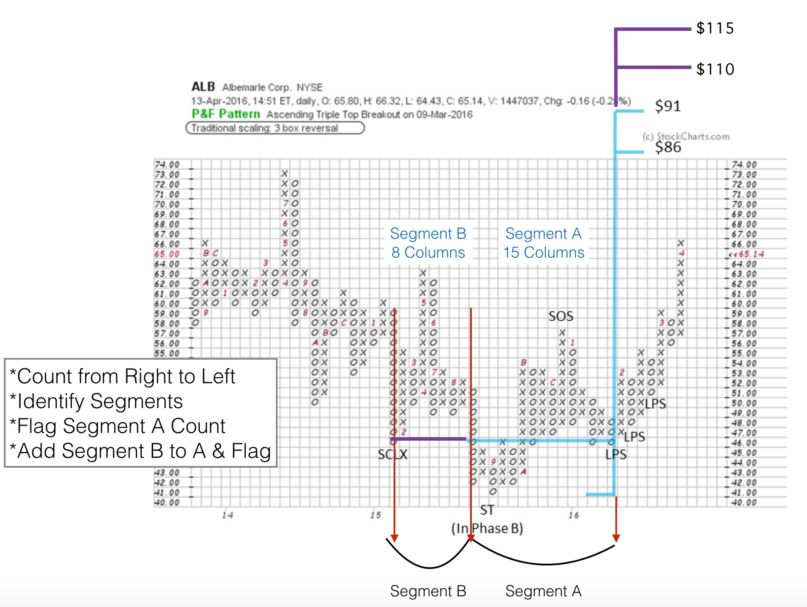
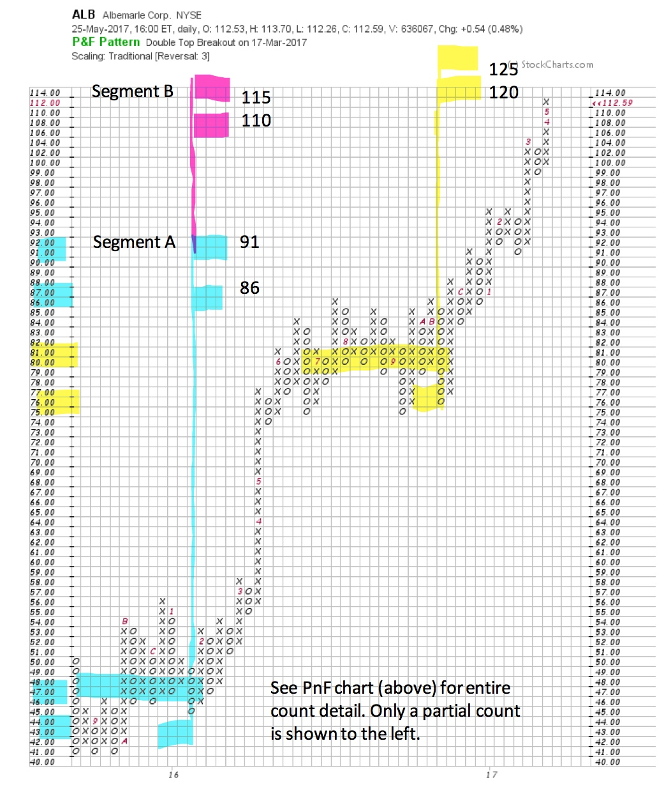

# Segmenting PnF Counts

URL: https://articles.stockcharts.com/article/articles-wyckoff-2017-05-segmenting-pnf-counts/
Date: May 27, 2017 at 08:00 AM
Author: Bruce Fraser

Wyckoffians often break up a large Point and Figure count into smaller count objectives. A large count objective usually requires a significant period of time to be fulfilled and pauses will occur along the way. Sometimes these pauses result in a period of Reaccumulation prior to moving on to higher and higher price objectives. Segmenting PnF counts can help to identify and evaluate these pauses.

Another very important reason to divide up PnF counts, is that often the entire base is not Accumulation. It is important to only count the Accumulation portion of the base structure. A decline can be stopped by a Selling Climax, but the strong hand of Composite Operator absorption may not yet be present. If that is the case, then only a part of the base is actual Accumulation. Over-counting a PnF Accumulation range is a common problem. Segmenting the PnF count is the answer to this potentially costly error. We are endlessly asking ‘how much of this trading range is Accumulation?’ What portion of this trading range structure is ‘Intelligent Accumulation?’

---

Secondary Tests (ST) are drives downward from the Resistance area toward Support. After a Selling Climax (SCLX) there remains an abundance of stock still in weak hands. This Supply of stock will continue to be liquidated on each push down. (Click here for more on Phase B and Secondary Tests) The C.O. will Support the stock with buying demand in and around the bottom of the Accumulation area. Exhaustion of selling and good demand by the C.O. will then result in rallies back toward the Resistance area of the trading range. These price declines to Support are distinct and typically have high volume (evidence of Supply). Secondary Tests are often used for the delineation points of Segments. They are identifiable on the vertical and the PnF charts. There can be numerous Segments in an Accumulation. Our example in this case has only two Segments.

Albemarle Corp. (ALB) is a stock we studied awhile back (click here for a link to the April 2016 blog post). At that time, we took a partial PnF count after a study of the vertical chart. Following the SCLX, there was a rally into an Upthrust (UT). Then a massive decline took ALB to a new low below the SCLX. There is minimal evidence of Accumulation between the ST and the SCLX and the entire ‘B Segment’ (green shaded box)could be considered a continuation of the downtrend. A good rally from the ST low is a clue of the emerging C.O. demand. Thereafter, good Support of ALB above the SCLX low is very constructive. LPS#1 leads to a rally out of the Accumulation area. We took a PnF count from LPS#1 to the ST as ‘Segment A’ (yellow shaded box). We suspect the footprints of the C.O. in the rally following the ST low. This gives us confidence when counting the PnF from LPS#1 to the ST. The essential question is whether the ‘Segment A’ PnF price objective justifies the trade? The ‘Segment A’ PnF count is $86/$91, a conservative and worthwhile trade objective.

The chart above was published in the original April 2016 post (with additional modifications here). Segments are always counted from right to left. If there is Accumulation it will always begin on the right side of the formation. The drive down to the Secondary Test (ST) is well defined, as is the SCLX. ‘Segment A’ extends to the ST and ‘Segment B’ extends to the SCLX. We are still unsure if the price action from the SCLX to the ST is Accumulation. We flag this ‘Segment B’ count by adding the columns to the ‘Segment A’ count. We will observe how the stock reacts to achieving the ‘Segment A’ price objective. We are judging whether Reaccumulation or Distribution forms at the ‘Segment A’ price zone. If the ‘Segment A’ price objective is all we get, it will still be an excellent campaign.

In this up to date chart, ALB exactly touches $86 and begins a trading range that becomes a Reaccumulation. We have ‘penciled’ the ‘Segment B’ count onto our chart. A formidable Reaccumulation generates a confirming PnF count that approximately matches the entire Accumulation count (Segments A & B). Therefore we conclude the ‘Segment B’ portion of the PnF count was Accumulation. And now we are approaching the $110/$115 price objective area with a potentially climactic acceleration. Does this necessarily mean the onset of Distribution… No. But it could result in a pause. There is still a PnF objective above current prices, which could be met and exceeded prior to a stopping action.

Segmenting PnF price objectives is a valuable technique for your Wyckoff toolkit. We will devote more time to sharpening these skills.

All the Best,

Bruce

Thank you to Dr. Hank Pruden for his collaboration in the creation of this post on Segment analysis.
