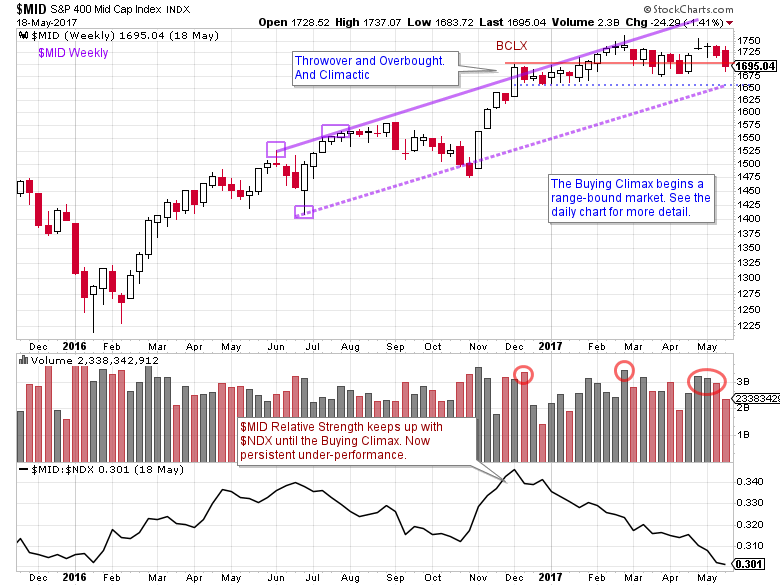
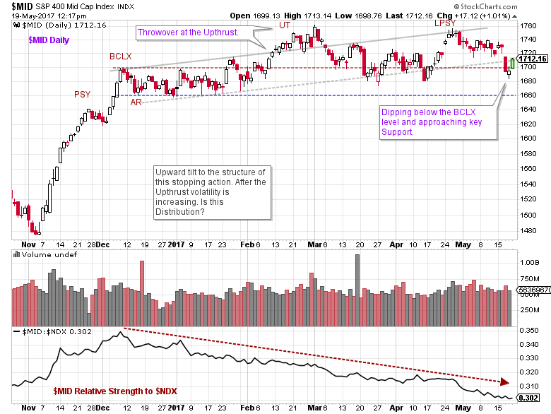
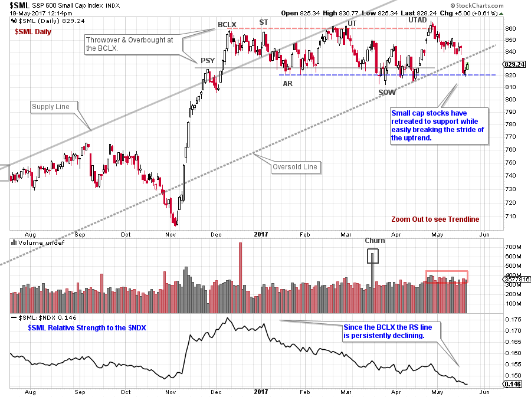
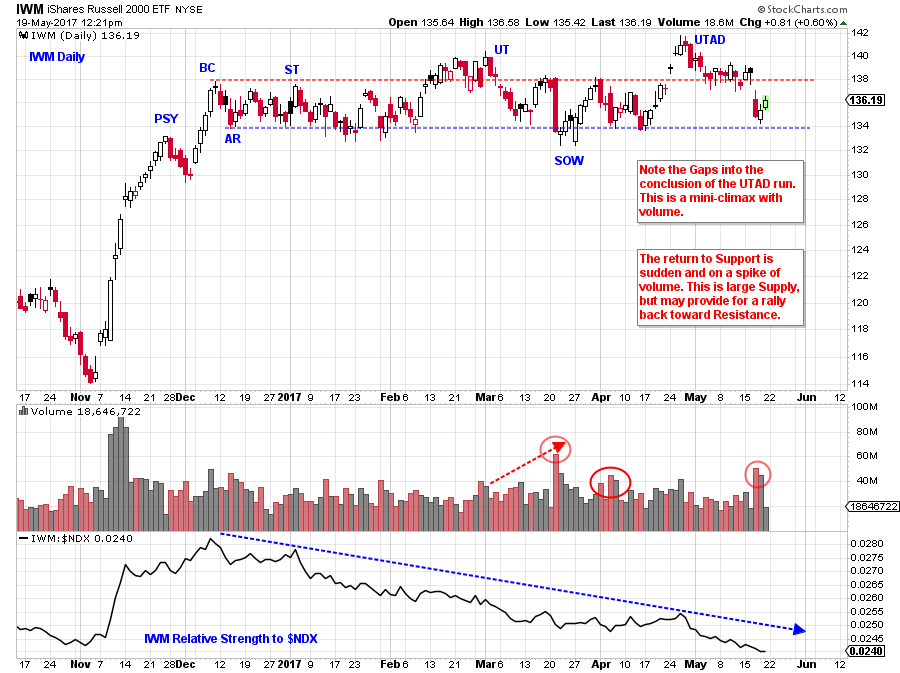

# The New Nifty Fifty

URL: https://articles.stockcharts.com/article/articles-wyckoff-2017-05-the-new-nifty-fifty/
Date: May 20, 2017 at 08:00 AM
Author: Bruce Fraser

The ‘Nifty-Fifty’ era for stocks started in the 1960s and went into the early 1970s. These fifty or so stocks were consistent out-performers. Their earnings, sales and stock price growth stood apart from most other stocks. These stocks grew in value, year after year. They became known as ‘One Decision’ stocks. These companies could be bought and held forever. Buy them and forget them. The result and the consequence was that the Nifty-Fifty became very overvalued, and they stayed that way for a long time. Most other stocks during this era languished, underperforming badly.

Eventually the Nifty-Fifty Era ran out of steam. The result was the stock malaise of the 1970s. Stocks were in a decade long trading range. The mistake market participants made was thinking any stock is a ‘One-Decision’ investment. It appears we could be in a new Nifty-Fifty Era (of sorts), which we should embrace, while keeping the above lesson in mind.

---

There is a consequence to such a narrow focus of capital. Very few stocks getting most of the investment capital makes for a two-tier stock market. This is a market of haves and have-nots. A study of the components of the NASDAQ 100 will reveal many of the haves. Where are the have-nots, and how are they doing in comparison?

(click on chart for active version)

The Mid-Cap S&P 400 Index ($MID) had a good run from the 2016 lows. Five weeks after the November election a Buying Climax (BCLX) and Throwover of the upward stride effectively stopped the advance. Relative Strength (vs. the $NDX) peaked at the same time. Declining RS, a Throwover, and a range bound market made the under-performance of Mid-Cap stocks even more evident.

(click on chart for active version)

Zooming into the daily view we see an upward tilt to the price structure. But all of the critical elements of a Wyckoff stopping action are evident. The Buying Climax price level (Resistance Line) is important because this is the place the Composite Operator began selling. Now after a long range-bound period, $MID is again at the BCLX peak. Volatility has increased after the Upthrust (UT). This is evidence of Distribution. For $MID to reestablish an uptrend it needs to settle down, become quiet and show signs of absorption. The Relative Strength line (RS) has been falling since December. Funds have been steadily rotating away from $MID to $NDX.

(click on chart for active version)

We move from Mid-Cap to Small-Cap stocks. The underperformance is even more noticeable. Small-cap S&P 600 Index ($SML) dramatically Climaxed in December and became range-bound. The S&P 500 Large-Cap Index Climaxed on March 1st. The NASDAQ 100 is still rising. We would conclude: the smaller the capitalization of the stocks, the weaker its performance. After becoming Overbought above the Supply Line of the trend channel with a Climactic (BCLX) surge, the trend stopped and drifted to Oversold where it rallied into a UTAD. Now at Support (and under the trend channel), $SML needs a rally. A breakdown here could complete the Distribution. Note the RS downtrend after the BCLX.

(click on chart for active version)

The Russell 2000 has the same family resemblance as the prior chart studies. Take some time to study IWM and consider the possible next step for this and each of the charts above.

We can see how the small and mid-cap stocks have been left behind since December. Now even the big-cap S&P 500 is falling away. Are we in a new Nifty-Fifty era? Who knows? But let’s make them ‘Two Decision’ stocks. #1 when we get in and #2 when we get out.

All the Best,

Bruce
