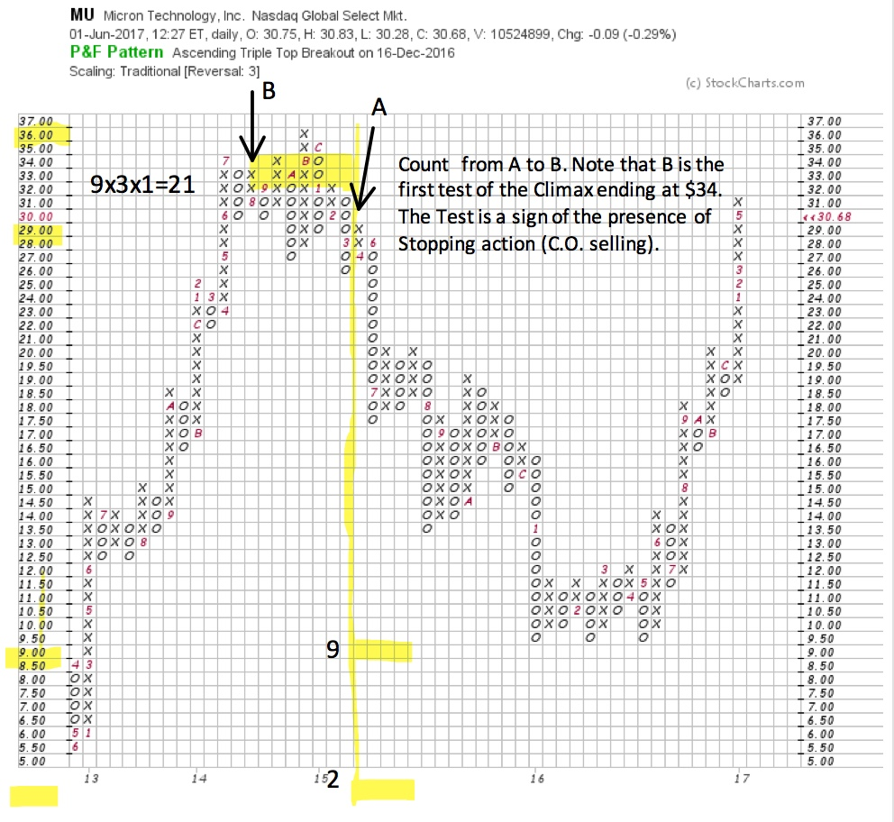
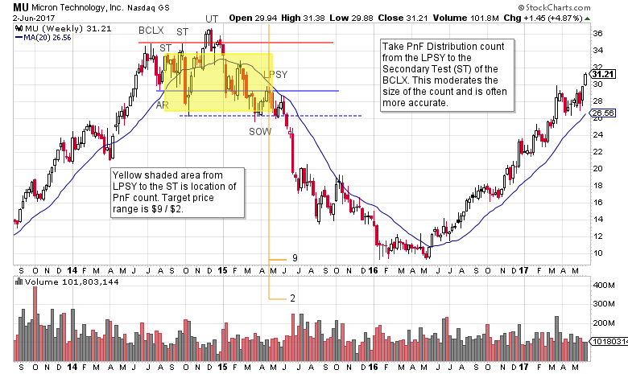

# Another Stupid Chart Trick

URL: https://articles.stockcharts.com/article/articles-wyckoff-2017-06-another-stupid-chart-trick/
Date: June 03, 2017 at 09:30 AM
Author: Bruce Fraser

Time for another ‘Stupid Chart Trick’ (click here for a prior chart trick). I have counted about one zillion (this might be a slight exaggeration, but barely) Point and Figure chart formations. As a consequence of this personal passion, I have devised some counting conventions that have proven to be very helpful. This is not a classic horizontal PnF counting technique. So please explore its usefulness for yourself with some practice counting.

A common problem with counting PnF Distribution is over-counting. We have addressed this in a prior post (click here for a link). Identifying the proper and accurate Distribution PnF count is a nuanced concept. Here is a technique to help with identifying counts that are more conservative (and I find more accurate).

---

As always start the count on the right side of the Distribution. On the vertical chart find the Last Point of Supply (LPSY), then identify this point on the PnF chart and count the columns toward the beginning of the formation (right to left). Instead of counting to the Buying Climax (BCLX) stop at the Secondary Test (ST) of the BCLX. The Distribution count will be smaller. Stopping at the ST is logical. It is where we know that the Composite Operator (C.O.) is stepping in and supplying the market with stock, thus stopping the advance. The presence of the C.O. results in a range bound market. Either Reaccumulation or Distribution will form.

This technique was employed with Micron Technology (MU). A PnF count from the LPSY to the BCLX would have produced a price objective of $3 /-$4. A classic over-counting error. Counting to the ST resulted in a range of $9 / $2. The final low was $9.50, a PnF hit. Thereafter­­, Accumulation formed (try counting this Accumulation and click here for an analysis).

(click on chart for active version)

On this weekly bar chart, we can see a classic Distribution forming in 2014/15 after a BCLX. The paradox of the PnF count generating too large of a downcount is resolved by taking the objective from the LPSY to the ST (of the BCLX).

Note the very poor rally after the Sign of Weakness (SOW). This is the Last Point of Supply (LPSY) and the point where the PnF Distribution count starts. The LPSY is only capable of a rise to the area of the Automatic Reaction (AR) low. This resistance is an important form of overhead supply that MU cannot rally back above, from then on the Markdown is in full force. Flagged on the bar chart is the PnF price objective ($9 / $2). A Selling Climax stops the decline at the $9 level.

Use this technique to systematically make your Distribution price objective more conservative and accurate. Then use your tape reading skills to identify the conclusion of the Markdown phase on the vertical chart (normally a Selling Climax). See if it sharpens your technique.

All the Best,

Bruce

Additional Resources:

Distribution Definitions (click here for a link)

Context is King (click here for a link)

Secrets of Point and Figure Distribution (click here for a link)
