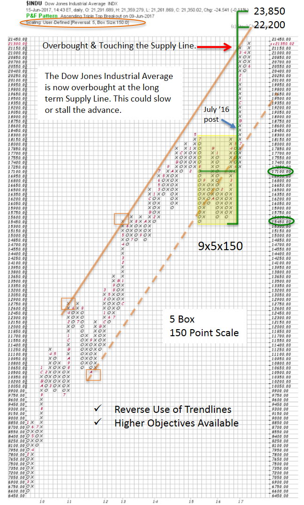
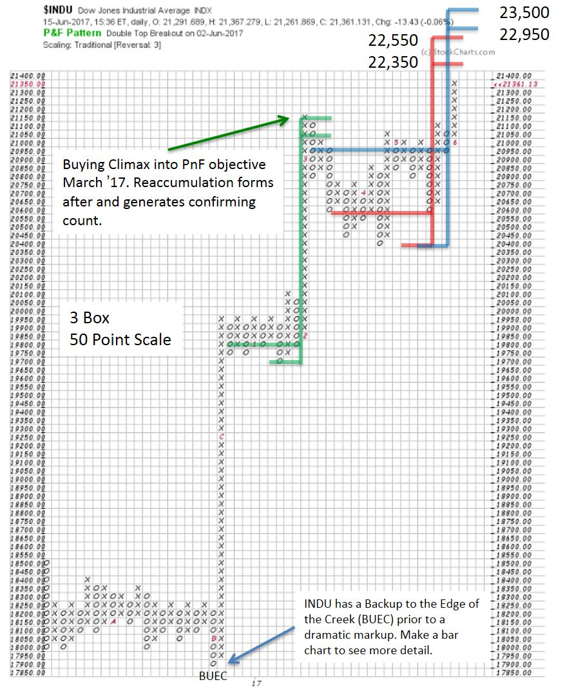

# More Pie. Bigger Sky!

URL: https://articles.stockcharts.com/article/articles-wyckoff-2017-06-more-pie-bigger-sky/
Date: June 17, 2017 at 08:00 AM
Author: Bruce Fraser

In 2011 Dr. Hank Pruden published a remarkable Point and Figure chart study, which called for a new bull market in stocks. The horizontal PnF counting method, as applied by Dr. Pruden, revealed a price objective of 17,600 / 19,200. That count produced a whopping 11,100 Dow Jones Industrial Average (INDU) points and was added to the countline of 8,100 and the low of 6,500. A big and bold count. During 2014 the minimum count was achieved. Thereafter a Reaccumulation formed. In July of 2016 a new uptrend began. Dr. Pruden, Roman Bogomazov and I reevaluated the original base count and the Reaccumulation to determine if there was more fuel in the tank for a continuation of the bull market. The result of this study was published here in July of 2016. Please take a minute and read this post (click here for a link). Also read the article where Dr. Pruden makes his legendary market call (click here for a link and turn to page 29).

When ‘Point and Figure Pie in the Sky?’ was posted, the INDU was jumping to a new high and clearing the 18 month Reaccumulation trading range at 18,600. In that blog post, the case was made for increasing the original Accumulation PnF count and making even higher price projections. In addition, the just completed Reaccumulation PnF count confirmed this higher price potential. New objectives were generated to approximately 22,000 / 24,000. Let’s now update the progress of the INDU on the way to these price objectives.

---

Utilizing the User-Defined settings, a Dow Jones Industrial PnF is generated above with a 5-Box reversal method and 150 point scaling. These two parameters are akin to generating a monthly vertical bar chart, which we can then use to take very large PnF counts. The Reaccumulation structure and a well-formed uptrend channel can be seen here. Two big items of note are 1) the PnF count (above) approximately equals the Accumulation PnF price objective generated from 2008 to 2010 and 2) a trend channel (from 2011 to the present) continues to remain in force (Reverse use of Trendlines method).

The recent run-up from the Reaccumulation breakout (yellow shaded area) has reached the upper bounds of the trend channel and now is overbought. This is a bit of a dilemma as the PnF count continues to project higher prices. There are a couple of ways Mr. Market could resolve this paradox. One way would be for a Buying Climax blow-off to surge above the ‘Supply Line’ and reach the price objective zone. This would likely be an exhaustion move and end the entire advance. In this situation, PnF objectives would be met on multiple counts. A second scenario would be for a Reaccumulation to develop at this Supply Line Resistance, and build another PnF count objective. As can be seen in the July 2016 post, bullish price targets reach as high as 24,400. A new Reaccumulation could be the pause that makes this higher objective possible.

We called for a Backup to the Edge of the Creek (BUEC) after the breakout in the July 2016 post, and that was what happened. It can be seen here in late 2016. Then the markup began, and it was dramatic. A pause generated an additional PnF count (in green) that results in the March ’17 Buying Climax (BCLX). The Reaccumulation that followed (in blue and red) was textbook and can be counted (using traditional scaling and 3 box reversal methodology). A run to the price targets generated by this Reaccumulation would fulfill price objectives on three levels using different PnF structures; the Accumulation base PnF count (2008-2010), the Reaccumulation PnF count of 2016 (these can be seen in the July 2016 post and the top chart above) and in this new 2017 Reaccumulation (bottom chart). We must be vigilant as this aging bull market approaches price targets established by these very large Point and Figure counts.

All the Best,

Bruce

Additional Reading:

'The Composite Man's Bull Market Campaign' by Pruden, Fraser, Bogomazov (click here for a link)
